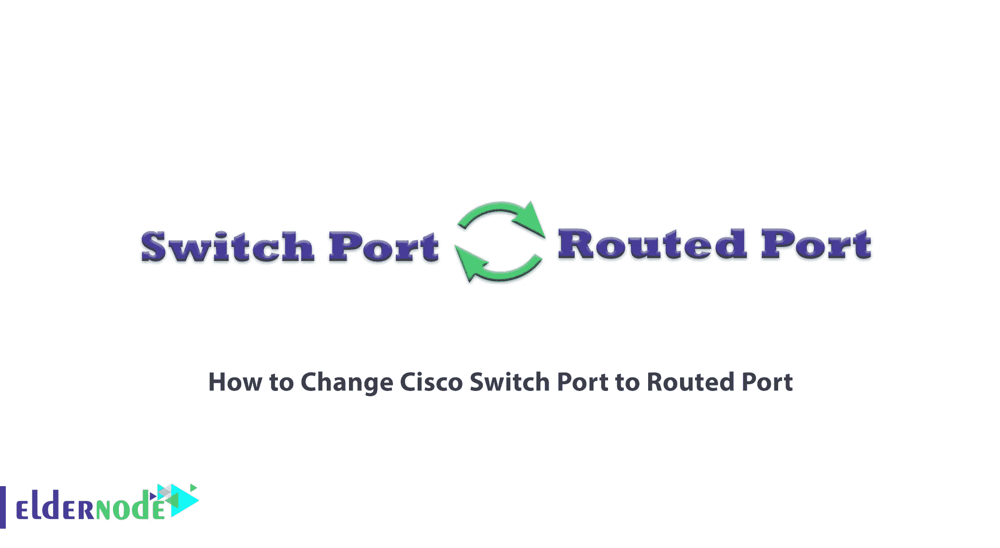

# 如何将 Cisco 交换机端口更改为路由端口- Eldernode 博客

> 原文：<https://blog.eldernode.com/change-cisco-switch-port-to-routed-port/>



思科是世界上最大的网络设备生产商，其最重要的两种产品是交换机和路由器。您可以根据需要使用交换机或路由器，但有时您需要在交换机和路由器之间进行路由。在本文中，我们将教您如何将 Cisco 交换机端口更改为路由端口。如果您想购买一台 **[VPS 服务器](https://eldernode.com/vps/)** ，建议您访问 [Eldernode](https://eldernode.com/) 中提供的软件包。

## **教程将 Cisco 交换机端口改为路由端口**

### **交换机和路由器简介**

交换机将计算机、打印机和服务器等多种设备连接到共享资源的网络。交换机充当网络控制器，允许设备通过**分组交换**相互交换信息和通信。

路由器是一种物理硬件或虚拟软件，用于在计算机网络之间接收、分析和发送数据包。事实上，路由器检查数据包的目的 IP 地址，然后考虑传输数据包的最佳方式。

### **什么是思科交换机？**

思科已经能够接管网络交换机生产和支持市场，并为各种业务推出了各种思科交换机。思科交换机主要分为三类:**核心**、**分布**和**接入**。

### **什么是思科路由器？**

路由器是思科生产的最强大的产品之一。思科路由器则不同，配备不同的模块，可用于家庭或商业用途。路由器是第 3 层设备，它传送网络下客户端生成的数据包。该目的地可以在同一个网络、另一个本地网络或互联网中。

## **将 Cisco 交换机端口更改为路由端口**

分配一个 IP 地址，然后输入以下命令:

```
config t
```

按下**回车键**开始，然后输入以下命令:

```
show ip interface brief
```

然后您将看到不同端口的列表；为其中一个端口分配 IP 地址:

```
interface GigabitEthernet 1/0
```

现在输入你的 IP 地址。

如果您看到以下错误:**【在'^'标记处检测到无效输入】**，请返回路由器 1 并输入以下命令:

```
ping ip address
```

由于此交换机是第 3 层交换机，您可以更改交换机端口使其可路由。为此，请输入以下命令:

```
no switchport
```

然后输入你的 IP 地址并键入 **no shutdown** 以确保错误不再发生。

退出其他部分后，键入以下命令:

```
ping ip address
```

现在，您可以看到 pings 命令已返回。

将 IP 地址放在第三层交换机[端口](https://blog.eldernode.com/port-forwarding-on-the-mikrotik/)上，这样如果需要的话，你可以在路由器和交换机之间路由。

## 结论

计算机网络中的交换机是通过分组交换连接计算机网络中的设备以在它们之间交换数据的网络硬件之一。通过本文，您将了解 Cisco 交换机和路由器，并学习如何在需要时将交换机端口更改为路由端口。