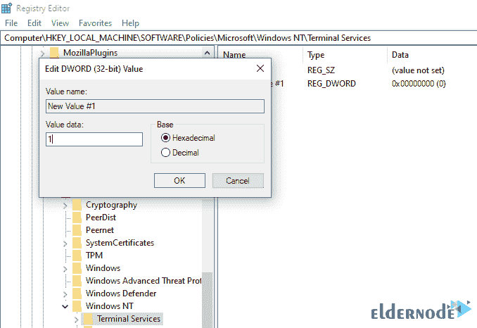

# 从注册表更改桌面远程协议- Eldernode

> 原文：<https://blog.eldernode.com/change-desktop-remote-protocol-from-registry/>


在 Windows 桌面远程服务中，影响速度和通信方式的因素之一是其通信协议。这篇文章将教你如何从注册表中改变桌面远程协议。默认情况下，如果网络连接在组织外部，Windows 会通过 [**UDP**](https://en.wikipedia.org/wiki/User_Datagram_Protocol) 进行通信，以加快速度并更快地执行命令。但是这种速度的提高会影响桌面遥控器上的一些服务。**例如** ，如果您通过桌面遥控器观看视频或收听音频文件，连接、声音或图像将会中断，唯一的解决方法是连接到 TCP 协议。

### 如何从注册表更改桌面远程协议

您可以通过 Windows 注册表进行设置，使桌面遥控器只与 **[TCP](https://en.wikipedia.org/wiki/Transmission_Control_Protocol) 协议**通信，这样您就不会遇到任何可能的问题。在这篇文章中，我们将教你如何从注册表中更改远程桌面协议。

**注意**通过 TCP 的远程桌面连接需要非常好的互联网速度，如果没有合适的通信速度，连接将达不到要求的质量，您肯定会。

***本教程仅适用于 Windows Server 2012 以上版本。***

首先通过 **Winkey + R** 组合键，打开 **Run** 窗口，进入 **regedit** ，然后点击 **Ok** 。


现在去下面列出的地址:

```
 HKEY_LOCAL_MACHINE > SOFTWARE > policies > Microsoft > WindowsNT > Terminal Services 
```

在这个部分中，**在一个空的部分上右击**并从新选项中点击 **DWORD** 并输入其名称 **SelectTransport** 并按下 **Enter** 。


然后**双击创建的键上的**，输入**期望值**，点击 **OK** 。

**0:** 如果输入零，桌面遥控器将同时使用 TCP 和 UDP 协议。

**1:** 如果输入数字一，桌面远程服务将只使用 TCP 协议。

**2:** 如果您输入数字 2，Windows 桌面远程服务将在连接中同时使用 TCP 和 UDP 协议。

输入所需的值并点击 **OK** 后，退出该页面并**重启**您的 Windows 一次。



重新启动后，将应用您想要的设置。

## 结论

您可以配置 Windows 注册表，使远程桌面只与 TCP 协议通信，以避免潜在的问题。本教程完整地解释了如何从注册表中更改桌面远程协议。