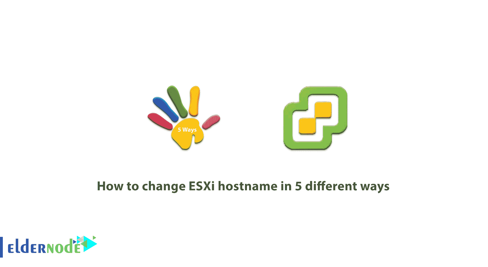

# 如何以 5 种不同方式更改 ESXi 主机名- Eldernode 博客

> 原文：<https://blog.eldernode.com/change-esxi-hostname-in-5-different-ways/>



如您所知，有几种方法可以在 ESXi 主机中更改主机名。基本上，在做任何事情之前，应该调查做这件事的原因。在这种情况下，用户必须知道更改主机名的原因，然后再进行更改。在本文中，我们试图让您**了解如何以 5 种不同的方式**更改 ESXi 主机名。您可以在专用服务器上实施 ESXi 虚拟化软件。为此，您可以查看 [Eldernode](https://eldernode.com/) 中的套装，购买一台[专用服务器](https://eldernode.com/dedicated-server/)。

## **教程用 5 种不同的方式改变 ESXi 主机名**

每个人都有一个[专用的](https://blog.eldernode.com/tag/dedicated-server/)主机名，必须在一些站点设置中指定。如果主机名定义不正确，系统、数据库和整个主机都会出现问题。这些障碍包括信息传递受阻，甚至操作缓慢。对于每个电子邮件、FTP 和数据库，都会创建一个专用的主机名，以确保数据传输和管理过程完整。在本文的后续部分，我们将向您介绍在 ESXi 中更改主机名的各种方法。

## 用 5 种不同的方式在 ESXi 中更改主机名

安装 ESXi 主机后，您需要做的第一件事是指定 IP 地址和主机名。默认情况下，主机名等于 localhost，IP 地址是 DHCP。在本教程中，我们将尝试学习如何使用 5 种方法在 ESXi 中更改主机名。请和我们呆在一起。

***注:*** 如果你使用的是 esx 6.0，可以参考文章[如何用 CLI 升级 esx 6.0 到 6.5](https://blog.eldernode.com/upgrade-esx-6-0-to-6-5-with-cli/)升级到 6.5。

#### 方法 1)如何使用主机客户端更改 ESXi 主机名

以前你必须安装额外的 Vib 来实现这个功能。但是现在您可以通过 web 浏览器访问主机客户端，而不需要额外的软件。请注意，ESXI 客户端主机当前正在安装 ESXi。您可以通过以下地址连接到您的主机:

```
https://ip_or_fqdn/ui
```

然后进入**联网>** > **TCP/IP 栈>** > **编辑设置**。在这种情况下，通过进入上述路径，将为您显示一个新的弹出窗口。此窗口中有一些按钮，您可以使用它们来更改主机名。


*


#### 方法 2)如何使用 vSphere Web Client 更改 ESXi 主机名

更改主机名的第二种方法是使用 vSphere web client。请记住，这是目前唯一允许您管理所有 vSphere 基础架构配置的客户端。此外，应该注意的是，基于闪存的客户端速度很慢，在某些情况下可能会有很多错误。请按顺序执行以下步骤:

第一步是通过 vSphere web client 进行连接。

然后进入**主机** > > **配置** > > **联网** > > **TCP/IP** 配置并选择。

然后选择默认系统堆栈，点击**编辑**图标。


*


最后，您可以通过打开的窗口更改主机名。

#### 方法 3)如何使用 vSphere HTML 5 客户端更改 ESXi 主机名

请注意，要以这种方式访问某些功能，您必须使用基于 vSphere 闪存的客户端，但您可以逐渐在客户端上获得更多可用功能。在第三种方法中，您可以像第二种方法(vSphere Web Client 方法)一样操作。请注意，您也可以通过 vSphere HTML 5 客户端更改您的主机名。


*


#### 方法 4)如何使用 SSH 或直接控制台更改 ESXi 主机名

使用这种方法需要激活 SSH。请注意，要在控制台窗口中输入遥控器，您必须输入以下命令:

```
dcui
```


现在，您需要转到下面的路径来配置其他部分。为方便起见，您可以遵循以下路径:

**F2** > > **配置管理网络** > > **DNS 配置** > > **主机名**

在 SSH 或直接控制台方法中，您必须完成所有配置。还有另一种方法可以访问文件菜单。然后复制您的会话，选择**查看**，然后选择**复制**。请注意，此会话也具有与源会话相同的访问权限。


*


#### 方法 5)如何使用 PowerCLI 更改 ESXi 主机名以挽救局面

如果您的服务器上有多台主机，第五种方法很有用。请记住，有几个为此目的编写的脚本。请注意，如果您有很多主机，可以使用 PowerCLI 方法来简化您的工作。

## 结论

有几种方法可以更改主机名，并且可以使用不同的工具进行更改。在本文中，我们试图解释在 ESXi 主机中更改主机名的不同方法。本文中提到的方法非常简单，很容易更改主机名。如果你想在这个虚拟机中创建一个虚拟机，可以参考文章[如何在 VMware ESXi 6.5](https://blog.eldernode.com/create-a-virtual-machine-in-vmware-esxi-6-5/) 中创建虚拟机。