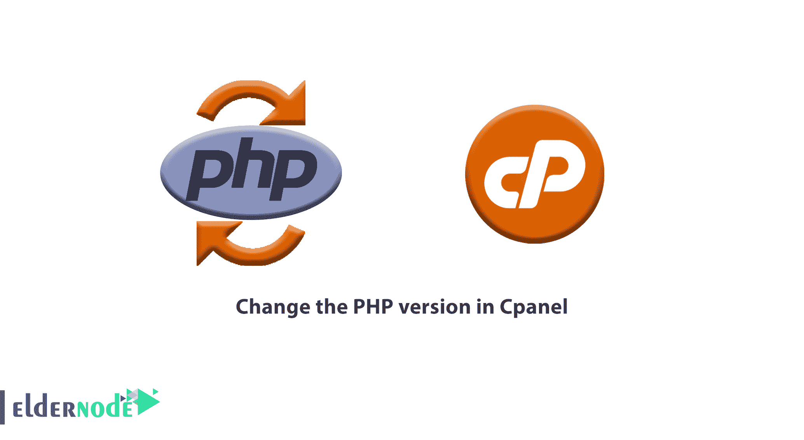
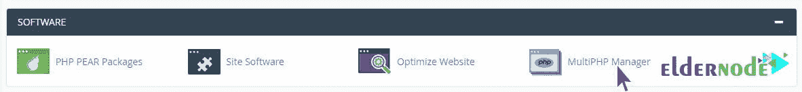
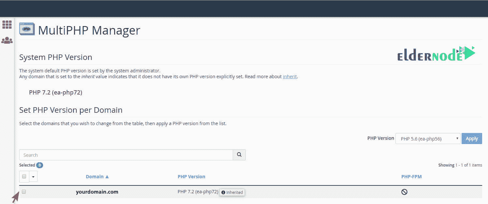
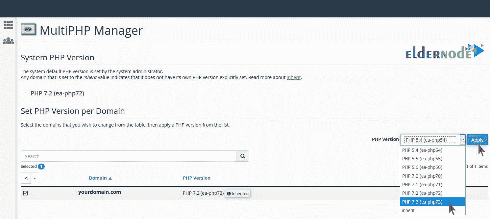
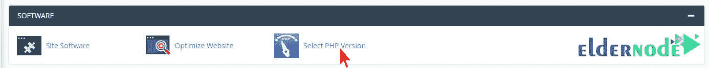
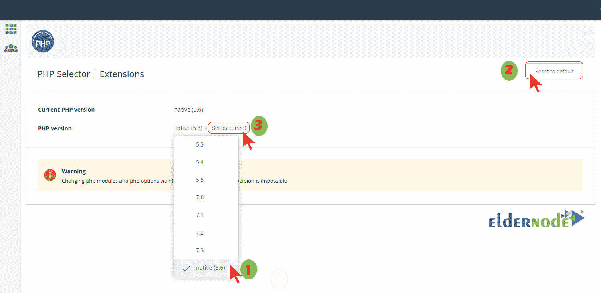

# 如何用两种方法在 Cpanel 中更改 php 版本

> 原文：<https://blog.eldernode.com/change-php-version-in-cpanel/>

在本文中，我们将教你如何在 [Cpanel](https://eldernode.com/category/cpanel/) 中更改 PHP 版本。 **PHP 版本**与网站上安装的模板或插件不兼容会导致几个问题。这些错误中最常见的一个是**错误 500** 。

在大多数情况下，通过更改主机的版本，这种错误很容易在短时间内消除。当然，需要注意的是，这个误差可能还有另外一个来源。

在上一篇文章中，我们教了你如何在 Direct Admin 中修改 PHP 版本。在这篇文章中，我们尝试检查在 Cpanel 控制面板上更改 **PHP 版本**的最快方法。

[Eldernode](https://eldernode.com/) 提供安全、快速的 [VPS 托管](https://eldernode.com/vps-hosting/)，卓越的性能特性，以及全天候待命的专业支持团队。

## 如何在 Cpanel 中更改 PHP 版本

### 如何升级主机中的 PHP 版本

在更新之后，每个模板或插件都兼容 **PHP** 的新版本。由于这个原因，旧版本与新版本的 PHP 不兼容，并成为问题。这种不兼容性甚至可能导致插件或网站模板无法正常工作。

这就是更新软件和功能的重要性变得更加突出的地方。由于这些更新是永久性的，所以有可能我们每次都想改变我们想要的版本。

### 如何通过 Cpanel 更改网站的 PHP 版本？

首先登录你的 [Cpanel](https://cpanel.net/) 主机。

此时，在软件部分的控制面板**第一页**上，你要寻找一个名为 **多 PHP 管理器** 的选项。在某些主机上，这一部分可作为 **选择 PHP 版本** 。

#### 如何用多 PHP 管理器在 Cpanel 中更改 PHP 版本

在你的控制面板的主页上，从软件部分，点击短语多 PHP 管理器。

然后您将被带到一个类似于下面的页面。

在这一部分，您将看到您在主机上定义的所有域的地址。只需**激活**你想要的域名旁边的复选框。

现在在 PHP 版本抽屉的**右上角**，选择你最喜欢的 **PHP 版本**。(类似下图)

**最后**，选择版本后，点击应用按钮保存修改。

为了确保该版本与您的网站兼容，请打开您网站的主页和登录页面。如果没有显示公告或**警告**，则该站点与选择的版本兼容。如果您因为任何原因得到一个错误，请尝试其他版本。

#### 如何用选择 PHP 版本在 Cpanel 中更改 PHP 版本

如前所述，软件部分的一些用户没有一个名为多 PHP 管理器的选项。为了改变他们主机的 **PHP 版本**，这组用户必须点击选择 PHP 版本选项。

然后你会看到一个叫做 PHP 选择器的页面。现在只需从 **PHP 版本**中选择你想要的版本。在进行任何更改之前，点击页面右上角**的恢复 为 默认按钮(这将使所选版本重置为默认)。**

****最后**，点击设置为当前链接到应用您的设置。**

****

****注:** 您选择的版本显示在短语当前 PHP 版本前面为**活动版本。**如果该部分没有改变，重复设置。**

**你可以很容易地改变 Cpanel 主机的 PHP 版本。**

****关于运行 Cpanel 的更多信息以及其他相关配置，可以关注下面的链接:****

****[1。在 cPanel](https://eldernode.com/working-with-file-manager-in-cpanel/) 中使用文件管理器 ****

****[2。教程如何将指南从 cPanel 迁移到 direct admin](https://eldernode.com/migration-guide-from-cpanel-to-directadmin/)****

****尊敬的用户**，我们希望您喜欢**如何在 Cpanel** 中更改 PHP 版本，您可以在评论区询问关于本次培训的问题，或者解决 [Eldernode 培训](https://eldernode.com/blog/)领域的其他问题，请参考提问页面部分，并尽快提出您的问题。腾出时间给其他用户和专家来回答你的问题。**

****好运。****