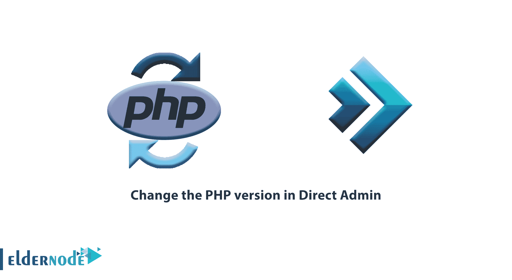
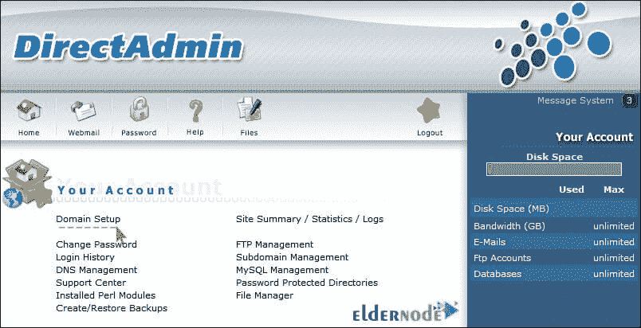
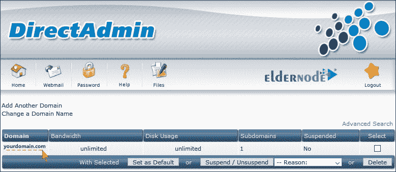
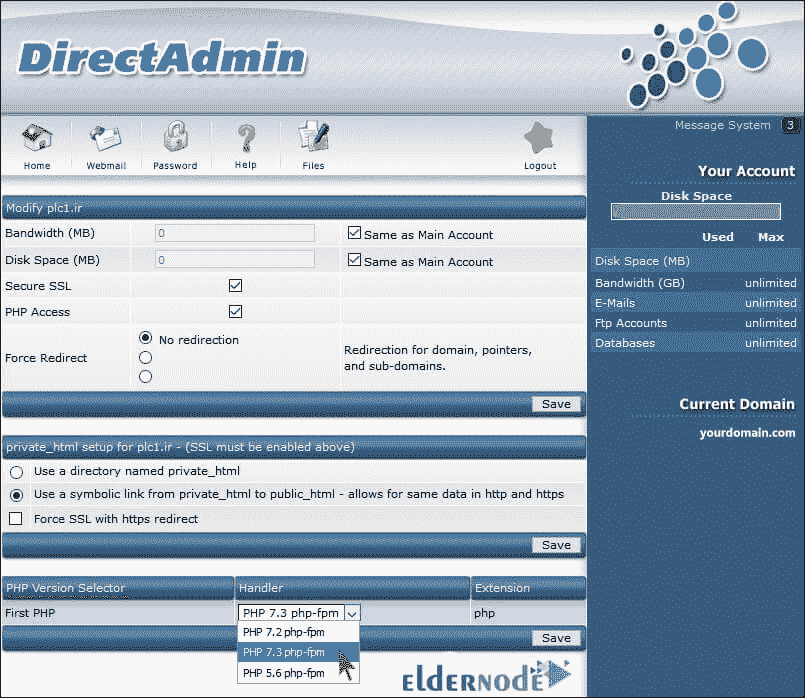
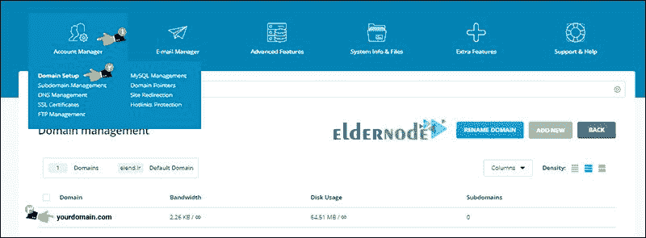
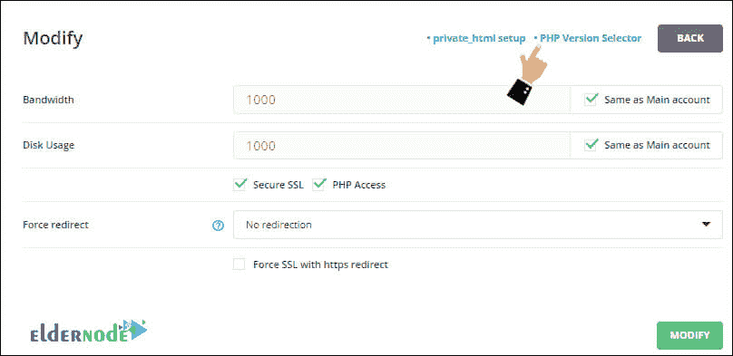
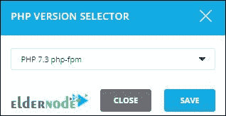

# 如何在直接管理新旧界面中更改 php 版本

> 原文：<https://blog.eldernode.com/change-php-version-in-direct-admin/>

在本文中，我们将教你如何在 [Direct Admin](https://blog.eldernode.com/tag/direct-admin/) 中更改 PHP 版本。在任何类型的主机中，无论是使用 [CPanel](https://blog.eldernode.com/tag/cpanel/) 控制面板还是使用 Direct Admin 控制面板，都可以进行诸如检测当前 **PHP 版本**并对其进行更改之类的更改。

在安装模板或者插件之前，你要了解你的主机的 **PHP 版本**，必要时进行更改。在某些情况下，更改 PHP 版本将修复网站的问题和错误。

在这篇文章中，我们将教你如何在直接管理中改变 PHP 版本。在本教程结束时，您将能够在直接管理中检测 PHP 版本并更改它。

[Eldernode](https://eldernode.com/) 提供安全、快速的 [VPS 托管](https://eldernode.com/vps-hosting/)，卓越的性能特性，以及全天候待命的专业支持团队。

### 如何理解直接管理的 PHP 版本

在[直接管理](https://blog.eldernode.com/tag/direct-admin/)中，可以更改 **PHP 版本**，但必须注意的是，添加所需版本必须由管理服务器通过 [SSH](https://eldernode.com/ssh-connection-softwares/) 完成。为此，首先，管理员将通过控制台添加相关版本，然后在用户主机控制面板中添加一个名为 PHP 版本 选择器的选项。

**注意:** 如果您没有访问此选项的权限，您应该向您的主机支持提出此问题。

### 如何在直接管理中更改 PHP 版本

**1。** 要入门，必须先 [登录 直接管理](https://eldernode.com/how-to-connect-to-directadmin/) 。为此，在浏览器中输入您的站点地址和端口: 2222 。当然，请注意，在某些服务中，由于用户请求和增加的登录安全性，此端口可能已被更改。

在成功登录后，您将看到一个类似于下图的页面，这是您的控制面板用户界面的主页面:

**2。** 在此页面，点击域名设置选项，进入域名设置页面。

下一页显示连接到这些主机的所有域的列表。由于每个域都有自己单独的设置，我们选择要应用更改的域，以进入同一个域的专用设置部分。

**3。本节中的**，仅指页面下方。

如图所示，有一个名为 PHP 版本选择器的部分。这个部分的存在意味着服务器管理员已经通过 [SSH](https://www.ssh.com/) 环境配置了这些版本。现在你可以从这个**下拉列表**中选择你想要的**版本**。

**最后**，点击保存按钮保存所需设置。

### 在新的直接管理中更改 PHP 版本

最近，直接管理的**新版本**可用，并在一些服务器上活跃。那些使用新的 Direct Admin 的用户必须通过以下途径来更改他们的 php 主机版本:

**1。** 首先，**登录**到你的直接管理主机。

**2。** 在**账户管理器**部分，点击域名设置选项，进入域名设置页面。

**3。** 点击你想要的域名。

**4。** 你会被重定向到一个类似下图的页面。点击 PHP 版本选择器选项。

**5。** 点击上面的选项，服务器上定义的 PHP 版本就会显示出来。你可以选择其中之一。

**注意:** 在直接管理中，这个列表中只显示最后两个 PHP 版本。

**6。** **最后**，点击 **保存** 按钮来改变你的主机的 PHP 版本。

**如需了解更多关于运行直接管理和其他相关配置的信息，您可以点击以下链接:**

[1。将备份从 Cpanel 移动到 DirectAdmin](https://eldernode.com/move-backup-from-cpanel-to-the-directadmin/)

[2。如何从一个 DirectAdmin 转移到另一个 direct admin](https://eldernode.com/how-to-move-from-one-directadmin-to-another/)

[3。如何在 DirectAdmin 中启用 atmail](https://eldernode.com/enable-atmail-in-directadmin/)

[4。在 directadmin 中配置 cron 作业](https://eldernode.com/configure-cron-job-in-the-directadmin/)

**亲爱的用户**，我们希望您喜欢**如何在直接管理**中更改 PHP 版本，您可以在评论区询问关于本次培训的问题，或者解决 [Eldernode 培训](https://eldernode.com/blog/)领域的其他问题，请参考提问页面部分并尽快提出您的问题。腾出时间给其他用户和专家来回答你的问题。

好运。