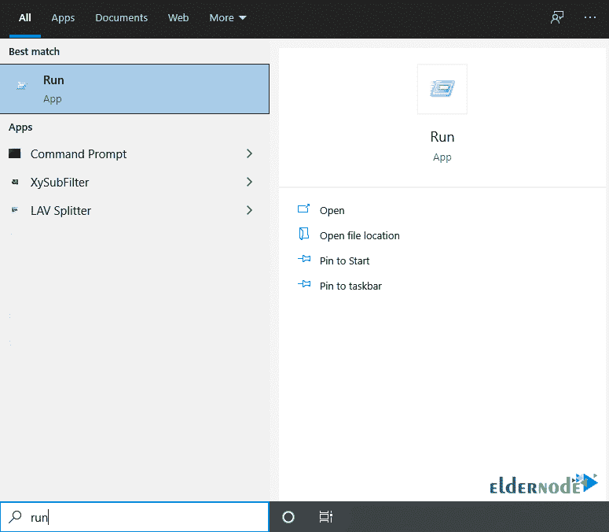
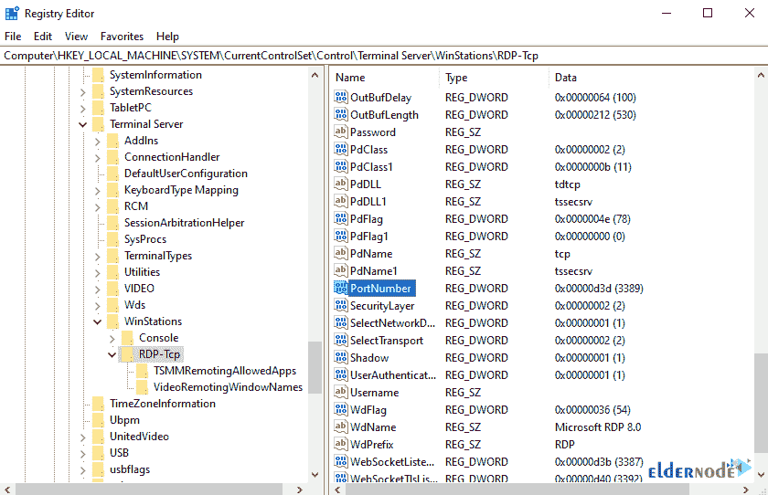

# Windows - Eldernode 博客上的教程更改 RDP 端口

> 原文：<https://blog.eldernode.com/change-rdp-port-on-windows/>


更改远程桌面端口是网络安全考虑因素之一。你可能想知道我们如何保护我们的网络免受黑客攻击。黑客最常见的活动是检查开放的网络端口并攻击它们。为了避免这些攻击，强烈建议取消网络端口的默认设置，并更改默认端口。远程桌面协议(RDP)是当今大多数公司和组织用于远程办公和远程网络管理的最重要的服务之一。在本文中，我们将向您介绍教程**在 Windows** 上更改 RDP 端口。如果你想得到一个 [购买 RDP](https://eldernode.com/buy-rdp/) 服务器，你可以在 [Eldernode](https://eldernode.com/) 中看到可用的软件包。

## **如何在 Windows 上更改 RDP 端口**

为了增加 Windows 服务器中的[安全](https://blog.eldernode.com/tag/security/)因素，服务器管理员改变了远程桌面端口的默认模式(端口 3389)。要更改端口，您必须首先在防火墙中激活端口。请注意，所选端口必须介于 1025 和 65535 之间。在下一节中，加入我们来一步步教你如何在[窗口](https://blog.eldernode.com/tag/windows/)上更改 RDP 端口。

### **为什么改 RDP 港？**

通常，RDP 服务使用 TCP 3389 端口。通过激活这种默认模式，黑客可以很容易地渗透到您的网络。要更改远程桌面端口，您可以出于安全原因将此端口更改为您需要的数量，并保护您组织的网络或内部服务器免受外部和内部攻击。这样做，就可以轻松防止黑客渗透。

所以把端口换成另一个号码最重要的原因是，如果你的 IP 被黑客扫描检查远程桌面访问，端口 3389 将被禁用，你的服务器将被隐藏在视野之外。在下一节中，我们将教你如何在 Windows 上更改 RDP 端口。

## **在 Windows 10 上更改 RDP 端口 2012，2016，2019**

第一步，从**开始**菜单中选择**运行**。



然后在运行窗口中，键入 **Regedit** 然后点击 **OK** 。


现在，在打开的窗口中，转到以下路径:

```
HKEY_LOCAL_MACHINE\System\CurrentControlSet\Control\TerminalServer\WinStations\RDP-Tcp\PortNumber
```



在下一步中，右击文件并选择**修改**。然后输入**十进制**选项和**新端口号**。


*


***注意:*** 为了能够成功连接，您必须按如下方式输入所需端口:

```
YY.YY.YY.YY:PORT
```

现在我们需要进入[防火墙](https://blog.eldernode.com/open-a-port-on-a-windows-firewall/)设置。打开具有高级安全性的 Windows 防火墙，以打开防火墙中的端口。为此，请使用 Windows 搜索功能或从以下路径输入:

开始>>控制面板>>系统和安全> > Windows 防火墙

要添加端口，点击**入站规则**并点击左栏中的**新规则**。


遵循如下所示的步骤:


*


输入所需的描述，点击**完成**。


## 结论

由于黑客在攻击服务器或目标系统时会搜索默认端口，因此应该采取措施来防止这种情况。最实用、最基本的方法之一就是更改默认的 RDP 端口。在这篇文章中，我们试图教你如何一步一步地改变 RDP 端口。如果你愿意，可以参考文章[如何保护 Linux VPS](https://blog.eldernode.com/how-to-secure-linux-vps/) 。