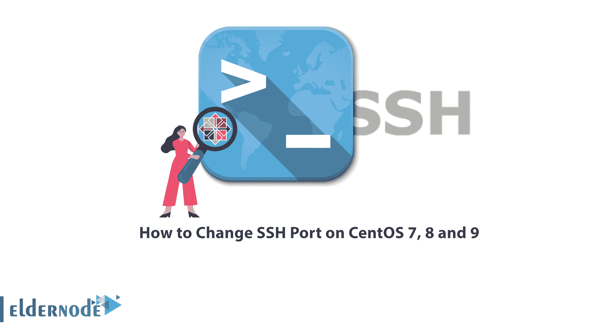

# 如何更改 CentOS 7、8 和 9 上的 SSH 端口- Eldernode 博客

> 原文：<https://blog.eldernode.com/change-ssh-port-on-centos/>



默认的 SSH 服务端口值是 22，在这种情况下，黑客可以通过端口 22 对服务器发起攻击，获得对服务器的控制或对其造成不可修复的损害。为了提高服务器的安全性，您必须更改默认的 SSH 端口。在本文中，您将学习如何在 CentOS 7、8 和 9 上更改 SSH 端口。如果你想购买 [**CentOS VPS**](https://eldernode.com/centos-vps/) 服务器，你可以在 [Eldernode](https://eldernode.com/) 网站查看提供的套餐。

## **教程更改 CentOS 7、8、9 上的 SSH 端口**

### **SSH 端口介绍**

SSH 是一种远程管理协议，允许用户远程控制和修改他们的服务器。此服务是 Telnet 的替代服务，与 Telnet 不同，Telnet 使用加密技术。它为远程用户身份验证、从客户端到主机的数据传输以及到客户端的重新传输提供了一种机制。按照以下步骤更改 CentOS 上的 SSH 端口。在这种状态下，需要重新标记要设置的端口，以便访问控制策略规则可以接受 SSH 服务进行连接。

在下一节中，我们将一步步教您如何在 [CentOS](https://blog.eldernode.com/tag/centos/) 7 和 8 上更改 SSH 端口。

### **更改 CentOS 7 和 8 上的 SSH 端口**

首先登录 CentOS 系统，运行以下命令**备份 SSH 配置**文件:

```
date_format=`date +%Y_%m_%d:%H:%M:%S` 
```

```
sudo cp /etc/ssh/sshd_config /etc/ssh/sshd_config_$date_format
```

然后**用下面的命令确认备份**:

```
ls /etc/ssh/sshd_config* 
```

```
/etc/ssh/sshd_config /etc/ssh/sshd_config_2019_09_05:21:40:10
```

您可以使用任何类型的文本编辑器(vi、vim、nano e.t.c)打开 SSH 配置文件:

```
sudo vi /etc/ssh/sshd_config
```

找到**端口 22** 和**的线路，取消对**的注释，并设置您的新服务端口以供使用；例如，我使用端口 9782:

```
Port 9782
```

保存更改后关闭文件。

如上所述，默认端口标记为 SSH 22:

```
semanage port -l | grep ssh
```

```
ssh_port_t tcp 22
```

为了**在防火墙上打开 SSH 端口**，您应该保持防火墙服务运行，并且只允许可信服务:

```
sudo firewall-cmd --add-port=9782/tcp --permanent
```

```
sudo firewall-cmd --reload
```

使用以下命令**安装防火墙**并启动服务:

```
sudo yum -y install firewalld
```

```
sudo systemctl enable --now firewalld
```

```
sudo firewall-cmd --add-port=9782/tcp --permanent
```

```
sudo firewall-cmd --reload
```

您可以使用以下命令**删除 SSH 服务**:

```
sudo firewall-cmd --remove-service=ssh --permanent
```

```
sudo firewall-cmd --reload
```

运行以下命令**重启 SSH 服务**并应用更改:

```
sudo systemctl restart sshd
```

最后**使用以下命令验证 SSH** 的监听地址:

```
netstat -tunl | grep 9782
```

```
tcp 0 0 0.0.0.0:9782 0.0.0.0:* LISTEN
```

```
tcp6 0 0 :::9782 :::* LISTEN
```

### **更改 CentOS 流 9 上的 SSH 端口**

通过 SSH 控制台首次登录服务器:

```
ssh [[email protected]](/cdn-cgi/l/email-protection)
```

运行下面的命令来**在 Linux 上安装您最喜欢的编辑器** (nano 或 VIM):

```
dnf install nano -y
```

然后**使用以下命令检查防火墙状态**:

```
systemctl status firewalld
```

运行以下命令**安装防火墙**:

```
yum install firewalld
```

现在，您需要使用以下命令再次检查防火墙状态:

```
systemctl status firewalld
```

使用以下命令**启用并启动 Firewalld** 服务:

```
systemctl enable firewalld
```

```
systemctl start firewalld
```

最后，再次检查防火墙状态:

```
systemctl status firewalld
```

运行以下命令**停止防火墙**:

```
systemctl stop firewalld
```

然后**重启防火墙**:

```
systemctl restart firewalld
```

然后使用下面的命令**在 Firewalld 上添加您的自定义 SSH 端口号**。例如，要使用端口 9782，您可以使用以下命令加入白名单:

```
sudo firewall-cmd --add-port 9782/tcp
```

```
sudo firewall-cmd --add-port 9782/tcp --permanent
```

```
sudo firewall-cmd --zone=public --permanent --add-port=9782/tcp
```

然后运行以下命令**重启防火墙**服务:

```
systemctl restart firewalld
```

然后**使用以下命令更改 SSH 端口号**:

```
nano /etc/ssh/sshd_config
```

最后运行以下命令来**重启 SSH** 服务:

```
systemctl restart sshd
```

## 结论

如前所述，黑客可以在默认的 SSH 端口模式下破坏您的服务器，因此您需要更改默认的 SSH 端口来增加您的服务器的安全性。在本文中，我们介绍了 SSH 端口，您了解了如何在 CentOS 7、8 和 9 上更改 SSH 端口。