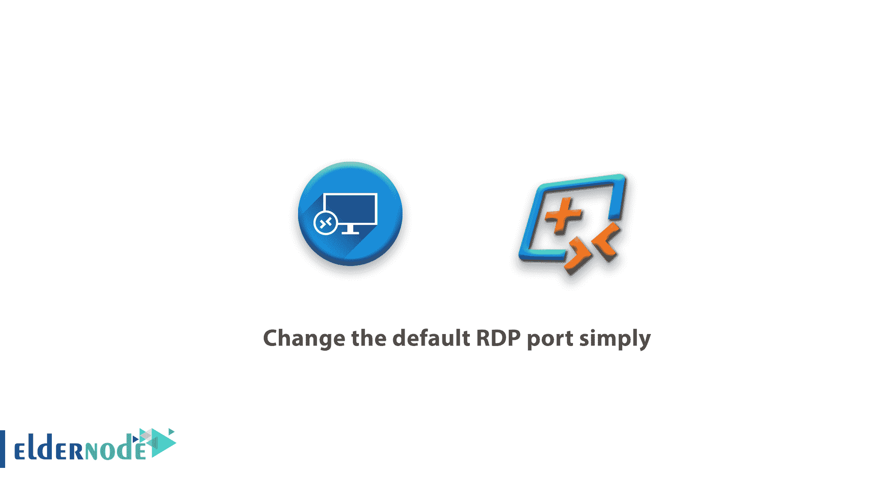
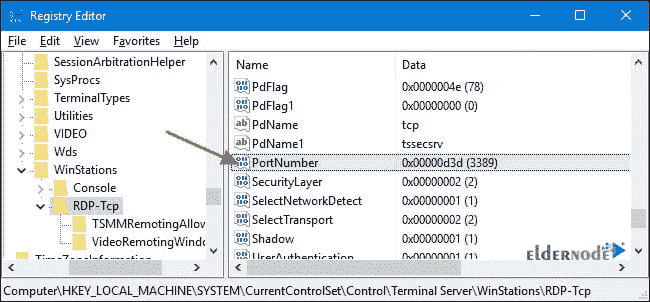
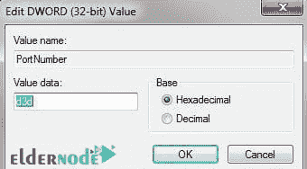
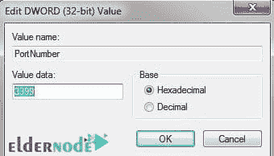
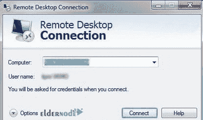

# 了解如何简单地更改默认 RDP 端口- Eldernode 博客

> 原文：<https://blog.eldernode.com/change-the-default-rdp-port-simply/>



【更新日期:2021-01-30】如果我要以合法黑客的身份攻击一家公司的网络或一个组织的网络，第一步就是扫描网络的开放端口。如果同时我意识到目标系统上的端口 3389 是打开的，我肯定会断定我可以使用 RDP 协议和远程桌面连接来连接到这个系统。在本文中，我们将**学习如何简单地更改默认的 RDP 端口**，即 3389。另一方面，我们将学习如何在您更改此端口号后通过远程桌面连接到此系统。这样做可以极大地防止黑客在网络检测的早期阶段检测系统，并为我们提供良好的安全度。你可以访问 [Eldernode](https://eldernode.com/) 提供的包来购买一个 [Admin RDP 服务器](https://eldernode.com/buy-rdp/)。

## **教程简单地改变默认的 RDP 港**

嗯，到目前为止还没有问题，但是如果我在目标系统中找不到这个号码的端口呢？或者我找到一个号码奇怪的端口，但我还没有听到计数！在这篇文章中，跟随我们一步一步地学习如何改变默认的 RDP 端口，以避免潜在的风险。

### **如何改变默认的 RDP 港只需**

[RDP](https://blog.eldernode.com/change-desktop-remote-protocol-from-registry/) 代表远程桌面连接。该协议是用于远程通信的特殊网络协议之一，允许用户在两台计算机之间进行通信并访问远程主机的桌面。在本文中，您将看到如何在[远程桌面](https://blog.eldernode.com/troubleshoot-remote-desktop/)连接中更改默认端口(端口:3389)。

只有拥有新端口号的用户才能与目标系统通信。例如，为此，我们需要将 [TCP](https://blog.eldernode.com/watch-tcp-udp-ports/) 3389 端口更改为 3399 端口号。您选择的端口号可以完全由您决定。

### **使用注册表**更改默认的 RDP 端口

请遵循以下步骤:

1-进入**注册表**部分和以下路径:

```
HKEY_LOCAL_MACHINE\System\CurrentConrolSet\Control\TerminalServer\WinStations\RDP-Tcp
```

2-找到一个名为**端口号**的实体，双击它。

3-将数字 3389 更改为您想要的数字。可能会显示为 d3d 而不是 3389。只要确保其他端口的数量不会干扰，最好是众所周知的端口。

4-确认并退出注册表，然后**重启**系统。

5-系统启动后，您可以使用 **MSTSC 控制台**通过其他系统远程切换到该系统，并输入更改后的端口号。



*



**



最后，您可以通过远程桌面连接到所需的计算机，如下所示。



## 结论

根本不建议使用网络上的默认端口，因为黑客和恶意网络机器人很容易访问这些端口。网络中最重要也是最脆弱的部分之一是远程桌面端口 3389。在本文中，我们试图全面直观地向您介绍如何更改远程桌面的默认端口。