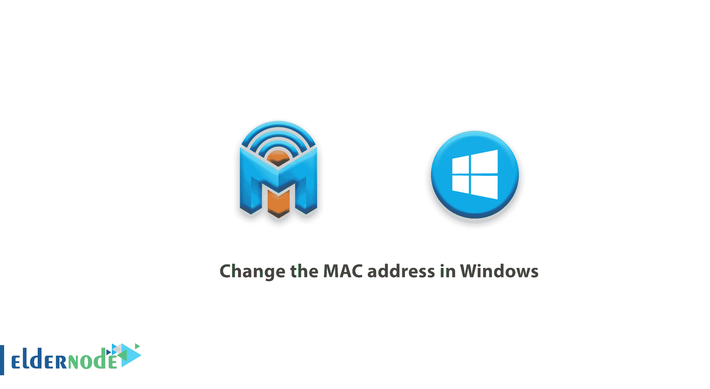
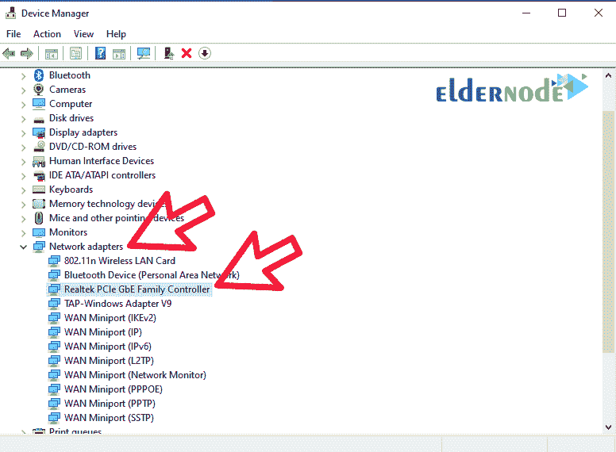
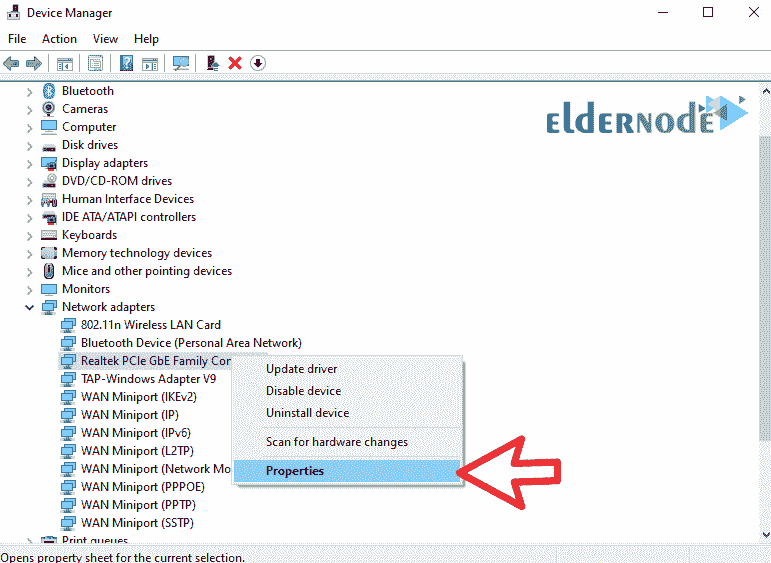
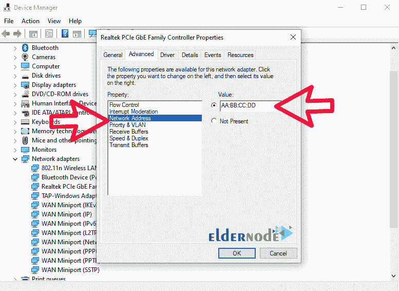

# 如何更改 Windows - ElderNode 博客中的 MAC 地址

> 原文：<https://blog.eldernode.com/change-the-mac-address-in-windows/>

了解如何在 Windows 中**更改 MAC 地址。在操作系统上更改 MAC 地址有许多原因，您可能出于各种原因需要这个技巧。同时，还有被防火墙屏蔽、网络中断、安装与 [MAC 地址](https://en.wikipedia.org/wiki/MAC_address)兼容的软件许可证等原因。，您可能需要更改 MAC 地址。你可以从 [Eldernode](https://eldernode.com/) 在线购买便宜的 [Windows VPS](https://eldernode.com/windows-vps/) 服务器。关注我们，了解如何在 Windows 中更改 MAC 地址。**

## 了解如何在 Windows 中更改 MAC 地址

**1。**首先，按下 **Winkey+R** 打开 **Run** 窗口。

**2。**输入短语 **devmgmt.msc** ，点击 **ok** 。

**3。**在**设备管理器**窗口中，点击**网络适配器**显示您的网络适配器。

**4。**然后**在您想要更改其 MAC 地址的适配器上右击**并选择**属性**。

**5。**在此部分，进入**高级**选项卡，在左侧菜单中选择**网络地址**。然后在左边的字段中输入您想要的 Mac 地址。

**6。**输入所需的 MAC 地址后，点击**应用**，然后点击**确定**应用设置。

**7。**然后**重启**你的系统一次或者**禁用**和**重新启用**你的网卡一次。

**8。**现在你可以在 [CMD](https://docs.microsoft.com/en-us/windows-server/administration/windows-commands/cmd) 中输入 **ipconfig /all** 命令来查看你的 Mac 适配器的地址并确保它改变了。

***注意:*** 如果你的**网卡**没有考虑到你所做的改动，那么操作过程没有问题，你的网卡不会允许改动。但是 Windows 10 中安装的**虚拟卡**将拥有更改 MAC 地址的全部能力。

**结论**

你不能忽视的是，电脑上的网络设置并不是那么简单和吸引人，总有一个小小的错误，就可能切断你的上网。但是如果你面对的是需要更改 MAC 地址的情况，应该说幸运的是只要你知道自己在做什么，这个过程会非常简单和短暂。在这篇文章中，我们试图教你如何在 Windows 中更改 MAC 地址。