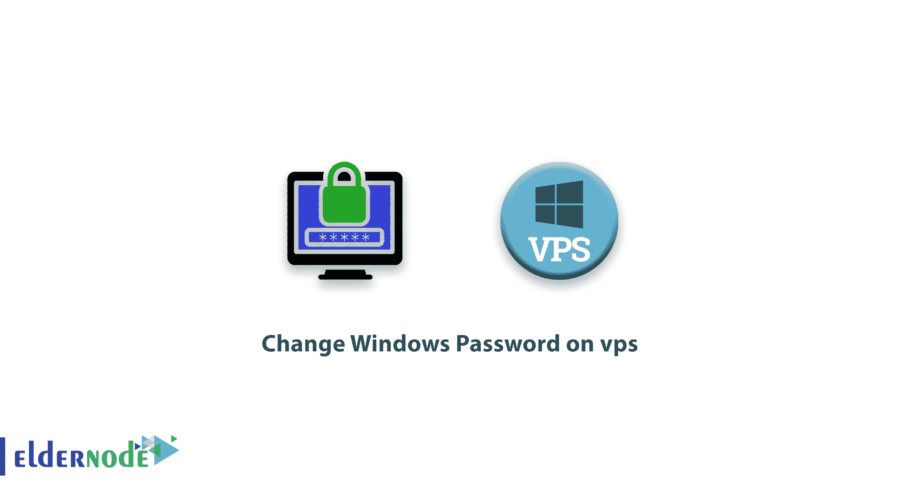
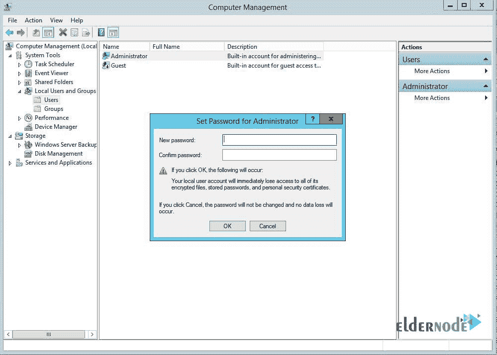

# 如何在 vps 上更改 Windows 密码- windows 密码更改

> 原文：<https://blog.eldernode.com/change-windows-password-on-vps/>

购买 [VPS 服务器](https://eldernode.com/vps/)后的安全措施之一是更改其密码。出于安全原因，您可能需要更改 Windows 服务器上的密码。更改您的 [Windows VPS](https://eldernode.com/windows-vps/) 服务器密码并不困难，您可以通过几个简单的步骤来更改您的密码。在这篇文章中，我们将向你展示**如何在微软视窗服务器的 VPS** 上更改视窗密码。每当您需要在 VPS 或[专用服务器](https://eldernode.com/dedicated-server/)上更改您的服务器管理员密码时，您可以按照以下步骤进行。

## 教程更改 VPS 上的 Windows 密码

防止操作系统密码泄露的一种方法是定期更改密码。通常，人们倾向于在从托管公司收到 VPS 服务器后更改服务器密码。需要注意的是，防止 VPS 服务器被黑客攻击的最好方法之一就是修改它的密码。所以在这篇文章中，我们将向您介绍如何在 VPS 上更改您的 [Windows](https://blog.eldernode.com/tag/windows/) 密码。

本教程适用于所有 Windows 服务器系列，如 windows server 2019、windows server 2016、windows server 2012 和 2012R2、windows server 2008 和 2008 R2，您也可以使用这些步骤在所有客户端窗口(如 windows 10、windows 8、windows 7 等)上重置密码。考虑使用强密码使您的 Windows 服务器更加安全。

### 更改 VPS 上的 Windows 密码

要在 MS Windows Server 中更改您的服务器管理员密码，请按照下列步骤操作:

**1-** 通过远程桌面登录您的服务器。

**2-** 按下 **Windows+R** 并键入*lusrmgr . MSC*

**3-** 展开本地用户和组。

**4-** 点击**用户**。

**5-** 右键点击**管理员**。点击**设置密码** > > **进行**。

**6-** 在两个字段中输入新密码，然后按**确定**。

就是这样！您现在已经更改了您的 windows server 密码。

这些步骤适用于所有 Windows server 2008、Windows Server 2012、Windows Server 2012R2、Windows Server 2016、Windows Server 2019 以及所有客户端 [Microsoft](https://www.microsoft.com/) windows 版本，如 Windows 10、Windows 8 等

如果您对在 VPS 或专用服务器上重置 windows 密码有任何疑问，您可以在下面发表评论。

## 结论

在许多情况下，购买装有 Windows 操作系统的服务器的用户需要更改他们的 Windows 服务器密码，以尽可能保证服务器的安全。所以在这篇文章中，我们试图让你了解如何在 vps 上更改 Windows 密码。