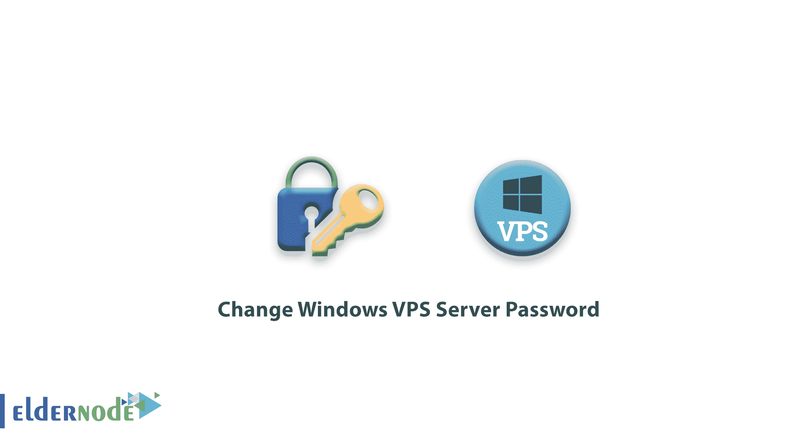
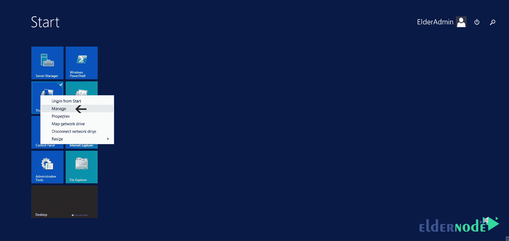
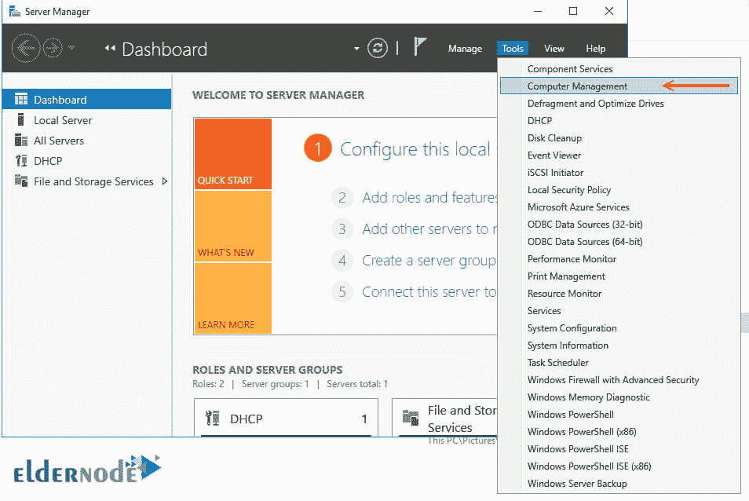
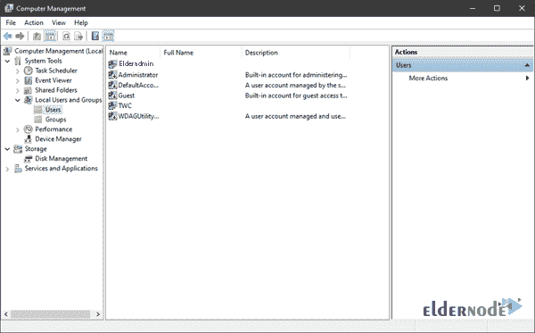
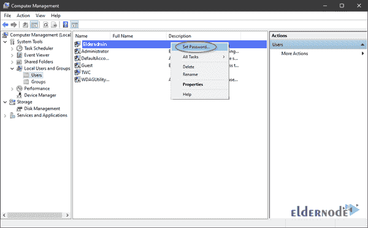

# 更改 Windows VPS 服务器密码- Eldernode

> 原文：<https://blog.eldernode.com/changing-windows-vps-server-password/>

更改 Windows VPS 服务器密码。防止操作系统密码泄露的一种方法是定期更改密码。在这篇文章中，我们将教你如何改变一个 [Windows vps](https://eldernode.com/windows-vps/) 服务器的密码。

请记住，为了 Windows 服务器的安全，请使用强密码。

要更改您已登录的 [vps 服务器](https://en.wikipedia.org/wiki/Virtual_private_server) (windows)的密码，步骤如下:

1.首先，**右键** 我的电脑。

2.点击管理。

3.在打开的页面中，从**工具**菜单中选择电脑管理。

4.然后选择本地用户和组选项和用户文件夹。

5.现在右击**管理员**并选择设置密码。

6.点击继续并输入两次新密码。

如果您成功更改密码，将显示消息“密码已发送”。

**尊敬的用户**，我们希望您能喜欢这个[教程](https://eldernode.com/category/tutorial/)，您可以在评论区提出关于本次培训的问题，或者解决[老年人节点培训](https://eldernode.com/blog/)领域的其他问题，请参考[提问页面](https://eldernode.com/ask)部分，并尽快提出您的问题。腾出时间给其他用户和专家来回答你的问题。

好运。

Goodluck.