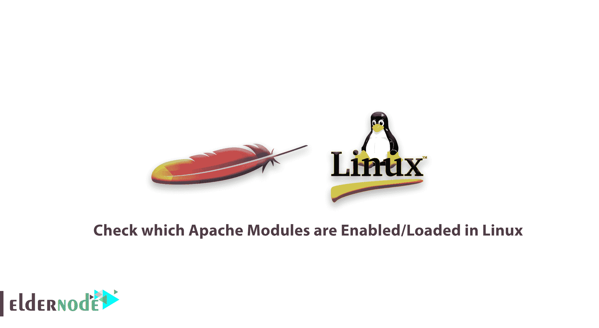

# 如何检查在 Linux - Eldernode 中启用/加载了哪些 Apache 模块

> 原文：<https://blog.eldernode.com/check-apache-modules-linux/>



一个 Linux 系统管理员需要知道一些 [Linux](https://www.linux.org/) 的小技巧。在本文中，您将学习**如何检查哪些 Apache 模块在 Linux** 中被启用/加载。

加入我们来讨论 Apache web 服务器前端，以及如何列出或检查您的服务器上启用了哪些 Apache 模块。

此外，让我们提一下，Apache 是基于模块化原则构建的，这样，它使 web 服务器管理员能够添加不同的模块来扩展其主要功能，并增强 Apache 的性能。

## 如何检查 Linux 中启用/加载了哪些 Apache 模块

让我们浏览一下这个指南，向您展示如何检查在 Linux 中启用/加载了哪些 Apache 模块。首先，回顾一些常见的 Apache 模块，包括:

1.  **mod _ SSL**——为阿帕奇提供 HTTPS。
2.  **mod _ rewrite**——允许用正则表达式匹配 URL 模式，并使用执行透明重定向。 [htaccess](https://eldernode.com/htaccess-tricks-on-cpanel-linux-host/) 招数，或者应用 HTTP 状态码响应。
3.  **mod _ security**——提供保护阿帕奇免受蛮力或 DDoS 攻击。
4.  **mod _ status**——允许您监控 [Apache web 服务器](https://eldernode.com/install-apache-web-server-debian/) 负载和页面静态

在 Linux 中， **apachectl** 或**apache 2 CTL**命令 用于控制 Apache 的 HTTP 服务器接口，它是 Apache 的一个前端。

显示 **apache2ctl:** 的使用信息

```
apache2ctl help  OR  apachectl help
```

**阿帕契帮**

```
Usage: /usr/sbin/httpd [-D name] [-d directory] [-f file]                         [-C "directive"] [-c "directive"]                         [-k start|restart|graceful|graceful-stop|stop]                         [-v] [-V] [-h] [-l] [-L] [-t] [-S]  Options:    -D name            : define a name for use in  directives    -d directory       : specify an alternate initial ServerRoot    -f file            : specify an alternate ServerConfigFile    -C "directive"     : process directive before reading config files    -c "directive"     : process directive after reading config files    -e level           : show startup errors of level (see LogLevel)    -E file            : log startup errors to file    -v                 : show version number    -V                 : show compile settings    -h                 : list available command line options (this page)    -l                 : list compiled in modules    -L                 : list available configuration directives    -t -D DUMP_VHOSTS  : show parsed settings (currently only vhost settings)    -S                 : a synonym for -t -D DUMP_VHOSTS    -t -D DUMP_MODULES : show all loaded modules     -M                 : a synonym for -t -D DUMP_MODULES    -t                 : run syntax check for config files
```

**Sys V init** 模式和 **pass-through** 模式是 **apache2ctl** 可以工作的两种方式。在 **SysV init** 模式中， **apache2ctl** 采用简单的一个单词的命令，格式如下:

```
apachectl command  OR  apache2ctl command
```

为了进行更多的验证，让我们看看这个例子，要启动 **Apache** 并检查其状态，如果您是普通用户，可以通过使用 [sudo](https://eldernode.com/sudoers-configurations-setting-sudo/) 命令以根用户权限运行这两个命令:

```
sudo apache2ctl start  sudo apache2ctl status
```

检查 Apache 状态

```
**[[email protected]](/cdn-cgi/l/email-protection) ~ $ sudo apache2ctl start**  AH00558: apache2: Could not reliably determine the server's fully qualified domain name, using 127.0.1.1\. Set the 'ServerName' directive globally to suppress this message  httpd (pid 1456) already running  **[[email protected]](/cdn-cgi/l/email-protection) ~ $ sudo apache2ctl status**  Apache Server Status for localhost (via 127.0.0.1)    Server Version: Apache/2.4.18 (Ubuntu)  Server MPM: prefork  Server Built: 2016-07-14T12:32:26      Current Time: Tuesday, 15-Nov-2016 11:47:28 IST  Restart Time: Tuesday, 15-Nov-2016 10:21:46 IST  Parent Server Config. Generation: 2  Parent Server MPM Generation: 1  Server uptime: 1 hour 25 minutes 41 seconds  Server load: 0.97 0.94 0.77  Total accesses: 2 - Total Traffic: 3 kB  CPU Usage: u0 s0 cu0 cs0  .000389 requests/sec - 0 B/second - 1536 B/request  1 requests currently being processed, 4 idle workers    __W__...........................................................  ................................................................  ......................    Scoreboard Key:  "_" Waiting for Connection, "S" Starting up, "R" Reading Request,  "W" Sending Reply, "K" Keepalive (read), "D" DNS Lookup,  "C" Closing connection, "L" Logging, "G" Gracefully finishing,  "I" Idle cleanup of worker, "." Open slot with no current process
```

当在**直通**模式下运行时， **apache2ctl** 可以采用以下语法中的所有 apache 参数:

```
apachectl [apache-argument]  apache2ctl [apache-argument]
```

如果您需要列出所有 Apache 参数:

```
apache2 help    [On **Debian** based systems]  httpd help      [On **RHEL** based systems]
```

[用加密货币](https://eldernode.com/bitcoin-vps/)购买虚拟机

#### 检查启用的 Apache 模块

您可以使用下面适用于您的发行版的命令来检查 Apache web 服务器上启用了哪些模块，其中**-t-D****DUMP _ MODULES**是 Apache 的一个参数，用于显示所有已启用/已加载的模块。

```
 On **Debian** based systems apache2ctl -t -D DUMP_MODULES     OR   apache2ctl -M
```

```
 On **RHEL** based systems $ apachectl -t -D DUMP_MODULES     OR   $ httpd -M  $ apache2ctl -M
```

列出 Apache 启用的加载模块

```
**[[[email protected]](/cdn-cgi/l/email-protection) httpd]# apachectl -M**  Loaded Modules:   core_module (static)   mpm_prefork_module (static)   http_module (static)   so_module (static)   auth_basic_module (shared)   auth_digest_module (shared)   authn_file_module (shared)   authn_alias_module (shared)   authn_anon_module (shared)   authn_dbm_module (shared)   authn_default_module (shared)   authz_host_module (shared)   authz_user_module (shared)   authz_owner_module (shared)   authz_groupfile_module (shared)   authz_dbm_module (shared)   authz_default_module (shared)   ldap_module (shared)   authnz_ldap_module (shared)   include_module (shared)  ....
```

**好样的** ！至此，您已经学会了如何使用 apache 前端工具来列出已启用/已加载的 Apache 模块。

亲爱的用户，我们希望本教程能对你有所帮助，如有任何问题或想查看我们的用户关于本文的对话，请访问 [提问页面](https://eldernode.com/ask) 。也是为了提高自己的见识，准备了这么多有用的教程给 [Eldernode 培训](https://eldernode.com/blog/) 。

**同样，阅读**

[如何降低负载提高站点速度](https://eldernode.com/reduce-load-and-increase-site-speed/)

[如何用 CWP 托管面板](https://eldernode.com/setup-a-web-server-with-a-cwp/)设置 web 服务器

[How to set up a web server with a CWP hosting panel](https://eldernode.com/setup-a-web-server-with-a-cwp/)