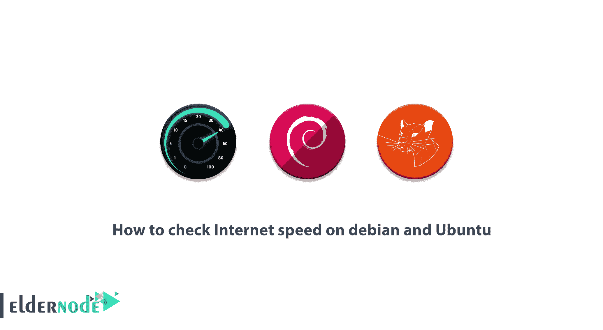

# 如何在 debian 和 Ubuntu - Eldernode 博客上查看网速

> 原文：<https://blog.eldernode.com/check-internet-speed-on-debian-and-ubuntu/>



Speedtest CLI 将 Speedtest 背后的全球服务器网络带到命令行。借助 Speedtest CLI，您可以轻松设置互联网连接的性能标准。这些标准包括自然地装载、卸载、延迟和丢失包裹，而不依赖于网络浏览器。您可以使用 Speedtest 测试服务器网络来测试台式机和服务器的互联网连接。应该注意的是，使用这个工具，可以收集自动脚本来收集连接性能数据，包括随时间变化的趋势。在这篇文章中，我们试图教你如何使用 speedtest-cli 在 debian 和 Ubuntu 上检查网速。你可以在 [Eldernode](https://eldernode.com/) 看到可以购买 [Ubuntu VPS](https://eldernode.com/ubuntu-vps/) 或者 [Linux VPS](https://eldernode.com/linux-vps/) 服务器的包。

## **教程在 Linux debian 和 Ubuntu 上检查网速**

### **在 Linux 上安装 speed test-CLI**

在本文中，我们将向您介绍如何使用两种方法安装 speedtest-cli 工具。第一种方法是使用 Python-Pip 包管理器完成的，第二种方法是手动完成的。请注意，您必须安装 [Python](https://blog.eldernode.com/install-python-3-ubuntu-20/) 2.4-3.4 或您系统的升级版本才能启动。在本教程中跟随我们。

### **如何使用 python-pip** 安装 speed test-CLI

要使用 python-pip 安装 speedtest-cli，您必须首先执行以下命令以 root 用户身份进入:

```
sudo su
```

然后，您需要通过运行以下命令来更新存储库包列表:

```
apt-get update
```

现在您需要安装 pip 包管理器。请注意，以下命令还会安装所需的依赖项:

```
apt-get install python-pip
```

将询问您是否要继续。必须按“ **y** ”。

现在，您需要使用以下命令安装该程序:

```
pip install speedtest-cli
```

```
Collecting speedtest-cli  Downloading https://files.pythonhosted.org/packages/61/8b/58d1de9a7fff3e91c5ab956ab4ba72b49f42d9f73d5f3e248c740dfcc816/speedtest_cli-2.1.1-py2.py3-none-any.whl  Installing collected packages: speedtest-cli  Successfully installed speedtest-cli-2.1.1
```

还应注意，您可以使用以下命令来升级 speedtest-cli:

```
pip install speedtest-cli –-upgrade
```

### 如何手动安装最新的 speed test-CLI

第二种方法是手动安装 speedtest-cli。运行以下命令下载 python 脚本:

```
cd /tmp
```

```
wget https://github.com/sivel/speedtest-cli/archive/master.zip
```

现在，您需要借助以下命令提取下载的文件:

```
unzip master.zip
```

现在，您需要通过执行以下命令来执行提取的脚本:

```
cd speedtest-cli-master/
```

```
chmod 755 speedtest.py
```

***注意:*** 你可以使用下面的命令来防止每次都键入完整的路径。以下命令将可执行文件移动到 **/usr/local/bin** :

```
sudo mv speedtest.py /usr/local/bin/speedtest-cli
```

### 如何使用 speedtest-cli 检查互联网速度

成功完成上述步骤后，您现在可以使用以下命令检查您的互联网连接下载和上传速度:

```
speedtest-cli
```

有趣的是，您可以检查速度的结果，而不是逐字节检查:

```
speedtest-cli --bytes
```

如果您只想获得关于 ping、下载和上传的信息，您应该使用以下命令:

```
speedtest-cli --simple
```

上述命令的输出类似于以下内容:

```
Ping: 5.35 ms  Download: 954.23 Mbit/s  Upload: 186.45 Mbit/s
```

应该注意，使用以下命令可以按公里检查服务器列表:

```
speedtest-cli --list
```

如果您希望根据特定区域的距离限制服务器的搜索结果并检查它们，您必须使用以下命令:

```
speedtest-cli --list | grep –i France
```

您可以使用服务器 ID 来测试特定服务器的连接速度。在以下示例中，服务器 ID 2604 用作示例。

```
speedtest-cli --server [server ID]
```

```
speedtest-cli --server 2604
```

您还可以轻松查看 speedtest-cli 工具的手册和版本号:

```
speedtest-cli --version
```

```
speedtest-cli --help
```

### **如何用 speedtest-cli** 创建网速日志

请注意，此时您可以将 Speedtest-cli 作为 cronjob 运行，以获取互联网速度测试报告。

```
crontab -e
```

您还必须向 crontab 添加以下命令行。添加以下命令后，**保存**以进行应用的更改。

```
30 00 * * * /usr/local/bin/speedtest-cli >> /tmp/speedlog.txt
```

## 结论

最著名的网速测试网站之一是 [SpeedTest](https://www.speedtest.net/) 。当然，通过连接到它和它在世界各地的众多服务器，你可以测量你的网速。对于 Linux 操作系统，这个网站设计了一个叫做 Speedtest-cli 的工具，运行在 Ubuntu 和 Debian 环境下，测试互联网的速度。在这篇文章中，我们试图向你学习如何在 debian 和 Ubuntu 上检查网速。如果你想知道你的网速状况，你可以使用本文提供的解决方案。