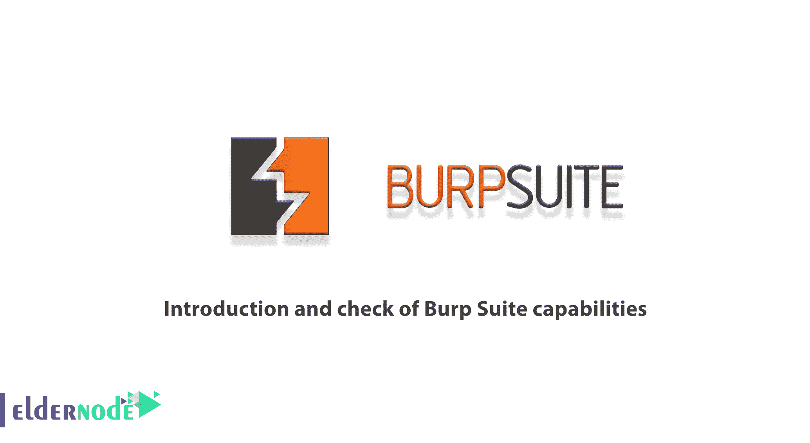
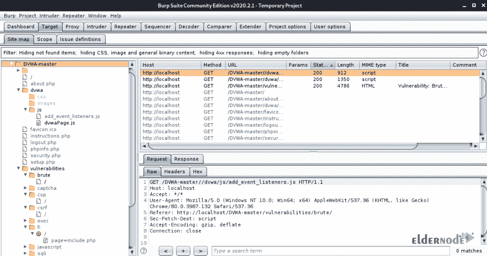
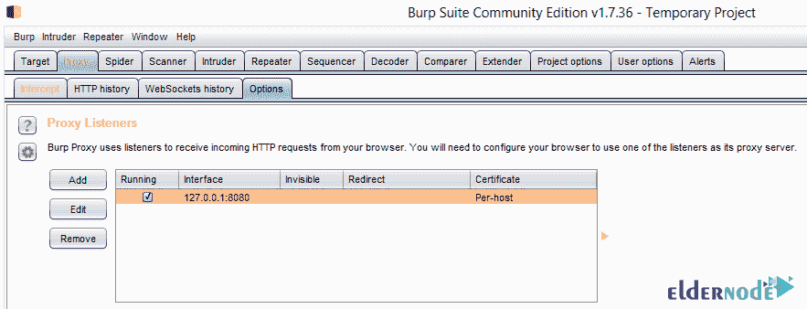
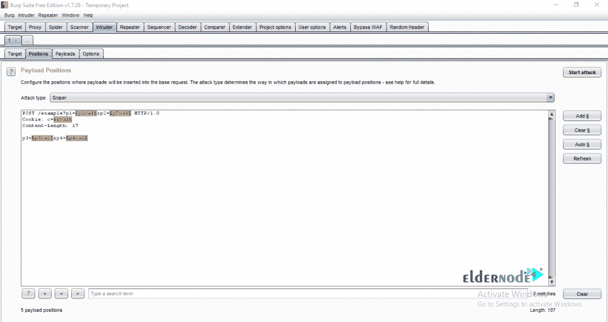
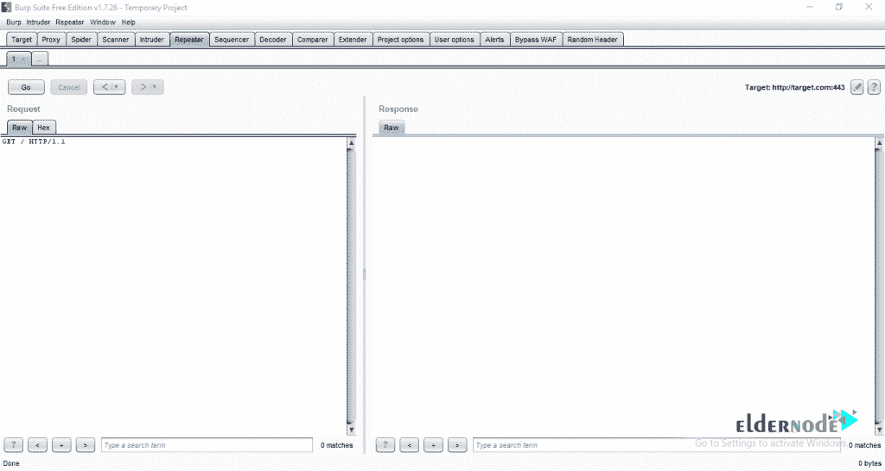
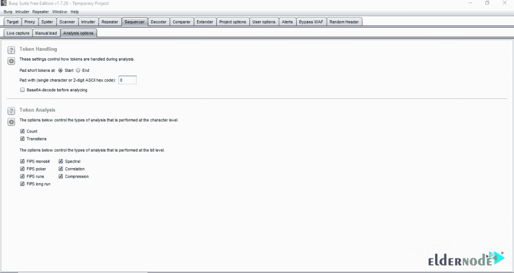
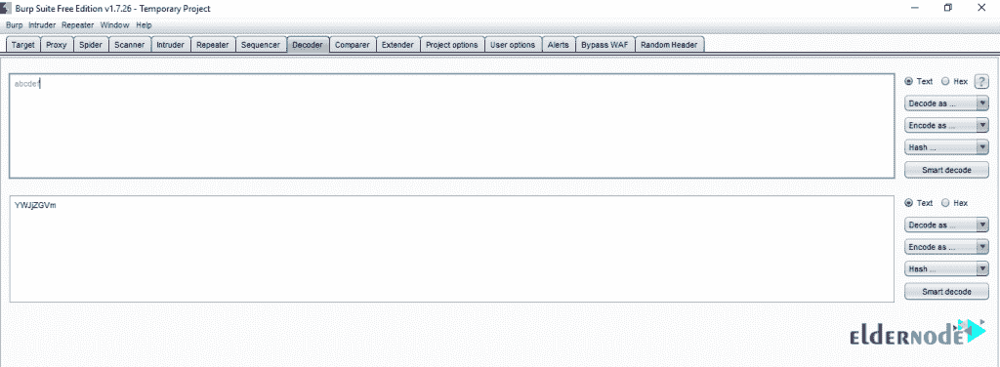

# Burp 套件功能介绍和检查- Eldernode 博客

> 原文：<https://blog.eldernode.com/check-of-burp-suite-capabilities/>

Burp Suite 是一款用于 web 应用安全检查的应用软件。该软件包括为您提供现代功能软件的工具。需要注意的是，这个软件是由 Portswigger 提供的，发布了两个版本，专业版和免费版。这个程序给用户完全的控制权，并允许他们结合不同的和先进的技术。因此，它使工作更快，更有效，更愉快。Burp Suite 非常简单、容易和可配置，并且有许多强大的功能来帮助那些测试软件的人。它的专业版包括多种工具和一个自动扫描仪。同时，免费版本是完整的，包括所有的基本工具。在这篇文章中，我们打算为您提供一个**介绍和检查打嗝套件功能**。如果你想买一个 **[VPS 服务器](https://eldernode.com/vps/)** ，你可以在 [Eldernode](https://eldernode.com/) 中看到可用的包。

## **介绍打嗝组曲**

Burp 套件是防御和进攻安全中最有吸引力的工具之一。这个工具是作为一套工具或一个平台在 web 应用程序上执行[安全](https://blog.eldernode.com/tag/security/)测试。这个工具包中的各种工具可以协同工作，为您提供对 Web 应用程序安全测试过程的全面支持。

有时，您可以使用 Burp 套件来识别 Web 应用程序中的软件和安全缺陷。您甚至可以在分析后使用相同的工具对 Web 应用程序执行所需的攻击，并识别该软件中的漏洞。

### **什么是打嗝组曲**

Burp Suite 是一个用于检查和测试网络中软件安全性的集成软件。该计划的各种工具无缝协作，以完成安全测试的所有阶段。从最初的规划到检测各种软件的风险，发现病毒，修复网络安全缺陷和弱点。

打嗝软件易于使用和生产。以便用户在第一次使用时可以很容易地使用它。这个程序可以在任何情况下使用，并有许多有效的功能，以帮助大多数专业用户。Burp 软件让您完全控制，将基本技术与最先进的自动化工具相结合，运行更快、更有效，并享受工作。

在这篇文章的后续部分，请加入我们，让您熟悉 Burp Suite 的模块和功能。

### **打嗝套件软件环境**

在本节中，我们将回顾 Burp Suite 软件选项卡，包括以下内容:

**目标:**您可以使用该工具收集所有 web 应用资源进行识别。

**代理:**使用[代理](https://blog.eldernode.com/setup-proxy-on-burp-suite/)选项卡，可以分析和编辑所有 web 应用流量。

**蜘蛛:**这个工具可以让你按照特定的算法和模式浏览互联网。

**扫描器:**仅专业版才有的全面的 web 应用安全扫描器。

**入侵者:**使用这个工具，你可以自动化所有的 web 应用请求，发现安全漏洞。

**Repeater:** 用于编辑和提交 web 请求的强大工具。

**Sequencer:** 用于检查令牌和 cookies 等的工具。

**解码器:**这允许你解密或加密数据。

比较器:这个工具用来查找网页上的变化。

### **打嗝套件模块介绍**

Burp Suite 为您提供了高级功能，允许您手动更改 web 应用程序的数据输入。Burp Suite 应用广泛，尤其是在基于 web 的软件的黑客攻击和渗透测试领域，但该软件的重要模块如下:

**代理模块:**Burp Suite 工具可以通过将自己作为中间代理服务器来窃听客户端和 web 服务器之间的流量。它还可以对 URL 提交的请求进行必要的修改。

**蜘蛛模块:**像谷歌爬虫一样，可以检查一个网站的所有页面，并列出其内容。

**专业的 Web 安全扫描器:**该扫描器工具可以扫描并识别网站内大量已知的 Web 漏洞。

**入侵者工具:**使用该工具，您还可以在使用 Burp 识别漏洞后执行攻击。

**Repeater 工具:**使用这个工具，你可以从客户端接收特殊的请求，经过处理后发送给服务器。

**定序器工具:**用于测试通信会话令牌。

## **检查打嗝套件功能**

Burp Suite 为您提供了高级功能，允许您手动更改 web 应用程序的数据输入。它也允许你在安全领域工作。以下是 Burp Suite 的 7 个特点:

1.能够查看并减少浏览器和目标应用程序之间的数据量

2.秘密检查，悄悄审查节目的内容和表现

3.先进的网络扫描器，检测和识别各种类型的缺点和弱点

4.清洁工具，用于有目的和强有力的攻击错误和修复不寻常的损害

5.用于重新运行和发送特定请求的复制工具

6.用于随机测试输入的序列工具，能够保存您的操作并在其他时间继续工作

7.扩展性，即执行自定义附件的能力，在 Burp 程序中执行非常具体和复杂的任务

## 结论

Burp Suite 是入侵测试工程师和工作是在网络软件和网站中查找 bug 的人使用最广泛的工具之一。在本文中，我们试图向您介绍 Burp Suite 并检查它的重要功能。如果你愿意，你可以阅读我们关于如何在 Debian 10 和 [Kali Linux](https://blog.eldernode.com/configure-burp-suite-on-kali-linux/) 上安装 BurpSuite 的文章。