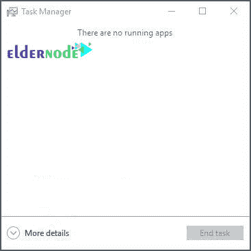
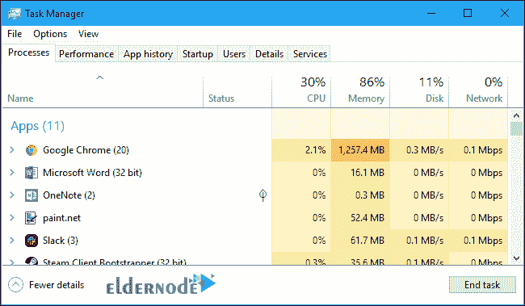
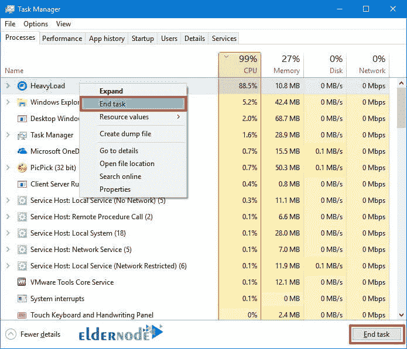
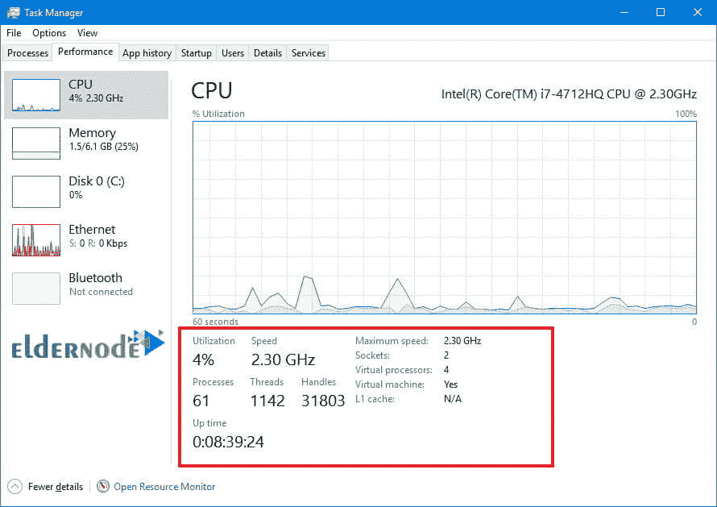
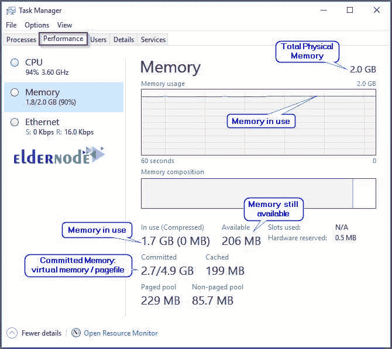
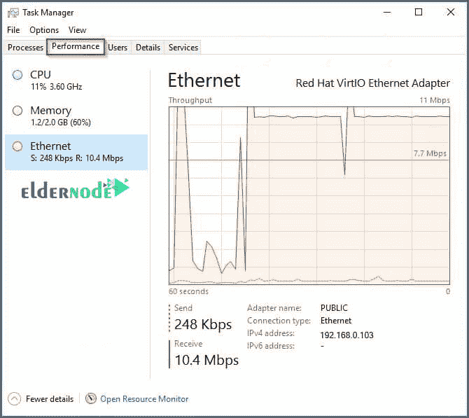
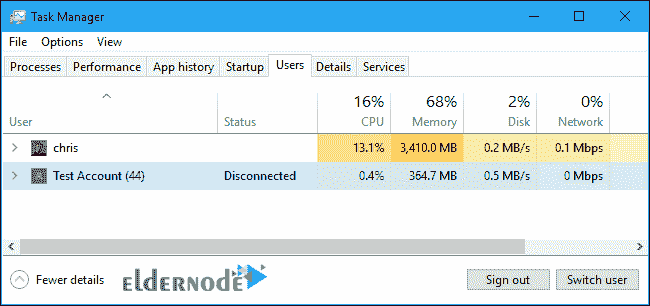
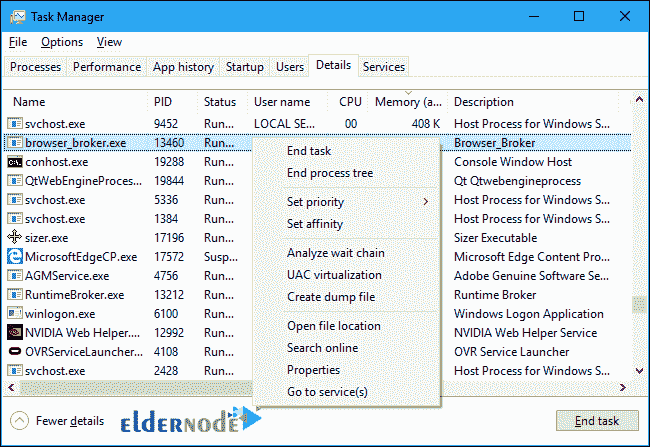
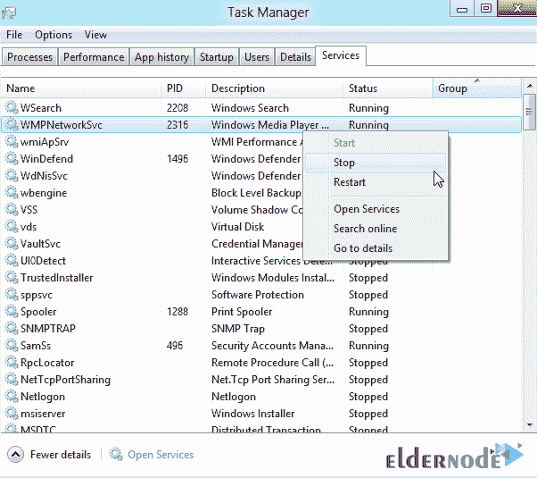
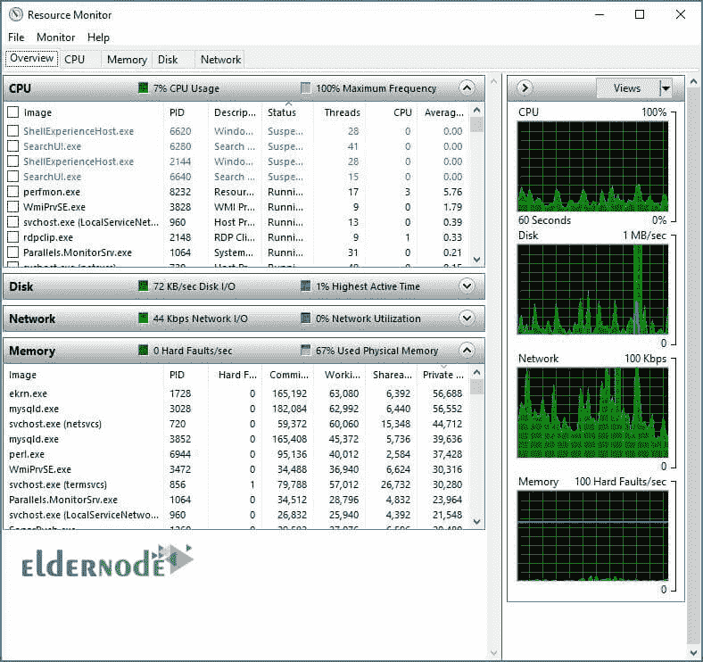

# 如何在 Windows Server - ElderNode 博客上检查服务器负载

> 原文：<https://blog.eldernode.com/check-server-load-on-windows-server/>

如何检查 [Windows 服务器](https://eldernode.com/tag/windows-server/)上的服务器负载？托管公司服务器管理的重要任务之一是**监控**服务器负载。服务器负载监控并确保服务器负载不会过高，确保主机管理人员硬件处于良好状态，并防止停机。

在本文中，我们将探讨如何找到服务器上的负载，并且在熟悉这个概念的同时，提供管理负载的解决方案。

虽然有许多工具和选项可用，但我们专注于我们的 [Windows VPS](https://eldernode.com/windows-vps/) 任务管理器，以帮助我们快速了解正在发生的事情，并与应用、进程和服务进行交互，以识别负载。

## 如何启动 Windows 任务管理器

**–第一种方式:** 点击开始菜单，输入任务管理器然后选择。

**–第二种方式:右击**任务栏区域，从菜单中选择任务管理器。

**–第三种方式:** 在[远程桌面](http://eldernode.com/tag/remote-desktop/)会话时按键盘上的 **Ctrl+Alt+End** 键。

**–第四种方式:** 运行命令 taskmgr 。

**如何在 Windows 服务器上检查服务器负载**

让我们看看任务管理器提供了什么。

您可以点击更多详细信息在该窗口中了解更多信息。

任务管理器提供了对流程、性能、用户、细节和服务的快速访问。

我们将浏览每个选项卡，看看它们能提供什么，并发现在**检查服务器负载**时要寻找什么。

### 1) 流程页签

进程选项卡向我们显示系统中正在运行的一切，以及它正在使用的 CPU 和内存资源的数量。

在顶部，你可以看到总 CPU 和内存利用率。

通过**点击**CPU或内存列标题，您可以**根据该标准对进程列表进行排序**。您还可以使用排序箭头来确定是从最高使用率到最低使用率排序，还是相反。

你可以**点击任意单个进程上的**和结束任务，查看资源使用，等等。

### 2) 性能选项卡

性能选项卡具有最直观的信息显示，并允许您从 CPU 、内存和以太网视图中进行选择，以显示 60 秒内的活动。

有了这个视图，您可以识别峰值或查看一段时间内的趋势，以确定某个状况是暂时的还是持续的。

#### CPU 性能

CPU 性能信息向您显示 CPU 的**类型**和**速度**，使用中的、线程和句柄的数量，以及大多数情况下虚拟 CPU 的数量。

您还可以看到系统已经运行了多长时间(正常运行时间)。

这最后一点信息可以告诉您服务器已经运行了多长时间，确认它是否成功完成了重启，或者它是否由于资源耗尽而意外重启。

#### 内存性能

内存性能信息向您显示系统中内存的总量**，以及中有哪些和可用。**

**代表[虚拟内存](https://en.wikipedia.org/wiki/Virtual_memory)和磁盘上的页面文件(RAM 的扩展)。**

****缓存** 代表 Windows 使用的内存， **分页池** 代表 Windows 使用的内存，如果内存开始不足，可以将这些内存分页到磁盘上的页面文件中。**

****未分页的** 不能分页到页面文件。**

****

#### **以太网性能**

**以太网性能信息向您显示**类型的网络适配器**以及它使用的资源数量，用一条曲线表示出站和入站流量，以及正在发送的数据的数值。**

**您还可以看到分配的适配器名称、连接类型和 IP 地址 (es)。**

****右键点击图上的**，可以看到网络详情，包括网络利用率、链路速度、状态、**字节** 发送和接收等。**

**在 **Performance 选项卡**上，您还可以选择启动 Resource Monitor 来查看更多细节。**

****

### **3) 用户标签**

**用户标签向您显示连接到服务器的所有用户列表，以及用户使用了多少 CPU 和内存资源。**

**你可以点击某个特定用户的**来断开他们的连接，给他们发送消息，或者接管他们的会话，如果我们有管理员权限的话。****

**在检查负载的上下文中，您可以确定特定用户是否消耗了过多的资源或者已经从会话中断开，让它在内存中运行，并选择是否注销用户以释放资源。**

****

### **4) 明细页签**

**详细信息标签向您显示所有正在运行的程序和进程的列表，以及它们的 **PID** ( 进程 ID )编号、程序是正在运行还是暂停、运行时的用户名、正在使用的 CPU 和内存的数量，以及进程的描述。**

**您可以**单击**任何列名，按照该列从高到低或相反的顺序进行排序。**

**PID 号非常有助于追踪事件日志中引用的特定进程。**

****右键单击**一个项目可让您选择选项，包括:**

****–**结束一个流程或流程树**

****–**为运行过程设置优先级**

**–建立与特定处理器或所有处理器的关联**

****–**附加选项**

****

### **5) 服务标签**

**服务选项卡向您显示服务名称的列表、它们的 PID ( 进程 ID 号)、服务的描述、作为**停止**或**运行**的状态，以及服务运行的组。**

****右键单击服务上的**可以让您启动、停止、重启，并访问附加选项。**

**您应该小心不要更改某些服务的状态，因为它们依赖于其他服务，停止错误的服务可能会对系统或设备产生意想不到的后果。**

**要了解某项服务的更多信息，您可以**右键单击**并选择在线搜索。**

****

****如何在 Windows 服务器上检查服务器负载****

## **启动资源监视器的方式**

****

****–**点击开始菜单，输入资源监视器然后选择。**

****–右击任务栏区域**，从菜单中选择任务管理器。**

**然后从**性能选项卡**选择打开资源监视器。**

****–运行**命令 resmon 。**

**概览为您提供了关于 CPU 、内存、磁盘和网络选项的数据和图表，所有这些都在一个页面上，并且可以选择展开或折叠每个部分。**

**它还会显示资源的当前使用量(T0)以及最长活动时间(T3)的 T2。**

**单击单个部分可提供更多详细信息。**

****

##### 

****一。 CPU****

****B 。内存** 除了显示物理内存的细目外，还显示进程和图形，以显示与页面文件的使用相关的提交费用和每秒的硬故障数，这可以指示 Windows 必须访问交换文件的次数。**

****注意:** 如果您的系统每秒显示数百个硬故障，这表明需要更多的物理内存。**

****C 。 Disk** 除了显示每个任务读写磁盘的数量之外，还显示了进程。**

**除了队列长度之外，图还显示了总的磁盘活动。**

**磁盘队列长度表示有多少磁盘 I/O 操作排队等待由磁盘处理。**

**如果发现最高活跃时间在 80%以上，磁盘队列长度为 2 或更长，说明进程正在等待，磁盘的性能正在影响系统的整体性能。**

**在许多情况下，这个数字会很高，因为系统缺少足够的物理内存，并且经常将信息分页到磁盘，或者过于依赖虚拟内存。它通常伴随着持续时间超过 90%的 CPU 运行。**

****D 。网络** 显示有网络活动的进程，此外还有 TCP 连接和监听端口，以及显示网络传输和 TCP 连接的图形。**

**持续的高网络利用率可能表明存在拥塞问题，需要更多容量。**

****尊敬的用户**，我们希望您能喜欢这个[教程](https://eldernode.com/category/tutorial/)，您可以在评论区提出关于本次培训的问题，或者解决[老年人节点培训](https://eldernode.com/blog/)领域的其他问题，请参考[提问页面](https://eldernode.com/ask)部分，并尽快提出您的问题。腾出时间给其他用户和专家来回答你的问题。**

**如何在 Windows 服务器上检查服务器负载。**

**好运。**