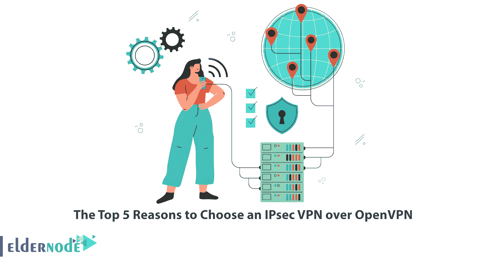

# 选择 IPsec VPN 而不是 OpenVPN 的五大理由

> 原文：<https://blog.eldernode.com/choose-an-ipsec-vpn-over-openvpn/>

VPN 协议是一组规则，指定数据如何通过您的计算机和 VPN 服务器进行路由。这些协议根据使它们彼此不同的条件而具有不同的规范。IPsec VPN 和 OpenVPN 都是 VPN 协议，本文将向您介绍选择 IPsec VPN 而不是 OpenVPN 的五大理由。如果你想买一台 [**便宜的 VPS**](https://eldernode.com/vps/) 服务器，请查看 [Eldernode](https://eldernode.com/) 网站上提供的经济套餐。

## **为什么选择 IPsec VPN 而不是 OpenVPN？**

IPsec 协议或互联网协议安全是一组流行的协议和服务，为 IP 网络提供[安全性](https://blog.eldernode.com/tag/security/)。它保护您在 IP 网络上的互联网流量，并在整个互联网连接中提供加密。该协议工作在两种模式下，包括传输模式和隧道模式，这两种方法都保证了强加密。

[OpenVPN](https://blog.eldernode.com/5-reasons-openvpn-is-better-than-pptp-vpn/) 是一种开源的 VPN 协议，可以针对不同的端口和加密类型进行配置和使用。它支持几种加密算法，最常见的 AES 和 Blowfish。

### **1- IPsec 比 OpenVPN 快**

由于 OpenVPN 是在用户空间实现的，不是很轻量级，所以速度比 IPsec 低。虽然 IPsec 是在内核 IP 堆栈中实现的，并且靠近内核，但它允许快速加密和解密。它通常速度很快。请记住，UDP 上的 OpenVPN 比 TCP 上的 OpenVPN 提供更高的速度。

### **2- IPsec VPN 允许您应用基于 IP 的限制**

IPSec 使用预定义的通信通道(如 UDP 500 和 UDP 4500)创建加密隧道，并使用 ESP 传输加密数据。它允许您基于 IP 应用基于 IP 的限制，并在 TCP/UDP 层执行编码。但是在 OpenVPN 中，你选择使用 UDP 端口或者 TCP。它可以毫无问题地绕过限制性防火墙。

### **3-比 OpenVPN**T3 更安全

这两种协议都使用安全算法进行加密，使用证书进行身份验证。这就是为什么这两种协议都是安全的，但 IPsec 比 OpenVPN 更安全。因为 IPsec 提供了最高级别的加密，并且没有已知的安全漏洞。此外，它支持各种算法和密码，如 RSA，PSK 和其他。而 [OpenVPN](https://blog.eldernode.com/set-up-openvpn-debian-10/) 的漏洞数量有限。

### **4-IPsec VPN 的安装过程更简单**

许多现代操作系统如 Windows、Mac、iOS、Android、Linux、Solaris、FreeBSD、OpenBSD 等都支持 IPsec VPN。此外，您可以直接将它安装在不同的操作系统上，也可以开箱即用。而 [OpenVPN](https://blog.eldernode.com/setup-an-openvpn-server-on-ubuntu-22-04/) 需要额外的软件，默认情况下操作系统通常不会安装这些软件。

### **5- IPsec VPN 更兼容**

IPsec VPN 内置了对多种操作系统和设备的支持。此外，许多桌面和移动操作系统本身支持 IPsec VPN。所以，它不需要第三方应用程序来运行。但是 OpenVPN 不需要内置支持。

我们的网站提供经济实惠的 VPS 服务器套装，如果你需要的话可以购买。

## 结论

IPsec VPN 通过确保数据包的身份验证和加密，在 IP 网络上的两个端点之间提供受保护的通信。在本文中，我们解释了选择 IPsec VPN 而不是 OpenVPN 的五大理由。我希望通过这篇文章的帮助，你可以选择最好的和最适合的 VPN。如果您有任何问题或建议，可以在评论区联系我们。