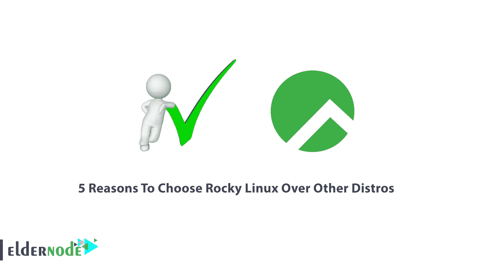

# 选择 Rocky Linux 而不是其他发行版的 5 个理由

> 原文：<https://blog.eldernode.com/choose-rocky-linux-over-other-distros/>

很长一段时间，CentOS 是 Linux 发行版中可靠的选择，尤其是对于服务器。因为它实际上是红帽企业版 Linux 的免费版本。但这一发展震撼了 CentOS 社区，并使主要开发人员之一想到创建 Rocky Linux，经过几个月的开发，Rocky Linux 的介绍版已经准备好并提交了。在这篇文章中，我们将提到选择 Rocky Linux 而不是其他发行版的 5 个理由。如果你想买一台 [Linux VPS](https://eldernode.com/linux-vps/) 服务器，你可以访问 [Eldernode](https://eldernode.com/) 网站上提供的套装。

## 为什么你选择 Rocky Linux 而不是其他发行版？

在本文的其余部分，请和我们一起解释选择 Rocky Linux 而不是其他发行版的 5 个原因。

### **1。**免费的

Rocky Linux 是基于 Red Hat Enterprise Linux 的免费 [Linux](https://blog.eldernode.com/tag/linux/) 发行版。正如我们所说，CentOS 是一个基于 RHEL 的发行版，因为它是一个稳定的发行版，而且不像 RHEL 那样是免费的，所以它是许多公司和开发者的绝佳选择。

### **2。安装**很简单

安装 Rocky Linux 非常容易。为此，只需从 [Rocky Linux](https://rockylinux.org/download/) 网站下载 ISO 镜像文件。然后访问 [Rufus](https://rufus.ie/en/) 网站下载。把安装过程进行到底，最后享受 Rocky Linux。

### **3。**真快

成功安装 Rocky Linux 之后，您会注意到这个操作系统与其他发行版相比速度有多快。

### **4。**很安全

在 Rocky Linux 上，默认情况下禁用通过 SSH 密码认证的远程 Root 登录。这项工作的目的是防止黑客通过暴力攻击渗透系统。但是，可以将其配置为在安装期间或之后允许远程根用户访问。此外，OpenSSL 3.0 对以前的版本进行了新的改进。

### **5。**很可靠

关于 Rocky Linux 的可靠性，需要记住的一点是，赞助商和合作伙伴以及其他非附属公司都可以提供对 Rocky Linux 的商业支持。正因如此，这个新操作系统的受欢迎程度和信任度与日俱增。

## 结论

由于 Rocky Linux 操作系统越来越受欢迎，社区支持也在增加。拥有一个大型的 Rocky Linux 社区意味着这个操作系统是免费的并且得到了很好的支持。在这篇文章中，我们试图向你解释选择 Rocky Linux 而不是其他发行版的 5 个原因。如果你有任何问题，你可以在评论区和我们分享。