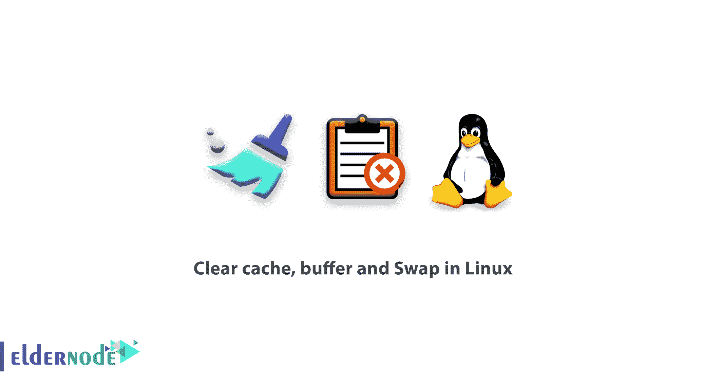

# 清除 Linux 中的缓存、缓冲和交换

> 原文：<https://blog.eldernode.com/clear-cache-buffer-and-swap-in-linux/>



正如你所知道的，任何操作系统都执行它的进程，并且从缓存、缓冲区等方面提高系统的运行速度。Linux 也不例外，也许可以说它比其他操作系统更好地利用了这个主题。相应地，为了管理和清除 Linux 中的缓存、缓冲区和交换区，如果需要的话，为您的用户提供一个删除的解决方案。在这篇文章中，我们将教授 Linux 中清除缓存、缓冲区和交换的命令和解决方案。如果您需要或需要填充 RAM，请使用它们，并降低系统速度以清空 RAM 中的更多空间。需要注意的是，你可以访问 [Eldernode](https://eldernode.com/) 中可用的包来购买一台 **[Linux VPS](https://eldernode.com/linux-vps/)** 服务器。

## **教程清除 Linux 中的缓存、缓冲和交换**

跟随我们学习如何在 [Linux](https://eldernode.com/tag/linux/) 中清除内存缓存、缓冲和交换。

### **什么是清除缓存、缓冲、交换？**

高速缓存是一种 SRAM 或 DRAM 存储器。该内存用于防止处理器和计算机 RAM 之间的处理时间延迟。内存高速缓存通常比计算机中使用的其他内存容量小，速度快。

缓冲区是一个临时位置，用于存储特定应用程序中未被其他应用程序使用的数据。缓冲区就像带宽的概念。当您试图通过网卡无法通过的网络(即没有所需的速度)传递大量数据时，网卡会将这些数据作为缓冲区保存。通过这样做，数据传输将以较低的速度连续不断地进行。

交换空间是系统硬盘的一部分，可以作为一个分区或文件引入 Linux 内核。当 Linux 内核需要更多 RAM 时，它使用交换特性将 RAM 中较少使用的部分复制到交换空间中，并在 RAM 中为自己创建空闲空间。如果需要复制到交换空间的那部分 RAM，就会发生与前面操作相反的情况，换句话说，Linux 内核使用交换空间作为 RAM 的补充。在 Linux 中使用交换空间允许低 RAM 的系统运行更重的程序。还应该注意的是，从 RAM 复制到交换空间可能会降低系统速度，反之亦然。

在下一节中，请加入我们，教您如何在 Linux 中清除内存缓存、缓冲区和交换。

## **如何在 Linux 服务器中清除内存缓存、缓冲区和交换区**

有三种方法可以删除缓存、缓冲区等。，它们是:

1)要仅删除 PageCache，可以输入以下命令:

```
sync; echo 1 > /proc/sys/vm/drop_caches 
```

2)现在，如果您需要删除已创建的 Dentries 和 Inodes，您必须输入命令:

```
sync; echo 2 > /proc/sys/vm/drop_caches 
```

3)最后，如果您考虑删除所有的**页面缓存**、**条目**和**窗口**，您必须输入如下命令:

```
sync; echo 3 > /proc/sys/vm/drop_caches 
```

这样，您就熟悉了 Sync 命令的功能，从现在开始，您可以使用它来清除缓存。最后，值得注意的是，您可以在某些时候以及当 Linux 服务器长时间没有重新启动时使用这个命令。

***注意:*** 重复使用该命令可能会中断 Linux 的性能并运行内核进程，因此应避免连续使用。

您还可以在 Cron 中使用该命令，在服务器上出现 24 或 48 小时的高压后自动清除。

## 结论

在本文中，我们试图向您传授关于 Linux 中清除缓存、缓冲区和交换的有用信息。如果愿意可以参考文章[如何在 Ubuntu 20.04](https://blog.eldernode.com/add-swap-space-on-ubuntu-20-04/) 上添加交换空间。