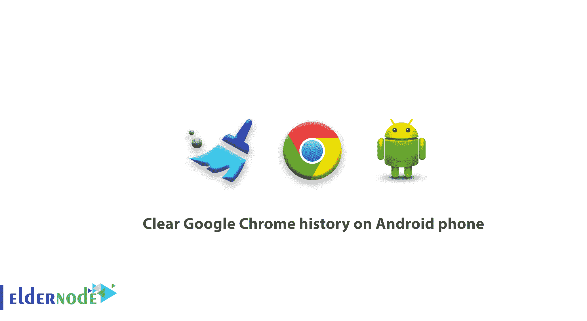
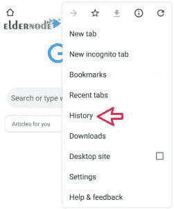
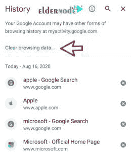
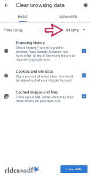
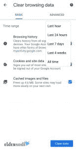
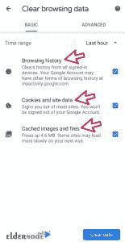

# 如何清除 Android 手机上的谷歌 Chrome 历史记录

> 原文：<https://blog.eldernode.com/clear-chrome-history-on-android/>

如何清除安卓手机上的谷歌 Chrome 历史？你可能也想在你的**手机**上清除你的谷歌搜索历史，但是不知道怎么做。步骤与[在 PC 和笔记本电脑上清除谷歌 Chrome 浏览器](https://eldernode.com/clear-google-chrome-browser-history/)历史的步骤非常相似，但为了让你更清楚，我们将解释所有步骤。

**[在 Eldernode](https://eldernode.com/windows-vps/)** 选择您的完美 Windows 虚拟专用服务器包

在这篇文章中，我们将教你如何清除你的谷歌 Chrome 浏览器历史记录。

### 教程清除 Android 手机上的谷歌浏览器历史

**1。** 在你的安卓手机上打开谷歌 Chrome 应用。

**2。** 轻点屏幕右上角**上的，以三个点的形式出现。**

****

****提示:** 你的导航栏可能在页面底部。向上拖动以查看三个点。**

****3。** 轻点历史按钮。**

****

****4。在打开的**新页面中，点清除浏览数据。**

****

****5。** 新的一页将再次为你打开。该页面显示一个名为时间范围的选项。从**下拉菜单**中，您可以选择所需的时间段。**

****

**通过选择这些选项中的任何一个，你可以指定何时清除你的谷歌浏览器搜索历史记录。这些时间段是:**

****

****a-** **最后一小时**:删除一小时前到现在的历史**

****b-** **过去 24 小时**:删除 24 小时前到现在的搜索历史**

****c- 最近 7 天**:删除最近一周的搜索历史**

****d-** **最近 4 周**:删除 4 周以来的历史**

****e- 所有时间**:完全删除所有时间间隔的搜索历史**

****6。** **在**选择想要的时间段后，会遇到以下三个选项。这些选项是:**

****

****–浏览历史** :选择此选项将清除您曾经访问过的所有搜索历史和站点。**

****–cookie 和站点数据** :删除站点数据**

****–缓存的图片和文件** :该部分与您目前已经进入的网站的缓存和文件有关，也是删除历史和重新阅读网站内容最重要的部分。**

****7。** 选择这些选项后，轻点删除按钮。**

**你的谷歌 Chrome 手机搜索历史记录现在已被完全清除。**

**下面，我们要教你**如何删除一个或多个**谷歌 Chrome 安卓搜索历史。**

### **如何清除 Android 手机上的一个或多个谷歌 Chrome 搜索历史**

**在学习如何清除 Android 手机的谷歌 Chrome 历史记录之前，你需要知道如何查看它。要在 Android 手机上查看谷歌搜索历史，您必须遵循以下步骤:**

****1。**T3 打开谷歌 Chrome app 。**

****2。** 点击更多的按钮，在图像的**右上方**处是三个圆点的形式。**

****3。T3 从**历史对话框**中，选择历史按钮。您现在可以看到搜索历史和您已经访问过的网站。****

**现在是时候了解如何删除谷歌 Chrome 安卓历史了。要做到这一点，你需要重复上一节的前几个步骤，然后删除谷歌历史中你不再需要的条目。**

**为了了解更多信息，我们将向您解释完整的步骤:**

****一。打开安卓手机上的谷歌 Chrome 应用。****

****b 。**在页面右上方**的**处，指向更多的，即三个点的形式。**

****c 。**点击历史按钮。**

****d 。**现在在你已经进入的**搜索历史**或站点上按住几秒。**

****e 。**点击删除按钮，这个按钮是一个垃圾桶的形状。**

**您的网站或搜索现在已从 Google Chrome 浏览器历史记录中删除。**

****尊敬的用户**，我们希望您能喜欢这个[教程](https://eldernode.com/category/tutorial/)，您可以在评论区提出关于本次培训的问题，或者想解决[老年人节点培训](https://eldernode.com/blog/)领域的其他问题，请参考[提问页面](https://eldernode.com/ask)部分，并尽快提出您的问题。腾出时间给其他用户和专家来回答你的问题。**

**好运。**