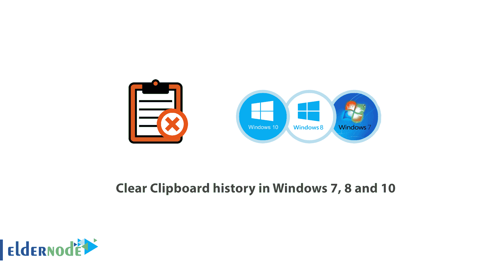
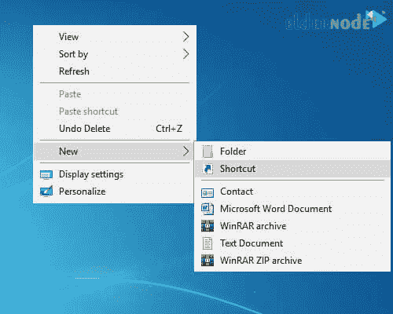
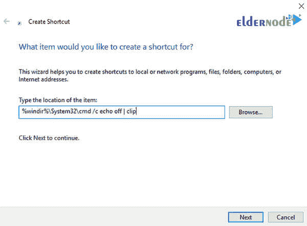
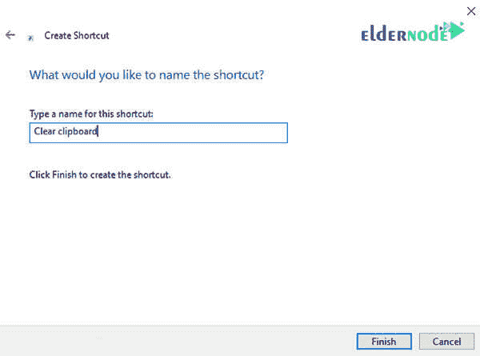
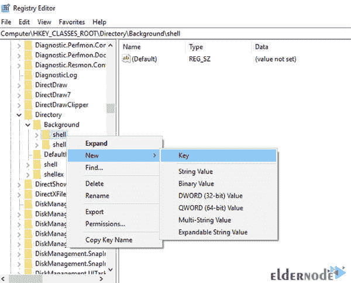
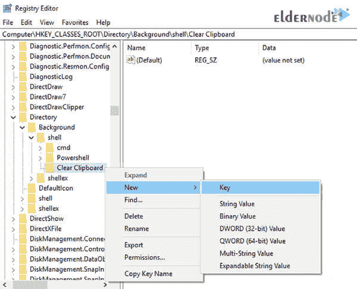
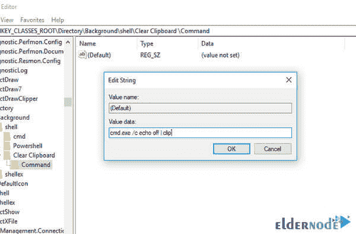
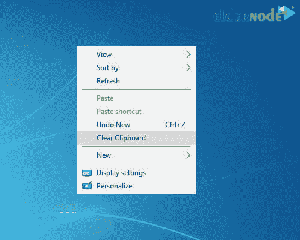

# 如何清除 Windows 7、8 和 10 中的剪贴板历史记录- ElderNode 博客

> 原文：<https://blog.eldernode.com/clear-clipboard-history-in-windows/>

如何清除 Windows 7、8、10 中的剪贴板历史？[剪贴板](https://en.wikipedia.org/wiki/Clipboard_(computing))是存储复制或剪切信息的存储器的名称。你可以使用剪贴板向**传送**信息到窗口的不同部分。现在有些用户可能因为各种原因，包括安全和个人原因，想要删除剪贴板中的历史和信息。在这种情况下，可以通过两种简单的方法来实现。

在本文中，我们要教你如何删除 Windows 剪贴板内存中的历史和信息。和我们在一起！

[***在 Eldernode***](https://eldernode.com/windows-vps/) 购买 Windows 虚拟专用服务器

借助 [Windows 10](https://eldernode.com/tag/windows-10/) 和 Windows 8 中可用的功能，清除剪贴板内存很容易。当然，有一些程序可以清理和管理你可以轻松使用的剪贴板内存。在本教程中，我们将讲解如何借助 Windows **内置工具**清除剪贴板，而无需安装和使用额外的程序。

## 清除 Windows 7、8 和 10 中的剪贴板历史记录

如你所知，在 Windows 中做很多事情的方法不止一种。删除剪贴板也是一样，有几种方法，下面我们会教两个例子:

### 方法一:建立快捷方式

在这个方法中，要清除剪贴板的内存，你首先需要在你的桌面上为此目的创建一个快捷方式！

为此，请按照下列步骤操作:

**1。** **在桌面的空白处右击**，然后从打开的菜单中选择新建。

**2。T3 从打开的**菜单**中选择快捷方式选项。**

**3。现在在打开的**窗口的框中为键入项目的位置，输入以下短语:

%windir%\System32\cmd /c 回声关闭|剪辑

**4。** 然后点击窗口左下角的下一步按钮。

**5。在下一个窗口的** 中，在键入该快捷方式的名称部分，为您的快捷方式选择一个与其性能相关的名称。**例如** 清除剪贴板。

**6。** 点击完成按钮。

***你的快捷方式被创建。***

你可以将这个快捷方式移动到桌面的任何地方。每次你**双击这个快捷键上的**，你的剪贴板内存就会被清除。如果快捷方式不起作用，请重新启动计算机一次。

### 方法二:在桌面右键菜单中添加清除剪贴板选项

您可以通过**注册表编辑器**添加一个选项来清除您的桌面右键菜单。为此，请按照以下步骤操作:

**1。** 打开开始菜单，输入运行搜索后打开。在打开的窗口中，键入并搜索 REGEDIT 并打开**注册表编辑器**。

**2。在打开的**注册表编辑器**窗口中的**T3，引用下面的注册表项地址:

HKEY _ 跟班 _ 根 \ 目录 \ 背景 \

**3。从左边的** ，**右键点击外壳上的**。然后从打开的菜单中，首先选择新选项，然后选择键选项和**名称**这个新键清除剪贴板。

**4。** 现在**右键单击**这个新键。

从打开的菜单中，首先选择新，然后选择键和**名** it 命令。

**5。在右边的** 面板中，**双击默认上的**，选择修改。

**6。** 在数值数据框中，输入以下短语:

cmd.exe/c 回声关闭|剪辑

**7。** 最后点击 Ok ，然后按 F5 键**刷新**注册表退出。

在你的桌面的空白处右击。你会看到清除剪贴板选项已经被添加到这个列表中，你可以通过选择它来清除你的剪贴板内存。

### 清除剪贴板的快速简单解决方案

如果您在剪贴板内存中存储了个人或敏感信息，这里有一些非常简单的方法来快速删除它:

***** 对你的屏幕进行截图，替换你**剪贴板** **内存**中存储的敏感信息。

***** 重启你的电脑。重新启动后，您可以清除剪贴板内存。

***** 打开命令行，运行以下命令清空剪贴板内存:

回声关闭|剪辑

**尊敬的用户**，我们希望您能喜欢这个[教程](https://eldernode.com/category/tutorial/)，您可以在评论区提出关于本次培训的问题，或者解决[老年人节点培训](https://eldernode.com/blog/)领域的其他问题，请参考[提问页面](https://eldernode.com/ask)部分，并尽快提出您的问题。腾出时间给其他用户和专家来回答你的问题。

好运。

Goodluck.