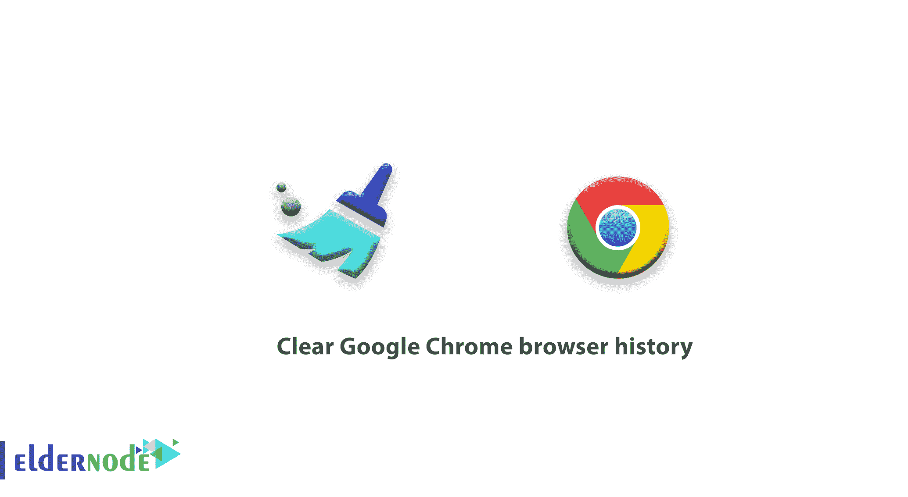
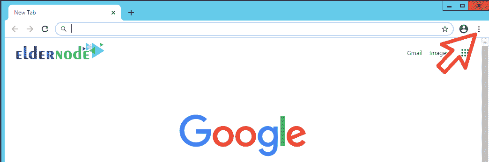
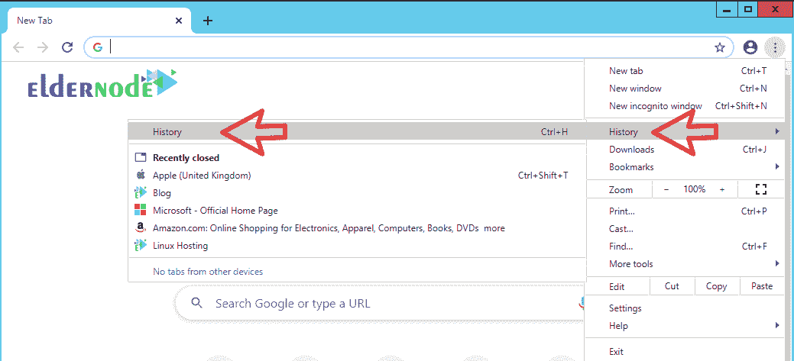
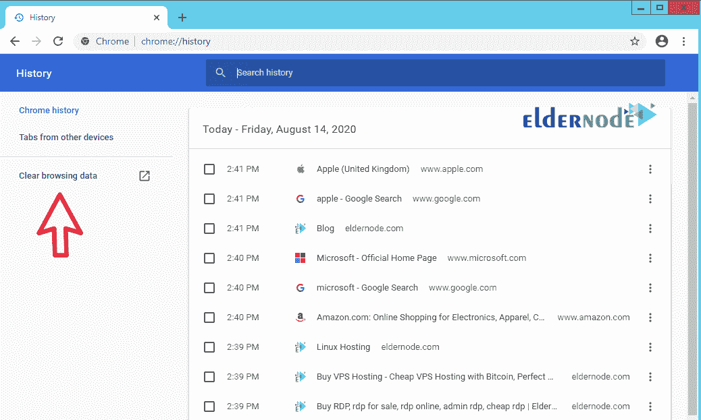
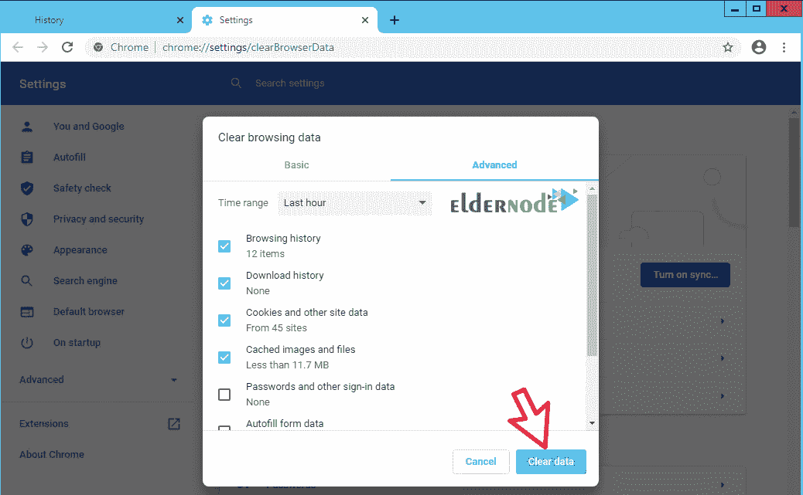
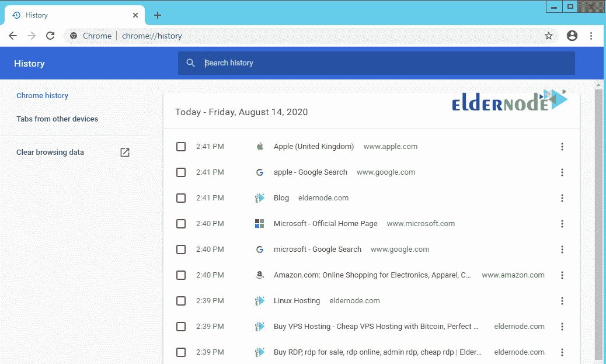
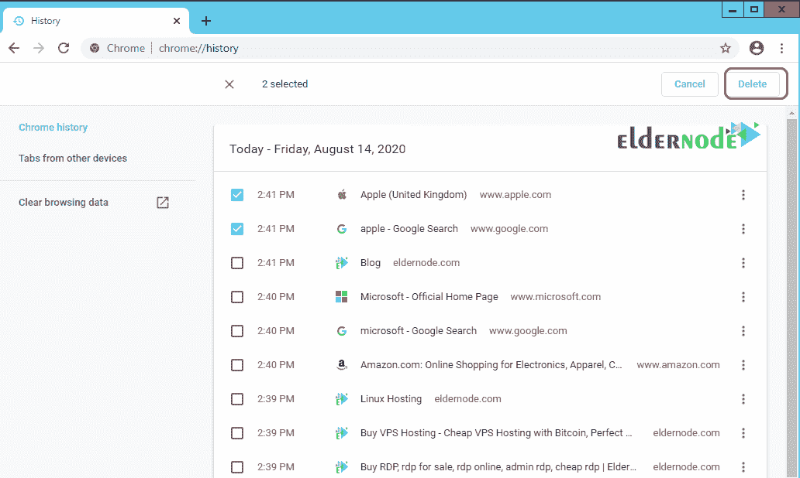
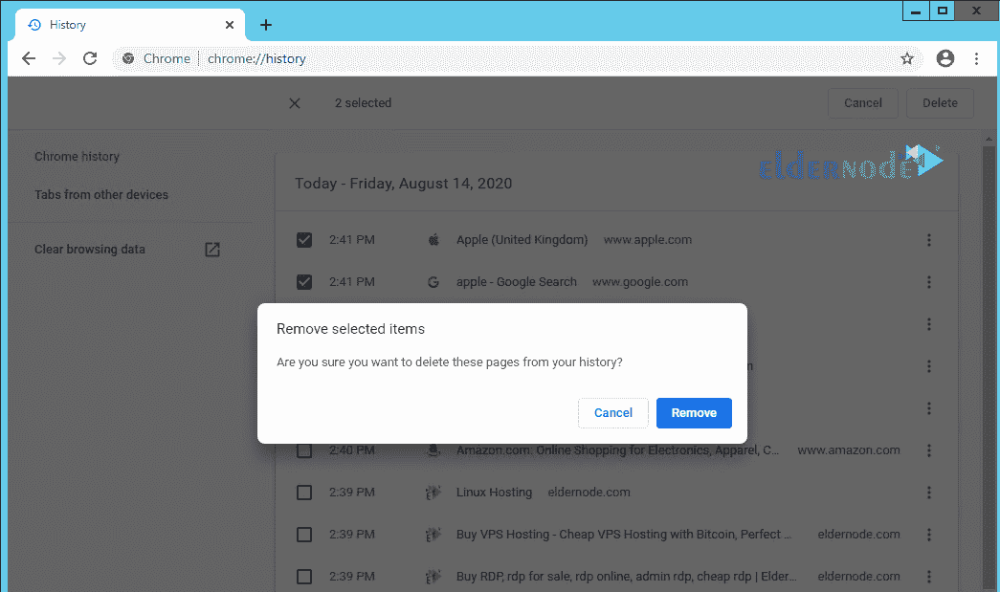

# 如何清除谷歌浏览器历史记录

> 原文：<https://blog.eldernode.com/clear-google-chrome-browser-history/>

如何清除谷歌 Chrome 浏览器历史记录？你可能遇到过这样的情况，有时你的浏览器崩溃或者你打开网站，如果你知道网站上发布了新内容，你会看到过去几天发布的相同内容。

当你第二次访问一个站点的时候，显示过去几天的内容没有别的原因，只是因为这个站点被缓存在你的浏览器中。重要的是这个问题不是直接来自你。网站所做的缓存站点和提高速度的设置会给你带来这个问题。

在这篇文章中，我们将教你如何删除[谷歌 Chrome 浏览器](https://www.google.com/chrome/)的历史记录，这样你就可以轻松清除你的浏览器缓存。

[**在 Eldernode** 的 VPS 托管计划](https://eldernode.com/vps-hosting/)

建议您至少每隔 1 至 2 个月清理您的浏览器以搜索互联网并使用您的 Chrome 浏览器。这将**在你的硬盘上释放空间**，并加速 你的浏览器。

跟随我们的[教程](https://eldernode.com/category/tutorial/)删除谷歌 Chrome 浏览器的历史。

### 如何清除谷歌 Chrome 浏览器历史记录

**1。打开**你的谷歌 Chrome 浏览器。

**2。**T3 点击页面右上角**的菜单。**

**3。** 从历史菜单中，**选择**历史子菜单打开其**设置**页面。

**注:** 按键盘上的 **Ctrl + H** 就可以打开这个页面。

**4。T3 在**历史**页面，点击清除浏览数据。**

**5。** 你会看到一个类似下图的页面。

你可以通过**设置**来删除你的 cacache che 和历史。在下文中，我们将解释每一部分。

**–从** 中清除以下项目:在这个字段中你可以告诉 Chrome 历史会为你删除多少时间。要将其完全删除，您必须将此部分设置为开始时间或全部时间。

**–浏览历史:**的所有历史搜索和**访问过的站点**。

**–下载历史 :** 所有曾经用 Chrome 下载过的文件。

### 教程清除谷歌 Chrome 浏览器历史

**注 1:** 选择此部分，只会删除下载文件的历史记录，而下载的文件会保留在您的系统中。

**–缓存图片和文件 :** 此部分与您已经进入的站点的缓存文件相关。这也是删除历史和重新阅读网站内容最重要的部分。

**–密码 :** 所有进入登录各种网站的密码都存储在这个部分。

**–自动填充表单数据:**Chrome 在各种网站表单中自动填充的所有信息都存储在这个部分。

**–托管 app 数据 :** 上面安装的 Chrome 软件相关的信息和数据都在这个部分。

**–媒体许可证 :** 如果您使用许可证或安全证书进入某些站点，它将被保存在此部分，通过选择它，您将删除它们。

现在有了我们提供的解释，你可以选择你想要的选项，然后点击清除浏览数据。

**注 2:** 如果你想在一般情况下刷新谷歌 Chrome 浏览器，你必须勾选所有选项，然后点击清除浏览数据。

**注 3:** 如果你不想删除以上全部，还可以通过删除文件和缓存图片来帮助加速 Google Chrome 。为此，除了检查浏览历史，还要检查缓存的图像和文件。然后点击清除浏览数据。

### 如何从谷歌历史中删除一个或多个网站

**1。**T3 如前所述，首先**打开**谷歌浏览器。

**2。** 浏览器的**右上角**有三个点，点击即可。

**3。** 从**历史子菜单**中选择历史选项，如下图:

**4。** 一个如下图所示的窗口将会打开，显示你已经打开的所有站点的列表。

勾选一个或多个你想从谷歌历史中删除的网站。

**5。** 现在在页面的**右上角**你会看到删除和取消选项。

选择取消按钮**移除勾选框**，选择删除从历史中删除该站点。

**6。出现的** 框中有两个按钮，删除和取消。

点击**取消**按钮会将谷歌浏览器历史回复到之前的步骤，但是选择**移除**会结束您的工作。

### 如何做一个私人评论？

知道如何在你的电脑或笔记本电脑上搜索一个网站而不被列在你的搜索历史中是很好的。为此，请按照下列步骤操作:

**1。** 首先，在电脑或笔记本电脑上打开谷歌 Chrome。

**2。** 然后点击页面上方的更多的，也就是三个圆点的形式。

**3。** 点击新建微服窗口按钮。

**注意:** 不用经历这三步，可以用组合键 ctrl + shift + N 。

**4。**T3新窗口现在将开启。在图像的左上角，**寻找**帽子和眼镜的图像并点击它。

**5。** 你现在可以在谷歌搜索栏做任何你想做的事情。

**亦作，见:**

[如何在 Firefox 中启用 Cookies】](https://eldernode.com/enable-cookies-in-firefox/)

[如何清除浏览器缓存](https://eldernode.com/clear-the-browser-cache/)

**尊敬的用户**，我们希望您能喜欢这个[教程](https://eldernode.com/category/tutorial/)，您可以在评论区提出关于本次培训的问题，或者解决[老年人节点培训](https://eldernode.com/blog/)领域的其他问题，请参考[提问页面](https://eldernode.com/ask)部分，并尽快提出您的问题。腾出时间给其他用户和专家来回答你的问题。

好运。