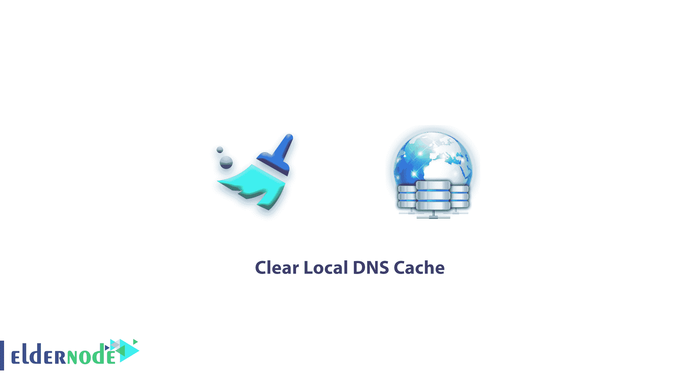

# 教程清除本地 DNS 缓存- Eldernode

> 原文：<https://blog.eldernode.com/clear-local-dns-cache/>



如何清除本地 DNS 缓存？有时，电脑可能无法访问网站或服务器。此问题可能是由于本地 [DNS](https://en.wikipedia.org/wiki/Domain_Name_System) 缓存造成的。在本教程中，我们将教你如何清除不同操作系统上的 DNS 缓存。

### 如何刷新 Windows 上的本地 DNS 缓存

1。使用 ***Windows 键+x**T5 进入超级用户菜单，然后选择命令提示符。*

或者

在**开始菜单**中搜索 cmd 。然后**在cmd.exe上右击**，选择以管理员身份运行。

2。在 Windows 中键入以下命令。然后按键进入。

```
 ipconfig /flushdns 
```

3。成功执行该命令后，您将看到以下消息:

```
 Successfully flushed the DNS Resolver Cache. 
```

您也可以从 eldernode 购买并使用 [Windows VPS 服务器](https://eldernode.com/windows-vps/)。

### 如何刷新 MacOS X 上的本地 DNS 缓存

1。首先启动终端。

2。键入与 MAC OS X 版本相对应的命令。

3。终于打到进入。

**A) Mac OS X 版本 10.10.4 及更新:**

```
 dscacheutil -flushcache; sudo killall -HUP mDNSResponder 
```

**B) Mac OS X 版本 10.10-10.10.3:**

```
 sudo discoveryutil mdnsflushcache; sudo discoveryutil udnsflushcaches 
```

**C)Mac OS X 10.9 版本:**

```
 sudo killall -HUP mDNSResponder 
```

**D)Mac OS X 10.6-10.8 版本:**

```
 sudo dscacheutil -flushcache 
```

### 如何刷新 Linux 上的本地 DNS 缓存

许多最新的 Linux 发行版都不像 Windows 和 MAC OS X 那样使用本地 DNS 解析器缓存。因此，有关当前默认软件的更多信息，请访问您的 Linux 发行版网站。

最常用的 DNS 缓存 Linux 应用之一是 [NSCD](https://en.wikipedia.org/wiki/NSCD) 。如果您安装了 NSCD，请执行以下命令之一。

要运行以下命令，首先打开您最喜欢的终端/ shell 应用程序。

**A) 清除当前用户的本地 DNS 缓存:**

```
 nscd -i hosts 
```

**B) 为所有用户清除本地 DNS 缓存:**

```
 nscd -I hosts 
```

**C) 一些 Ubuntu 和 Debian 衍生的发行版:**

```
 sudo service dns-clean restart 
```

选择您的完美的 [Linux VPS](https://eldernode.com/linux-vps/) 服务器包。

**尊敬的用户**，我们希望您能喜欢这个[教程](https://eldernode.com/category/tutorial/)，您可以在评论区提出关于本次培训的问题，或者解决[老年人节点培训](https://eldernode.com/blog/)领域的其他问题，请参考[提问页面](https://eldernode.com/ask)部分，并尽快提出您的问题。腾出时间给其他用户和专家来回答你的问题。

好运。