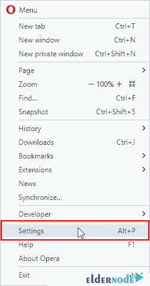

# 如何清除浏览器缓存- Eldernode

> 原文：<https://blog.eldernode.com/clear-the-browser-cache/>

如何清除浏览器缓存？如果您是网站设计者，并且希望更改网站的外观，则必须清除浏览器缓存，以确保应用更改。这是因为加载页面所需的文件可能仍然以缓存模式加载，在这种情况下，您将看不到任何更改。

但是如果你是一个普通用户，你仍然可能遇到网站页面出错的情况。

现在你知道了清除浏览器缓存的原因以及什么是浏览器缓存，在本文中我们将看看如何清除不同的浏览器缓存。

**选择你的完美 [Windows 虚拟专用服务器](https://eldernode.com/windows-vps/)套餐**

## 谷歌 Chrome 浏览器

要清除[谷歌 Chrome 浏览器](https://www.google.com/chrome/)缓存，首先点击三点图标。或者使用 ALT + E 组合键打开类似下图的浏览器菜单。

然后点击设置导航至谷歌 Chrome 浏览器设置页面。

进入设置页面后，在**搜索框中输入缓存。**

现在像下图一样，点击 Cleare 浏览数据选项，就是清除谷歌 Chrome 浏览器的数据。

点击此选项后，将会打开一个类似于下图的窗口，您可以自定义使用该窗口。

从时间范围选项中，选择清除谷歌浏览器缓存的时间间隔。然后选择缓存的图像和文件选项，只删除缓存的图像和文件。

如果选择其他选项，除了 cookie 缓存之外，还可以删除浏览器历史等数据。

**最后**，点击蓝色清除数据按钮，等待浏览器缓存根据文件大小清空。

## 火狐浏览器

要清除[火狐浏览器 c](https://www.mozilla.org/en-US/firefox/new/) ache，先点击浏览器一角的三线图标。然后点击首选项或选项进入**火狐浏览器设置**页面。

您也可以在浏览器的地址栏中键入 about: preferences，然后按回车键。

这一步，在**搜索框**中输入缓存，按进入。与下图类似，将显示清除 Firefox 浏览器缓存的清除数据按钮，您必须点击该按钮。

要清除火狐浏览器缓存，只需**勾选**的缓存网页内容选项，最后点击清除按钮。

在 Firefox 浏览器中，该方法将从头删除所有缓存文件。

**注意:** 为了能够控制时间间隔，只需用历史搜索代替缓存搜索即可。

搜索类似上图的短语历史后，点击清除历史按钮，显示如下窗口。

现在使用时间范围清除选项选择所需的时间间隔。

然后选择缓存选项，通过激活**复选框**删除缓存文件。

**最后**，点击立即清除按钮，等待火狐浏览器缓存根据文件大小被清除。

## Internet Explorer 浏览器

要清除[ie 浏览器](https://www.microsoft.com/en-us/download/internet-explorer.aspx)缓存，首先点击右上角的浏览器齿轮图标。

然后点击互联网选项。

打开以下窗口后，点击删除按钮。

点击删除按钮后，将会打开一个类似下图的窗口。通过此窗口，您可以选择数据类型。

这里，因为我们只想删除缓存文件，所以选中临时互联网文件和网站文件复选框。然后点击删除按钮，从 ie 浏览器中删除缓存文件。

## Opera 浏览器

要清除 [Opera 浏览器](https://www.opera.com/)缓存，首先点击左上角的浏览器菜单图标。

然后点击设置或者使用 ALT + P 组合键导航到 Opera 浏览器设置页面。

这将带您进入 Opera 浏览器设置页面。

首先你必须点击左边的隐私&安全标签，类似下图。

点击清除浏览数据按钮，打开如下窗口。选择要删除的时间间隔和数据。

如图所示，首先从选项中选择间隔，从选项中删除后续时间，以清除 Opera 浏览器缓存。

然后选择缓存的图像和文件选项，仅删除缓存的图像和文件。如果选择其他选项，除了 cookie 缓存之外，还可以删除浏览器历史等数据。

选择随时清除 Opera 浏览器缓存后，点击蓝色的清除浏览数据按钮，等待浏览器缓存根据文件大小进行清除。

**尊敬的用户**，我们希望您能喜欢这个[教程](https://eldernode.com/category/tutorial/)，您可以在评论区提出关于本次培训的问题，或者解决[老年人节点培训](https://eldernode.com/blog/)领域的其他问题，请参考[提问页面](https://eldernode.com/ask)部分，并尽快提出您的问题。腾出时间给其他用户和专家来回答你的问题。

好运。