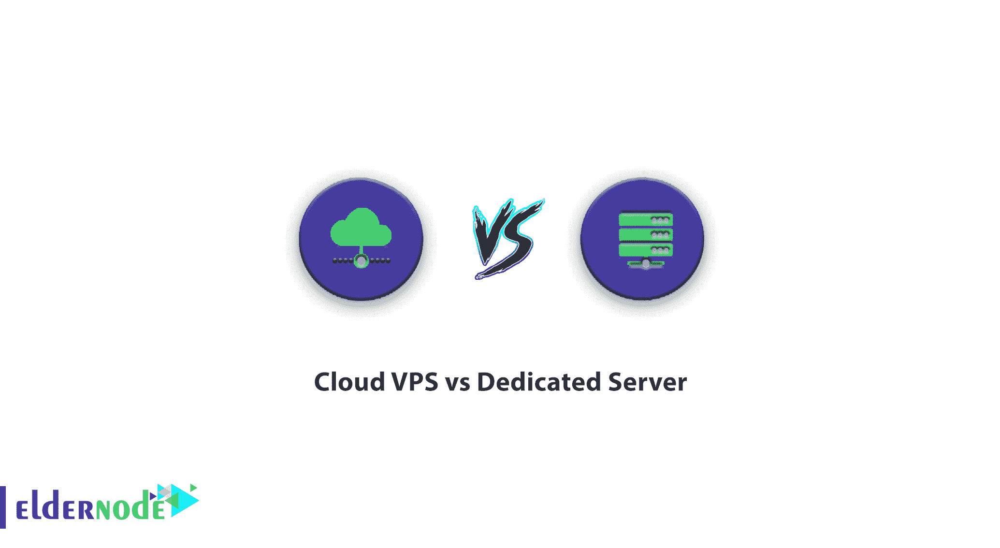
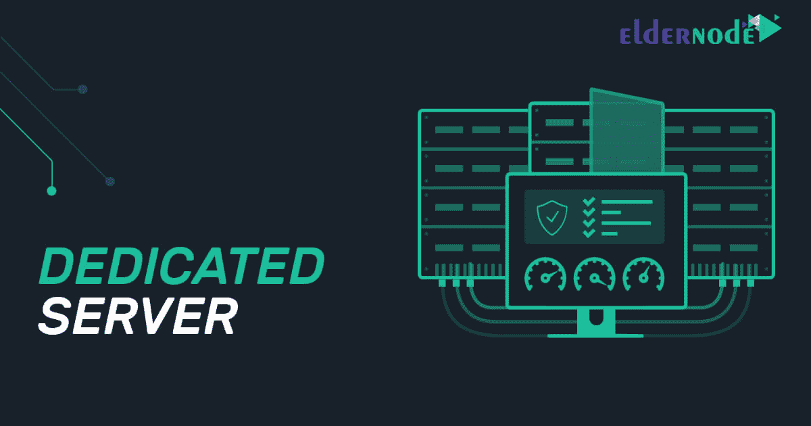

# 云 VPS 与专用服务器- Eldernode

> 原文：<https://blog.eldernode.com/cloud-vps-vs-dedicated-server/>

在启动一个网站后，你首先应该考虑的事情之一是升级你目前使用的服务的能力。如果你还在使用从一开始就在网站上建立的共享主机，是时候考虑拥有一个独立的服务器了。云 VPS 服务器或专用服务器是您可以拥有的两个选项之一，但这一选择取决于对这两种服务之间差异的认识。

在本文中，我们将进一步了解这些服务器，看看在云 vps 服务器和专用服务器之间，哪一个更适合您。

## 什么是云服务器？

云服务器是在云计算平台上创建并呈现在互联网上的逻辑服务器。事实上，云服务器是在云基础设施和云计算环境中提供的虚拟专用服务器。有必要说明的是，在正常情况下，虚拟服务器只在具有相关硬件的物理服务器上实现，在这种情况下，随着任何相关硬件组件的故障，其上的所有虚拟服务器也将面临问题。因此，这是虚拟服务器中通常使用的单点故障。

但是在云环境中，所创建的虚拟专用服务器具备运行所需的所有软件要求，并且绝不依赖于集中式软件或只有一个硬件的物理服务器。这使得在任何时候都可以在任何可用的物理服务器上运行相关的机器，只需自动地在线迁移它们(如果需要的话)。

云服务器由于软硬件问题与环境分离，具有很高的稳定性、安全性和性能。云计算环境中的服务器不能互相伤害，而且因为资源是完全专用的，如果这个环境中的每个云服务器都在使用其所有的专用资源(不知何故是过载的),将不会对其他现有的云服务器产生任何影响。

另一方面，云服务器比常规(物理)服务器更经济，因为用户可以以更合理的价格购买资源更多同时速度更快的服务器。例如，你的网站在云服务器上的加载速度会比普通服务器快，你的费用(相关云服务器的费用)会与物理服务器的费用相等，在某些情况下还会更少。除此之外，您还将能够利用有用的云功能。

云服务器的可扩展性是另一个特性。升级资源(如 RAM、CPU、HDD)的可能性非常简单快速。由于这个特性，在业务的任何阶段，花费你需要的资源量就足够了。

这就是云服务器迅速流行的原因，在许多情况下，云服务器比物理服务器更受欢迎。

## 什么是专用服务器？

服务器通常是一台功能强大的计算机，但需要注意的是，由于所需的功率和稳定性，构建服务器的技术不同于普通计算机。尽管服务器的功率更高，但它占用的空间也比普通计算机少。该服务器用于各种领域，其中一些领域如下:

**–**托管网站

**–**计算机网络的控制、管理和评估

**–**用于邮件服务器、数据库服务器、流程服务器等

**–**用于工程、医学、军事等各种技术领域

**–**用于存储信息

还有几百个…

专用服务器，根据硬件的不同，可能很普通，也可能很强大。由于服务器通常必须长时间可用，并且硬件稳定性在其中非常重要，因此使用特殊技术来延长服务器组件的使用寿命。

### VPS 服务器和云服务器的区别

一些公司认为 VPS 服务器和云服务器是一样的，但这是错误的，原因如下:

***服务器设置***

**–**VPS 服务器是多个用户共享的专用服务器的一部分。

**–**云服务器使用分布在不同物理服务器上的资源。

***地点***

VPS 服务器和云服务器之间的主要区别是 VPS 服务器在专用服务器中的硬件位置，而云服务器在多个专用服务器中的硬件位置。

***成本***

专用云服务器相对昂贵，因为你必须支付硬件、安装、设置和维护费用。云许可证的价格也包括在内，在您的 VPS 服务器中，您只需支付较少的费用，根据您的付费比例，我们会向您提供资源，而在您的专用服务器中，您需要支付硬件和服务器存储空间的价格。

### 云服务器和专用服务器的区别

VPS 服务器和专用服务器各有优缺点。哪一个适合你，完全取决于你的情况。中小型公司通常不需要专用物理服务器上的所有可用资源。如果您的企业不需要所有这些资源，您就不需要购买专用服务器。VPS 服务器通常可以满足稳步发展的公司的需求。大型组织也需要更多专用服务器。根据给出的解释，我们可以简单地说:

***在以下情况下，可以购买 VPS 服务器:***

**–**您的站点仍在增长，服务器的成本对您来说非常重要。

**–**您的站点需要更多资源，但不足以购买一台强大的专用服务器。

**–**您在服务器上进行了复杂的设置，并且想要定期备份整个操作系统。

**–**您希望能够快速更改服务器操作系统，并使用已安装的软件设置服务器。

***在以下情况下，可以购买专用服务器:***

**–**你想让你的网站发挥最大作用。你的网站需要更多的内存和强大的处理器来满足大量的访问者。

**–**您需要一台服务器，它的功能和组件可以根据您的需要进行更改。

永远记住去找那些在提供这类服务方面有良好声誉的公司。

下一点是支持和提供备份服务。服务器故障和软件问题是不可避免的。因此，选择一个无论何时何地你寻求帮助都会帮助你的托管公司。

## 结论

考虑到以上所有情况，并考虑到消除了许多关于云服务器的缺点和担忧，这种类型的服务器已经变得非常流行，并使云服务器成为任何企业的理想选择。