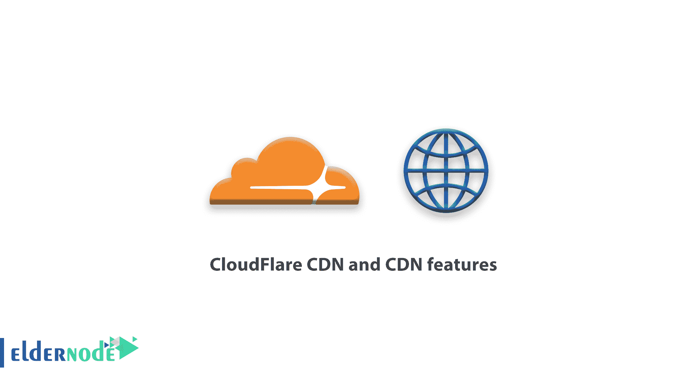

# CloudFlare CDN 和 CDN 功能—什么是 Cloudflare CDN

> 原文：<https://blog.eldernode.com/cloudflare-cdn-and-cdn-features/>

最近我们讲解了 [CDN](https://eldernode.com/what-is-cdn-content-delivery-network/) 。在本文中，您将更加熟悉 Cloudflare CDN 和 CDN 功能**。CDN** 是一种内容交付技术，放置在您的主机和 web 访问者之间，显示信息。

## CloudFlare CDN 和 CDN 特性

### 什么是 CloudFlare CDN

CDN CloudFlare 于 2009 年在加利福尼亚州旧金山推出。该公司在提供网络服务以及提高网站效率的基础上开始运营。在下文中，您将了解使用 CloudFlare CDN 的重要性。 **CDN CloudFlare** 是全球最安全、最快的 CDN 之一。该公司通过提供所需的服务和许多功能，在网络管理者中特别受欢迎。

### CloudFlare CDN 特性

**1-防范安全威胁**

在 CloudFlare CDN 系统中，会省去一些安全攻击，因为你的服务器的位置在 **CloudFlare CDN** 服务的后面。

**[DDOS 攻击](https://en.wikipedia.org/wiki/Denial-of-service_attack)、** [**SQL 注入**](https://en.wikipedia.org/wiki/SQL_injection) 需要直接目的服务器渗透的攻击，在该服务中已基本消除。如下图，当黑客攻击你的服务器时，黑客会遇到 Cloudflare CDN 服务器，用其他服务器连接你的服务器。因此，您网站的访问者可以很容易地通过另一台服务器连接到您的主机。

**2-阻止垃圾信息爬虫**

据报道，互联网上有一些爬虫会进入不同的网站，并在调查的不同部分输入广告短语。CDN CloudFlare 通过在云上进行的安全设置，在很大程度上阻止了这些垃圾邮件机器人进入您的网站。

**3-减少带宽消耗和服务器资源**

由于您站点的固定信息缓存在 **CloudFlare CDN** 服务器上，因此与您主机的连接将仅限于读取新的动态 HTML 代码。这些代码将大大减少您的带宽和硬件资源。

**4-免费使用 Cloudflare CDN 服务器**

在各公司推出 **CDN 服务**之前，大公司为了提高效率，以非常高的成本设计并建立了他们的 CDN。但是今天，随着免费 CDN CloudFlare 服务在所有企业网站上的推出，小型网站可以利用这一功能。

**5-网站始终活跃**

CloudFlare CDN 最重要的功能之一是缓存您站点的信息。即使您的服务器关闭或脱机，它仍保持活动状态。

**6-更好更高级的压缩**

CDN CloudFlare 能够压缩信息，如 **CSS** 、 **HTML** 代码，以加快您的 web 性能。

**7-提供一个分析系统**

大多数网站管理员都在寻找一个有信誉的网站分析系统。通过连接到一个 **CloudFlare CDN** ，你将拥有一个非常稳定和强大的**分析系统**。

**8-清除缓存功能**

CDN CloudFlare 不断在后台寻找你网站的缓存。所以它不间断地向访问者提供你的所有信息。

你可以在下面的照片中看到全球 **CloudFlare** 服务器积累的例子。

亲爱的用户，我们希望您喜欢本教程，您可以在评论区提出关于本次培训的问题，或者解决[老年节点培训](https://eldernode.com/blog/)领域的其他问题，请参考[提问页面](https://eldernode.com/ask)部分并在其中提出您的问题。