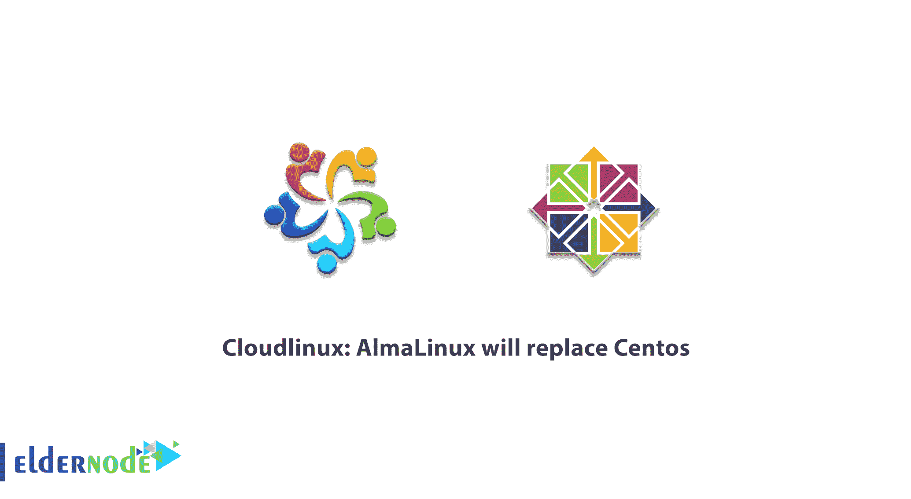

# Cloudlinux: AlmaLinux 将取代 CentOS - Eldernode 博客

> 原文：<https://blog.eldernode.com/cloudlinux-almalinux-will-replace-centos/>

如果你读到了一些关于你最喜欢的操作系统的意想不到的消息，而你还在寻找真相和最终结果，这是你需要读到最后的。 **C** 社区 **Ent** 企业 **O** 运营 **S** 系统是**R**ed**H**at**E**企业 **L** inux 的改造，所以它的成本是这样的。毫无疑问，红帽受益于 CentOS 社区，但公司和开发者从未因支持 CentOS 而向 RHEL 付费。2021 年初不久，红帽已经宣布 CentOS 将于 2021 年结束。但 CentOS Stream 将在上述日期后继续存在，并将作为 Red Hat Enterprise Linux 的上游分支。加入我们这篇文章， **Cloudlinux: AlmaLinux 将取代 CentOS，**来清楚地了解这个主题。2021 年不会只给你带来令人震惊的消息，在 [Eldernode](https://eldernode.com/) 上有新的 2021 年优惠和折扣来购买你自己的 [Linux VPS](https://eldernode.com/linux-vps/) 。

## **AlmaLinux 将取代 CentOS**

### **是时候告别 CentOS 8 了吗？**

根据有据可查的消息，CentOS 的粉丝将面临其未来和功能的巨大变化。CentOS 8 将于 2021 年结束，并将重点转移到 CentOS Stream。

**是时候告别 CentOS 8，向 CentOS 流问好了吗？**阅读 CentOs Stream 的简要说明。CentOS 用户更喜欢拥有经验丰富的 Linux 管理员和开发人员的公司。但是由于 Red Hat 最近的决定，由于没有其他选择，迁移到 CentOS Stream 似乎是一个好主意。

[CentOS](https://blog.eldernode.com/tag/centos/) Stream 没有旧 CentOS 定点发布作为滚动发布 Linux 发行版的稳定性。与 CentOS 8 类似，CentOS Stream 也有定期更新。但是，作为 CentOS Stream 用户，您可能会在其他人之前测试 RHEL，并且您可能会报告错误，需要等待在 RHEL 得到解决才能收到安全更新。是啊！这真的像是一个诡计，但事实是 CentOS Stream 并没有被认为是 CentOS Linux 的替代品。Red Hat 没有将 CentOS Stream 视为生产服务器。这只是达到项目目标的必然步骤。当大型企业使用 CentOS 8 时，红帽将自己的内部项目转移到 CentOS Stream。

此外，CentOS 声称 CentOS Stream 将在 RHEL 之前获得修复和功能。因此，在这些软件包进入 RHEL 版本之前，比 RHEL 预期的更少的错误和更多的运行时特性。

### **洛基 _ Linux 抗议结果**

人们分为两类。第一派认为抗议会起作用。过一会儿，第二个人会相信第一个人🙂

哎呀！我知道这不是一个有趣的好情况，但我有一些好消息。一旦红帽宣布他们将重心从 CentOS Linux 转移的决定，许多用户开始在社交媒体上做出反应。幸运的是，他们被 CentOS 联合创始人听到，用户听到一个新的名字作为替代；[洛基-Linux](https://rockylinux.org/) 。看起来红帽公司并不真正了解 CentOS 在个人和公司中的广泛使用、有效性和受欢迎程度。用格雷戈里·库尔茨的话来说，显然可以理解他对最近的决定感到不满。然而，在他的努力下，一个新的项目 Rocky-Linux 宣布启动。而现在是 CentOS fork，对于正在寻找出路的用户来说是一个很好的解决方案。Rocky-Linux 的名字是为了纪念他已故的 CentOS 联合创始人 Rocky McGough。

## **任务可能；用 AlmaLinux** 替换 CentOS

由于 Linux 社区需要一个替代品，CloudLinux OS 作为 CentOS 的克隆也宣布了用于 CentOS 替代的 Lenix 项目。这个永远免费的项目改名为 [AlmaLinux](https://almalinux.org/) 。CloudLinux 拥有 4，000 多家客户和合作伙伴，将提高 Linux 服务器和设备的安全性、可用性和稳定性。

AlmaLinux 将是 RHEL 8 的开源、免费、社区驱动、1:1 二进制兼容版本。它由 CloudLinux 专业技术构建，将于 2021 年第一季度上市。CloudLinux 每年会在新的 Linux 发行版上投入 100 多万美元。采用 RHEL 和 CentOS 代码并将其微调到 CloudLinix OS 正是这个国家的事情。CentOS 用户也收到了该公司的好消息。他们承诺 Lenix 将提供一种不间断的方式来转换现有的 CentOS 服务器，不需要停机或重新安装任何东西。

### **脱离 CentOS Linux 的特性**

虽然红帽休息 CentOS Linux 和大多数用户表现出他们的愤怒和不满意，让我们从另一个角度来看这个决定。微软首席项目经理、前 Red Hat 开发人员和 CentOS 董事会成员 Jim Perrin 解释了他不反对这种方法的原因。他列举了以下三个特点:

1-它使 RHEL 开发更加透明和可靠。

2-它为 ISV 和开发者提供了一种贡献修复和特性的方式。

3-它为社区提供了一种提供反馈的方式。

## 结论

“建立一个更广泛、更多样化的社区”是红帽公告中提到的标题之一。但用户似乎对这种替代并不满意，他们是对的。虽然 Red Hat 支持 CentOS 7 到 2024 年 6 月 30 日，但 CentOS 8 用户希望支持到 2029 年。但红帽会继续更新 CentOS 8，直到 2021 年底。只有时间能告诉我们用户是否会转向 CentOS Stream。为了避免 Linux 社区中的巨大差距，CloudLinux 推出了 AlmaLinux。这样，多租户 web 和服务器托管公司将获得一个定制的、高性能的轻量级服务器。AlmaLinux 允许您通过一个命令移植整个 CentOS 服务器群，而无需重新安装或重启。然而，用户正在等待 CentOS 的新替代品会是什么样。