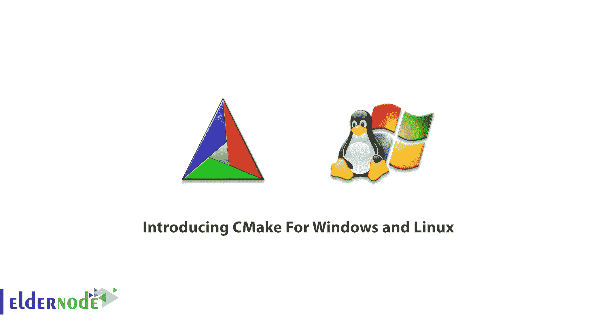
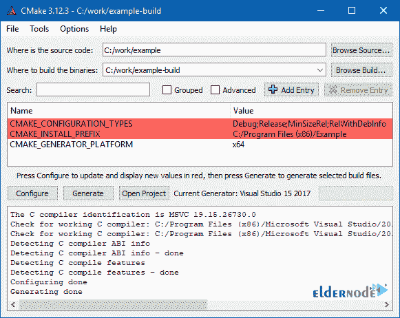
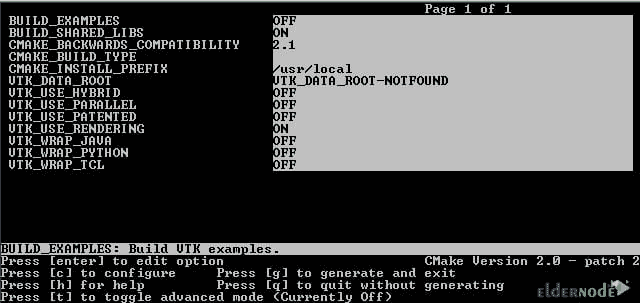

# 介绍用于 Windows 和 Linux 的 CMake-elder node 博客

> 原文：<https://blog.eldernode.com/cmake-for-windows-and-linux/>

CMake 是一个独立于编译器的软件自动化程序。这个程序的一个很好的特点是支持目录层次结构。简单来说，CMake 就是一个管理你项目建设过程的工具。你可以编写自己的程序，告诉 CMake 在哪里存储源码、头文件和库等其他程序组件，每次你想构建自己的程序时，只要让 CMake 帮你做就行了。您不再需要逐个执行编译和链接命令。要改变一个文件，花时间编译整个项目，不要担心目录是否整洁。CMake 就是这么做的。在本文中，我们试图**介绍 Windows 和 Linux 的 CMake】。你可以访问 [Eldernode](https://eldernode.com/) 中提供的包来购买 [Linux VPS](https://eldernode.com/linux-vps/) 服务器或者 [Windows VPS](https://eldernode.com/windows-vps/) 服务器。**

## **CMake For Windows 和 Linux**

CMake 是一个开源、多平台工具的名称，旨在构建和测试软件包。这个程序被设计用来控制软件项目的编译过程，这样项目可以在任何平台上创建，而不需要特定的配置文件。这个程序的任务是不管操作系统的类型如何都可以做项目，这样你就可以最终用你最喜欢的编译器来构建项目。

### **什么是 CMake？**

CMake 是一个独立于编译器工作的软件自动化程序。这个程序可以被认为是一个软件项目管理工具。编写您的程序，然后通过引入资源、头文件和其他与程序相关的库的存储来引入该工具的最终版本，这样您就不必执行所有的链接命令来更改一行代码。CMake 可以轻松安装在 [Windows](https://blog.eldernode.com/tag/windows/) 和 [Linux](https://blog.eldernode.com/tag/linux/) 操作系统上。在接下来的教程中，我们将学习如何在 Windows 和 Linux 上安装 CMake。请关注我们的文章。

### **Cmake 特性**

在本节中，我们将简要介绍 cmake 的特性。这些功能包括:

1-编译代码的能力，不管代码在什么位置

2-能够在不同的操作系统上编译代码

3-能够识别文件和库的位置

4-依赖性管理

5-能够为不同的系统生成 make 文件并为不同的 ide 生成项目

### **cmake 有什么好处？**

–允许您在任何 IDE 上转移和开发项目。自然，您可以利用该开发环境的所有特性。需要注意是，Visual Studio、Jetbrains CLion、Eclipse 和 Qt Creator 等开发环境都支持 CMake。

–您可以将 Cmake 用作任何想要编译操作的操作系统的交叉平台。然后，您可以获得与该操作系统相关的输出文件。这意味着您可以在 Windows 上请求 Linux 可执行输出，而无需在该操作系统上。这个特性对开发嵌入式软件非常有帮助。

–许多开源库，包括 C/C++中的所有 KDE 应用程序，都使用 CMake 作为构建系统。所以当你想使用它们的时候，你不再需要知道那个库的结构。

–使用 Cmake，您可以检查系统的所有环境变量。你甚至可以判断出你需要编译程序的特定包是否安装在系统上？如果没有安装，可以用 CMake 命令从网上下载这个包，并把它放在自己的地方。该特性适用于高度依赖于其他应用程序的大型项目。

### **Windows 版 CMake 简介**

在本节中，我们将介绍 Windows 上的 CMake。请注意，Windows 的[下载页面](https://cmake.org/download/)上预先配置的二进制文件以 MSI 包和 ZIP 文件的形式提供。因此，您可以轻松地从源代码下载并构建 CMake。需要注意的是，下载页面也提供了源代码版本。

要在 Windows 中从源树构建 CMake，您必须首先安装最新的 CMake 二进制版本，因为它用于构建源树。一旦安装了二进制文件，就需要像其他项目一样在 CMake 上运行它。这样做意味着选择 CMake 作为源目录，然后为生成的可执行文件选择一个二进制目录。在下图中，您可以看到 Windows 中的 Cmake 环境

### **介绍 CMake For Linux**

在这一节中，我们将介绍 Linux 上的 CMake。请注意，一些 UNIX 操作系统的下载页面上提供了预配置的二进制文件。您也可以轻松地从源代码下载并构建 CMake。下载页面提供了源代码版本。在下图中，你可以看到 Linux 环境下的 Cmake。

## 结论

CMake 是一个管理源代码的工具。换句话说，CMake 被设计成各种 Makefile 方言的生成器。如今，CMake 构建 Ninja 等现代构建系统，以及 Visual Studio 和 Xcode 等 ide 的项目文件。在本文中，我们试图向您介绍 CMake For Windows 和 Linux。