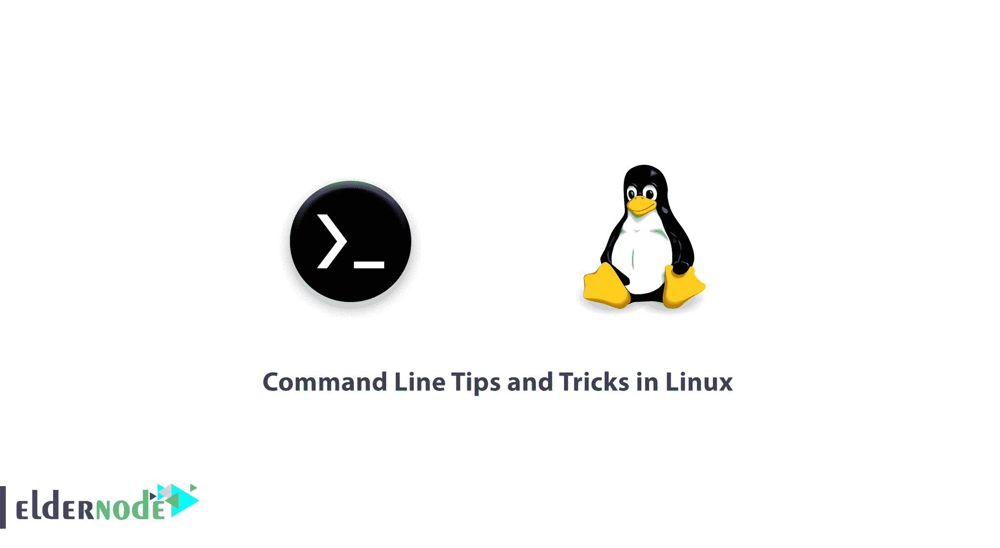

# Linux 中 5 个有趣的命令行提示和技巧

> 原文：<https://blog.eldernode.com/command-tips-linux/>



一个 Linux 系统管理员需要知道一些 Linux 技巧。在本文中，您将学习 Linux 中 5 个有趣的命令行提示和技巧。

当你充分利用 Linux 的时候，有许多有用的特性似乎是给许多 Linux 用户的提示和技巧。有时提示和技巧成为需要。它帮助您使用相同的命令集和增强的功能来提高工作效率。

## Linux 中 5 个有趣的命令行提示和技巧

在本指南中，我们将开始一个新的系列，在这里我们将写一些提示和技巧，并尝试在短时间内尽我们所能。因此，加入我们来学习 Linux 中 5 个有趣的命令行提示和技巧——第 1 部分。

**1-** 为了审核我们过去运行过的命令，我们使用历史命令。

```
history
```

因为历史命令不输出带有最后执行命令日志的时间戳。您可以通过运行以下命令来解决这个问题。

```
HISTTIMEFORMAT="%d/%m/%y %T " history
```

另外，如果您想要永久地附加这个更改，请将下面一行添加到 ~/.bashrc.

```
export HISTTIMEFORMAT="%d/%m/%y %T " 
```

现在，从终端运行:

```
source ~/.bashrc 
```

看看命令和开关的解释。

1.  **历史**–GNU 历史库
2.  **组织格式**–环境变量
3.  **% d**–日
4.  **% m**–月
5.  **% y**–年
6.  **% T**–时间戳
7.  **source**–简而言之，将文件的内容发送到 shell
8.  **。bashrc**–是一个 shell 脚本，BASH 在交互启动时运行。

**您可能会感兴趣:**

[如何永远每 X 秒运行或重复一个 Linux 命令](https://eldernode.com/run-repeat-linux-command/)

[如何暂时或永久禁用 SELinux】](https://eldernode.com/disable-selinux-temporarily-permanently/)

**和**

[如何在 Linux 中运行有时间限制的命令](https://eldernode.com/run-command-with-time-limit-linux/)

**2-** 列表中的下一个宝石是——如何检查磁盘写入速度？嗯，一个简单的 **dd** 命令脚本就可以满足这个目的。

Linux 中 5 个有趣的命令行提示和技巧——第 1 部分

```
dd if=/dev/zero of=/tmp/output.img bs=8k count=256k conv=fdatasync; rm -rf /tmp/output.img 
```

同样，这里是命令和开关的解释。

##### **DD–转换并复制一个文件**

**如果=/dev/zero–读取文件而不是 stdin**

1.  的**=/tmp/output . img**–写入文件而不是 stdout
2.  **bs**–一次最多读写 M 字节
3.  **计数**–复制 N 个输入块
4.  **–按照逗号分隔符号列表转换文件。**
5.  ****RM**–删除文件和文件夹**
6.  ****-RF**–(-r)递归删除目录和内容，(-f)不提示强制删除。**
7.  ****3-** 如果您希望检查占用您空间最多的前六个文件，您可以使用由 du 命令编写的简单的一行脚本，它主要用作文件空间用途**

**并查看命令和开关的解释。**

****杜**–估计文件空间使用量**

****-hsx**–(-h)人类可读格式，(-s)摘要输出，(-x)一种文件格式，跳过其他文件格式的目录。**

1.  ****排序**–排序文本文件行**
2.  ****-RH**–(-r)反转比较结果，(-h)为比较人类可读格式。**
3.  ****头**–输出文件的前 n 行。**

5.  **[用加密货币购买虚拟机](https://eldernode.com/bitcoin-vps/)**

****4-** 该是查看统计终端中每一种文件的时候了。借助 **stat** (输出文件/文件系统状态)命令，我们可以输出与文件相关的统计数据。**

****5-** 最后，最后但并非最不重要的，这一行脚本是为那些，谁是新手。如果你是一个有经验的用户，你可能不需要它，除非你想从中得到一些乐趣。好吧，新手有 Linux 命令行恐惧症，下面的一行程序会生成随机的手册页。好处是作为一个新手，你总能学到东西，而且永远不会感到无聊。**

```
`stat filename_ext  (viz., stat abc.pdf)` 
```

**命令和开关的解释。**

****Man**–Linux 手册页**

```
`man $(ls /bin | shuf | head -1)` 
```

****ls**–Linux 列表命令**

1.  ****/bin**–系统二进制文件位置**
2.  ****–生成随机排列****
3.  ******头**–输出文件的前 n 行。****

5.  ******好样的** ！通过接触这一点，您已经成功地学习了 Linux 中 5 个有趣的命令行提示和技巧。****

******尊敬的用户**，我们希望本教程对您有所帮助，如果您对本文有任何疑问或想查看我们用户的对话，请访问[提问页面](https://eldernode.com/ask)。也为了提高你的知识，有这么多有用的教程为[老年人节点培训](https://eldernode.com/blog/)准备。****

******同样，请阅读:******

****[如何在 Linux 中找到并杀死正在运行的进程](https://eldernode.com/find-kill-running-processes-linux/)****

****[Linux 服务器监控命令](https://eldernode.com/linux-server-monitoring-commands/)****

****[Linux 中 5 个有趣的命令行提示和技巧——第 1 部分](https://eldernode.com/command-tips-linux/)****

****[如何找出哪个进程监听某个特定的端口](https://eldernode.com/find-process-listening-port/)****

****[Linux Server Monitoring Commands](https://eldernode.com/linux-server-monitoring-commands/)****

****[5 Interesting Command Line Tips and Tricks in Linux – Part 1](https://eldernode.com/command-tips-linux/)****

****[How to Find Out Which Process Listening on a Particular Port](https://eldernode.com/find-process-listening-port/)****