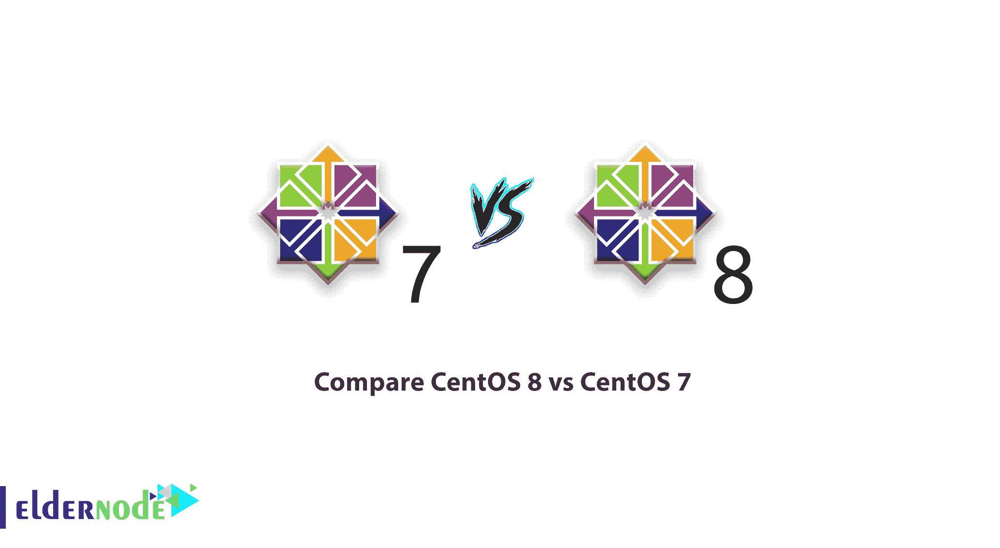
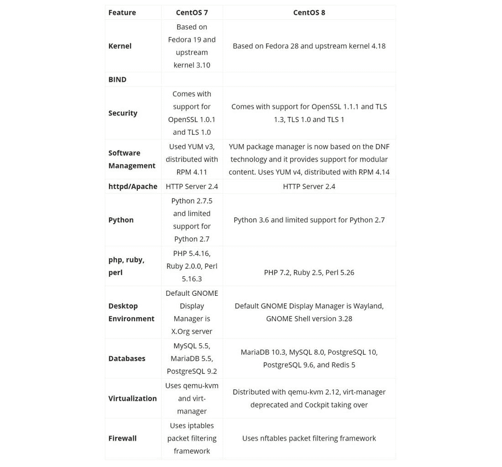

# 比较 centos 8 和 centos 7 在 CentOS 8 和 CentOS 7 之间的差异

> 原文：<https://blog.eldernode.com/compare-centos-8-vs-centos-7/>

#### 简介

当 2019 年 9 月 24 日*CentOS 8 正式发布时，许多人可能想知道 CentOS 7 会有什么显著的变化。这篇文章试图检查比较 CentOS 8 与 [CentOS 7](https://eldernode.com/centos-vps/) 。*

## *比较 CentOS 8 和 CentOS 7*

*CentOS 主要版本需要大量的规划和工具更改，因为它基于比以前版本更新的 Fedora 版本。这意味着从安装程序、软件包、打包和构建系统的所有东西都需要大修才能与新的操作系统一起工作。这意味着，根据重建工作所需的更改，总会有一个上升期。EL-8 和 EL-7 之间的差异也不例外，因为内核发生了巨大的变化，存储库格式增加了“模块”, RPMS 增加了许多 EL7 和之前版本没有的功能。在 EL7 和 EL8 之间唯一没有显著变化的是初始化系统，它仍然是“系统”。*

##### *CentOS 8 新功能*

*对于 CentOS 爱好者来说，最重要的事情之一是， [CentOS 8](https://eldernode.com/centos-vps/) 构建于 4.18 Linux 内核之上。是的，这与最新的 Linux 内核相去甚远，但 CentOS 和 RHEL 一样，都是关于生产系统的稳定性。如果你想要明亮、闪亮的新内核，看看 [Linux](https://eldernode.com/linux-vps/) 发行版，比如 Fedora。*

#### *百分之 8 vs 百分之 7*

*现在来看看其他一般的和次要的区别，请看下表*

**

#### *结论*

*从上面所做的一些不同可以看出，新的 CentOS 8 版本做了一些重大改变。从安全性到如何管理虚拟机，您应该会发现主要的增强功能，以使 CentOS 8 的服务器管理变得尽可能简单和安全。
现在你可以查看这篇文章，当你决定使用 CentOS 8 作为服务器时，你可以在 [ElderNode](https://eldernode.com/) 上[购买 CentOS 8 VPS 服务器](https://eldernode.com/centos-vps/)。*

*希望“比较 CentOS 8 和 CentOS 7”这篇文章有用。*