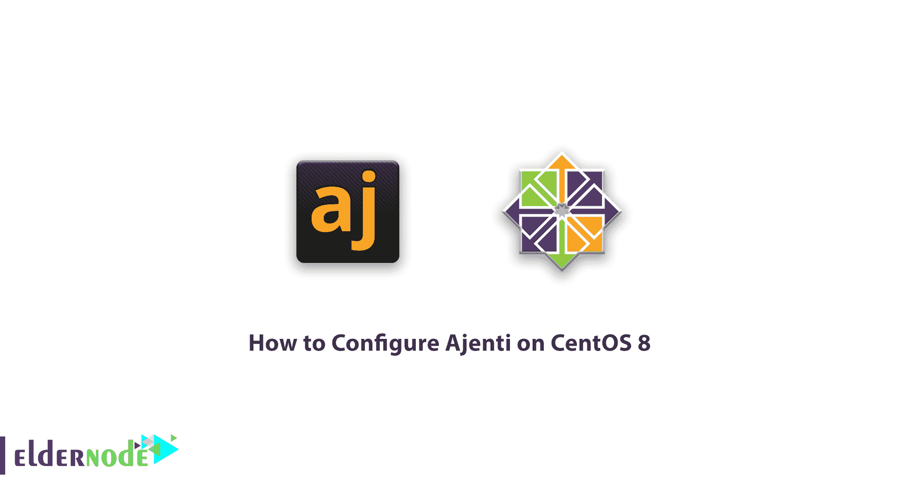

# 如何在 CentOS 8[完整] - Eldernode 博客上配置 Ajenti

> 原文：<https://blog.eldernode.com/configure-ajenti-on-centos-8/>



逐步了解如何在 CentOS 8 上配置 Ajenti。Ajenti 是斯洛文尼亚大学研发团队开发的开源控制面板。尽管这个面板是免费的，但它有一个企业版，能够同时支持多台服务器，只需支付很少的费用。但是在服务器上使用它是免费的。Ajenti 控制面板非常专业，同时非常流畅，据其开发者称，它可以与 [Cpanel](https://blog.eldernode.com/tag/cpanel/) 和 [Plesk](https://blog.eldernode.com/tag/plesk/) 面板竞争。Ajenti 支持 Python、Ruby、PHP 语言，并全面管理相关服务。在本文中，我们尝试教您如何在 CentOS 8 上配置代理。您可以从 [Eldernode](https://eldernode.com/) 中提供的套装中选择并购买您的 [CentOS VPS](https://eldernode.com/centos-vps/) 服务器。

## 阿让蒂简介【完整】

所有控制面板设置 [VPS 服务器](https://eldernode.com/vps/)几乎没有问题。但是阿让蒂做得更有效率。大多数服务器管理员更喜欢 Ajenti，因为它的访问速度相对较快，性能更好。

除了安装核心之外，这个控制面板还在服务器上安装高级工具，如文本编辑器、代码管理、web 终端和文件管理。所有这些将使你的网站管理更加高效和有效。为此，您可以轻松管理 Samba、Squid、Munin 等服务器。用它。

凭借其多功能的用户界面，用户可以安装现成的软件包和使用自动配置的虚拟电子邮件。自动配置包括 EXIM4、IMAP、简易 DKIM 激活、DMarc 和 SPF。

除了支持广泛的操作系统，还可以运行 Python、Ruby、PHP 和 Node.js。

### 阿让蒂控制面板先决条件

**1。**在安装之前，您必须将 EPEL 存储库添加到您的服务器中。输入以下命令下载 EPEL:

```
wget http://download.fedoraproject.org/pub/epel/6/x86_64/epel-release-6-8.noarch.rpm
```

**–**然后输入以下命令进行安装:

```
rpm -ivh epel-release-6-8.noarch.rpm
```

**–**用编辑器打开 **epel.repo** 文件:

```
vi /etc/yum.repos.d/epel.repo
```

**–**在地址开头的第四行，将短语 HTTPS 改为 HTTP。

修改前的主要短语如下:

```
mirrorlist = https: //mirrors.fedoraproject.org/metalink? repo = epel-6 & arch = $ basearch
```

修改后的短语应该是这样的:

```
mirrorlist = http: //mirrors.fedoraproject.org/metalink? repo = epel-6 & arch = $ basearch
```

***注意:*** 更改后，按一次 **Esc** 键，然后输入短语 **:wq** 保存更改并退出编辑器。

**2。**安装 EPEL 后，更新你的 CentOS Linux。

## 如何在 CentOS 8 Linux 上安装 ajen ti

**1。**输入以下命令下载 Ajenti 包:

```
wget http://repo.ajenti.org/ajenti-repo-1.0-1.noarch.rpm
```

**2。**下载后，通过以下命令安装 Ajenti 存储库:

```
rpm -i ajenti-repo-1.0-1.noarch.rpm
```

**3。**最后，使用以下命令安装 Ajenti 控制面板:

```
yum install agent
```

***注意:*** 安装时会问你几个问题来安装不同的包，都可以通过输入 **y** 和 **Enter** 键来通过。

**4。**重新启动 Ajenti 服务一次:

```
service agent restart
```

## 教程在 CentOS 8 上配置 ajen ti

输入以下命令打开**端口 8000** 以允许防火墙访问 Ajenti。首先，输入以下命令:

```
iptables -A INPUT -p udp -m state --state NEW --dport 8000 -j ACCEPT  iptables -A INPUT -p tcp -m state --state NEW --dport 8000 -j ACCEPT
```

然后使用以下命令保存 **iptables** 的更改:

```
service iptables save
```

最后，重新启动 iptables 服务:

```
service iptables restart
```

然后打开浏览器，输入 IP 服务器和端口 8000。请注意，Ajenti 控制面板会随 HTTPS 一起打开。

**例如**，浏览器中服务器 192.168.1.1 的 IP 应该输入如下地址:

```
https://192.168.1.1:8000
```

### 如何解决进入 Ajenti 面板的问题

***注意:*** 如果您无法使用您的 Linux 用户名和密码登录 Ajenti 控制面板，请按照以下步骤操作。

**–**用编辑器打开 **config.json** 文件:

```
vi /etc/ajenti/config.json
```

**–**然后找到你想要进入 Ajenti 控制面板的用户。

**–**在密码字段中，删除现有的密码散列，并简单地输入您的密码(纯文本)。

**–**然后保存文件，并使用以下命令重新启动 Ajenti 服务一次:

```
service agent restart
```

## 结论

Ajenti 是唯一一个轻量级的、功能强大的控制面板，具有众多开源功能，为管理和运行小型服务器提供了一个响应迅速的 web 界面。这个控制面板是 VPS 服务器和[专用服务器](https://eldernode.com/dedicated-server/)的最佳选择。该选项具有内置插件，用于配置和管理软件和服务器服务，如 Apache、Nginx、MySQL、FTP、防火墙、文件系统、Cron、Samba、Squid、开发人员代码编辑器和终端访问。在本教程中，我们试图教你如何在 CentOS 8 上安装和配置 Ajenti。