# 教程配置搜索引擎优化插件

> 原文：<https://blog.eldernode.com/configure-all-in-one-seo-plugin/>

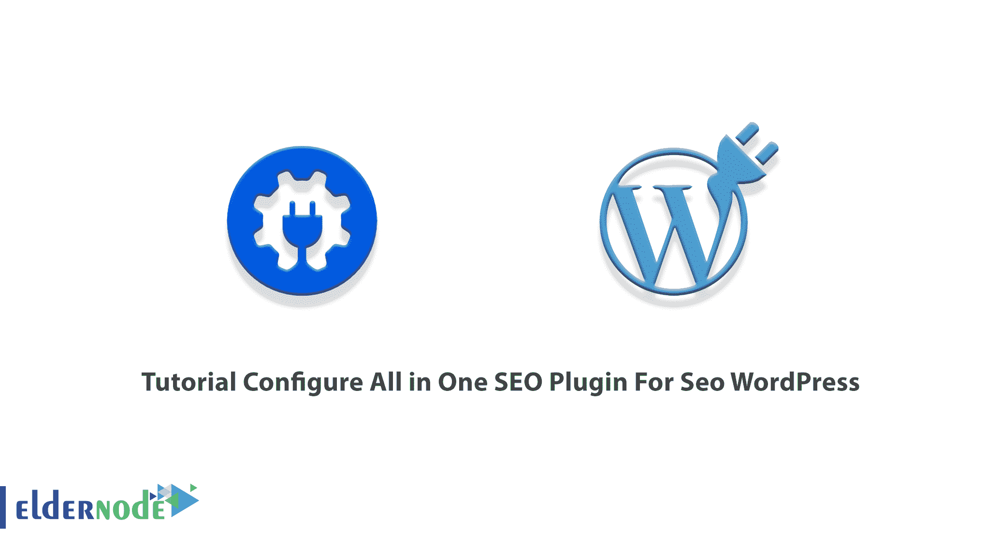

WordPress 的 All in One SEO 是最初的 WordPress SEO 插件，也是最全面的 WordPress SEO 插件和工具包。为了提高你的网站的搜索引擎优化排名，你不应该是一个搜索引擎优化专家或聘请一个。AIOSEO 被认为是最容易上手的 WordPress SEO 插件，既简单又强大。不难说 AIOSEO 是世界上最好的 WordPress SEO 插件。加入我们这篇文章来回顾一下**教程为 Seo 配置一个 SEO 插件。各种月度和年度托管计划可在 [Eldernode](https://eldernode.com/) 上获得。预订您自己的 [VPS](https://eldernode.com/vps/) 并入住我们酒店。**

## **为 Seo 配置多合一 SEO 插件**

虽然 WordPress 在默认情况下是针对 SEO 进行优化的，但是我们建议您使用许多其他设置来改进您的搜索引擎优化。自 2007 年以来，这个多合一搜索引擎优化包被下载了超过 3000 万次，是搜索引擎优化中使用最广泛的插件。顾名思义，这是一个全方位的搜索引擎优化解决方案。之前，All in one SEO 插件已经完全介绍过了，你也看到了它所有出色的特性。所以，如果你渴望开始使用这个最流行的 SEO 插件，继续阅读本指南，学习如何安装和配置它。

### **如何为 WordPress** 设置一个 SEO 包

这是非常容易安装和使用的搜索引擎优化插件。本指南将以最简单的方式向您展示安装和配置该插件的过程。让我们来看一下所需的步骤，并回顾一下它的所有功能。

*第一步:*

很明显，你需要**安装并激活一个 SEO 插件**。因此，登录你的 WordPress 网站的管理面板，如下图所示导航:

插件>>添加新选项。

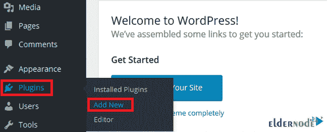

*第二步:*

一旦搜索栏打开，输入“ **all in one SEO** ”并点击 **Install Now** 按钮，开始下载。

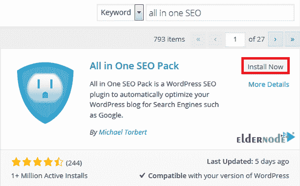

*第三步:*

成功下载并安装后，点击**激活插件**链接。

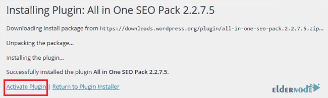

*第四步:*

一旦插件被安装并激活，你会在 WordPress 管理区工具条菜单中发现一个新的搜索引擎优化标签。

*Step 4:*

**如何配置多合一 SEO 插件**

现在你已经添加了一个 SEO 插件，你可以开始配置它的设置了。

所以，只需点击一个 SEO >中的**ll>通用设置**选项如下图所示:

### 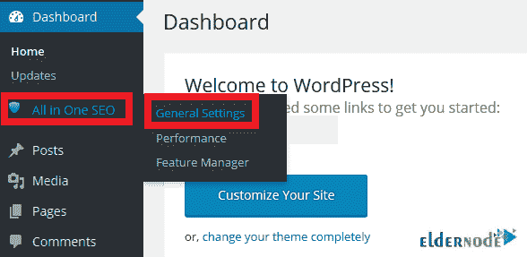

**如何使用多合一 SEO 插件**

在多合一 SEO 插件中有一些重要的设置你可以修改。在下面，我们将回顾它们来帮助你使用这个插件:

**1-通用设置**

### 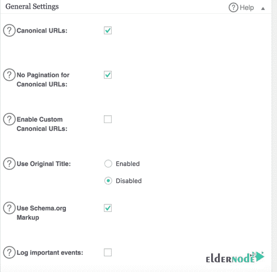

#### 现在，让我们看看上面所有选项的定义。

**_ 规范网址:**

要确保您的网站不会因为任何重复内容或导致相同内容的多个 URL 而受到惩罚，请启用它。

**_ 规范 URL 无分页:**

要删除规范 URL 的任何分页，请启用它。

**_ 启用自定义规范 URL:**

要向编辑帖子屏幕添加新字段并为帖子设置自定义规范 URL，请启用它。

**_ 设置规范 URL 的协议:**

如图所示，您可以选择用于规范 URL 的协议。如果你选择*自动*选项，它将使用你的 WordPress(【wp-config.php】T2)配置文件中指定的协议

**_ 使用原标题:**

如果你的主题或者其他插件干扰了搜索引擎优化插件标题标签的编写，你可以启用这个选项。

**_ 使用 Schema.org 标记:**

这种标记为搜索引擎提供了显示丰富片段所需的信息。

**_ 记录重要事件:**

如果你必须调试，让它写一个任何插件事件的日志。

**2-首页设置**

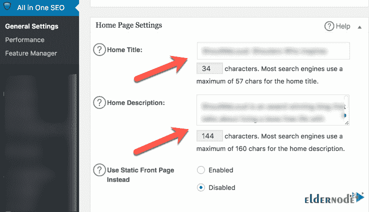

#### 如上所述，您需要在主页设置中添加一些细节。让我们看看更多关于它的细节。

**_ 首页标题:**

当你的主页打开时，这个标题将出现在浏览器标签的顶部。这是主页的 SEO 元标题。建议长度不超过 60 个字符。

**_ 首页描述:**

这是将显示在搜索结果中的描述。用 160 个字符写下你的博客内容。让它有意义、信息丰富、关键词丰富。

**_ 首页关键词(逗号分隔):**

此外，您会看到关键字设置选项。由于元关键字不再被视为搜索引擎排名因素，您可以勾选禁用框，然后继续标题设置。

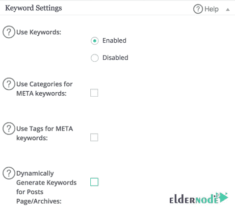

**3-标题设置**

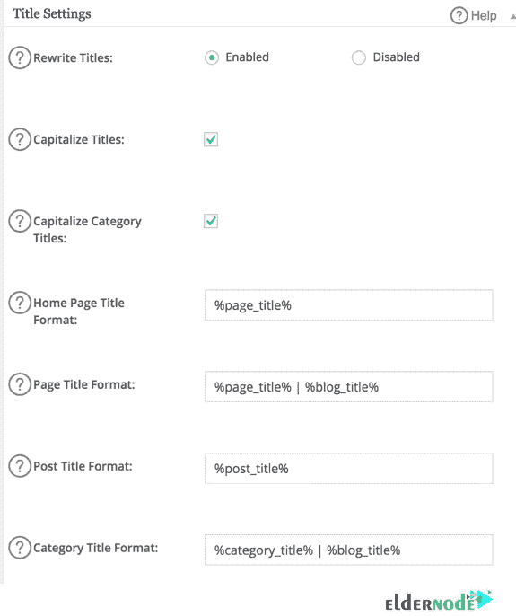

您可以复制如上图所示的设置。查看每个选项的定义。

#### **_ 重写标题:**

默认情况下，此选项处于启用状态，您可以在下面的字段中修改每种内容类型的标题。

**_ 大写标题:**

默认情况下，此选项是启用的，即大写标题中每个单词的第一个字母。

**_ 首页标题格式:**

这个选项允许你改变你的页面标题和它下面的其他标题的格式，你需要点击“？”图标，选择您想要的格式。

**4-自定义岗位类型设置**

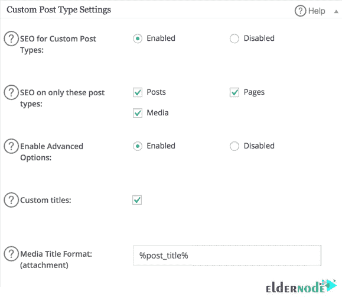

#### 对于自定义文章类型设置，您可以保持原样。但是，请查看下面的更多解释:

**_ 自定义帖子类型的 SEO:**

默认情况下，此选项处于启用状态。因此，它导致所有在一个搜索引擎优化工作与任何自定义帖子类型，你可能有你的网站。

**_ SEO 仅针对这些帖子类型:**

要仅选择插件将使用的特定帖子类型，请选中相应的框。

**_ 启用高级选项:**

此选项将在此部分添加一个名为自定义标题的新字段，您可以选中该字段来手动配置每个自定义帖子的标题标签的格式。

**5-显示设置**

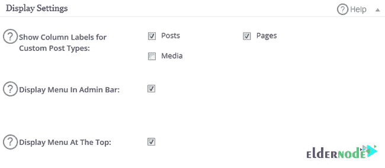

#### 此外，对于显示设置，您可以保持原样。下面是每个选项的功能。

**_ 显示自定义帖子类型的列标签:**

要更改您可以看到已添加元数据的自定义帖子类型，请选中相应的框。

**_ 在管理栏显示菜单:**

如果你喜欢在 WordPress 的管理面板上看到一个叫做 SEO 的插件按钮，启用它。

**_ 顶部显示菜单:**

如果您想在仪表板的顶部导航菜单中显示插件按钮，请选中此框。

**6- Noindex 设置**

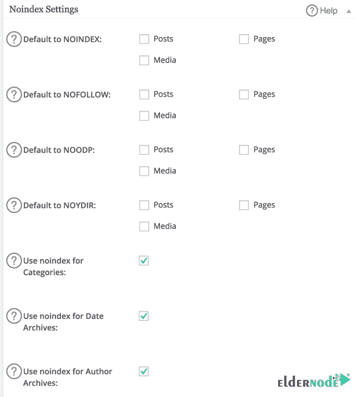

#### Noindex 设置非常重要和有用。您可以使用它来限制搜索引擎索引您网站上的内容或跟踪指向其他网站的链接。这样，你的存档页面就不会在 Google 中被索引。

**_ NOODP 选项:**

如果您希望搜索引擎不使用 ***开放目录项目*** 中关于您网站的标题和描述，请勾选相应的复选框。

**_ NOYDIR 选项:**

如果你想对雅虎目录*做同样的事情，使用这个选项。*

***7-高级设置***

*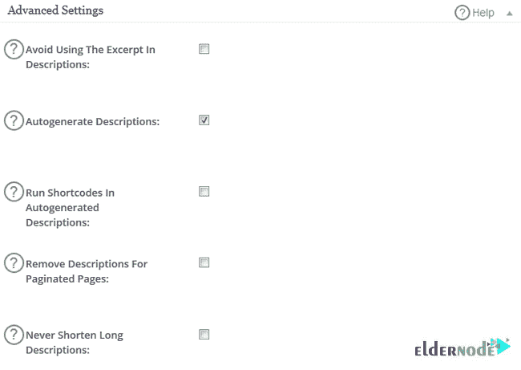*

#### *取消高级设置下的**自动生成描述**选项。因为以某种方式写一个你自己的元描述是一个好主意，这可以产生更好的点击率。*

***_ 避免在描述中使用摘录:***

*要防止 All in One SEO 插件使用摘录来生成描述，请选中此框。*

***_ 自动生成描述:***

*该插件将自动生成你的第一段描述。所以，如果你为你的文章写了一个好的介绍，启用它。*

***_ 运行自动生成描述中的短代码:***

*如果内容中有任何用于生成描述的短代码，并且您希望它们运行，请启用此选项。*

***_ 不要缩短长描述:***

*要使描述超过 160 个字符，请启用此选项。*

***_ 排除页面:***

*如果您想排除一些页面输出元信息，您可以在这里列出它们。*

*就是这样！您已经成功地学习了如何使用 All in One SEO 插件来改善网站的搜索引擎结果。*

*结论*

*在这篇文章中，你学习了教程为 Seo WordPress 配置一个 SEO 插件。要写出优秀的内容，你必须在单篇帖子设置中考虑三个选项:元标题、元描述和关键词。要了解更多细节，请参考我们在 [WordPress 教程](https://blog.eldernode.com/tag/wordpress/)上的相关文章。如果你喜欢这个 SEO 插件，开始在你的网站上使用它来优化它，从搜索引擎获得最大的结果。但是如果你喜欢其他的，请在[社区](https://community.eldernode.com/)上讨论，让我们知道。*

*If you want to exclude some pages from outputting meta information, you can list them here.*

*That’s that! You have successfully finished learning about the way you can use the All in One SEO plugin to better your website’s search engine results.*

## *Conclusion*

*In this article, you learned Tutorial Configure All in One SEO Plugin For Seo WordPress. To write excellent content, you must consider three options in the single post settings: Meta title, Meta Description, and Keywords. To learn more in detail, refer to our related articles on [WordPress tutorials](https://blog.eldernode.com/tag/wordpress/). If you like this SEO plugin start using that on your website to optimize it to get maximum results from search engines. But if you prefer any other one, discuss it on [Community](https://community.eldernode.com/) to let us know about that.*