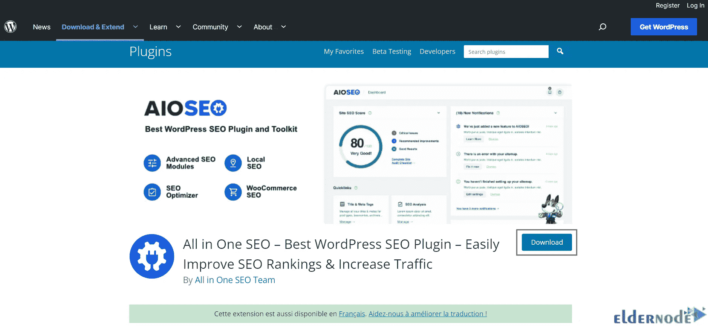
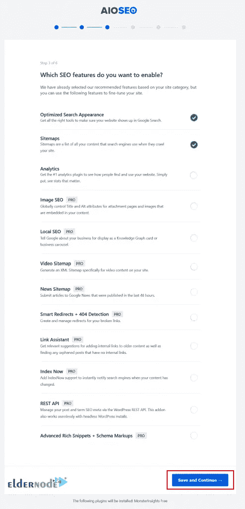

# 如何配置一个搜索引擎优化插件

> 原文：<https://blog.eldernode.com/configure-all-in-one-seo/>

每个 SEO 专家都想在谷歌和其他搜索引擎中排名靠前，SEO 让你的网站在这些搜索引擎中排名靠前。所有在网站上工作的人都希望以不同的方式将与他们业务相关的词链接到谷歌搜索结果的顶部。但关键是你必须花很多时间来击败竞争对手。All In One SEO 插件提高了网站的优化，适合那些刚刚开始工作的人。这篇文章将教你如何配置所有的 SEO。如果你打算 [**购买 VPS**](https://eldernode.com/vps/) 服务器，你可以查看 [Eldernode](https://eldernode.com/) 网站上提供的套装。

## 为什么您需要在一个 SEO 中配置所有功能？

All In One SEO 是最好的 SEO 插件之一，可以让你的网站在搜索引擎中排名更高。这也有助于你从 Twitter 和脸书等社交媒体平台获得更多免费流量。这个插件在 2007 年开始工作，已经安装了超过 200 万次。All In One SEO Pack 插件，也称为 AIOSEO，已被翻译成 56 种语言，并通过显示帖子的 TruSEO 分数来帮助您创建更多搜索引擎友好的内容。

All In One SEO 附带了在搜索引擎中排名更高所需的所有 SEO 功能，包括智能 SEO 模式标记、高级 SEO 模块、强大的 SEO 网站地图套件、本地 SEO 模块、Google AMP SEO、WooCommerce SEO 等。

## 如何用 Configure All In One SEo 让自己的网站排名更高？

在下一节，我们将教你使用 2 方法在 WordPress 中安装 All In One SEO 插件。

### **安装 AIOSEO 使用 WordPress 管理插件上传**

首先，你应该**从[官方 WordPress 网站](https://wordpress.org/plugins/all-in-one-seo-pack/)免费下载 All In One SEO** Pro:

下载完成后，登录你的 WordPress 站点，进入**插件>添加新的**路径，将 ZIP 文件上传到你的 WordPress 站点:

点击**上传插件**按钮:

现在浏览您的计算机，选择下载的所有在一个搜索引擎优化专业压缩文件。为此，点击**选择文件**:

上传文件后，点击**立即安装**:

### **安装 All In One SEO** **使用 WordPress 插件搜索**

此外，您可以使用插件搜索安装所有搜索引擎优化。要做到这一点，请再次进入**插件>添加新的**路径，搜索一体化搜索引擎优化插件:

接下来，点击 All In One SEO 插件旁边的 **Install Now** :

安装完成后，你应该点击**激活**插件:

最后，您需要通过点击 All In One SEO 菜单中的**常规设置**来激活您的许可证密钥:

您已经在购买收据上收到了许可证密钥。您应该在许可证密钥字段中输入它，然后单击**连接。**

## **如何设置和配置多合一 SEO 插件**

在这一步，你将学习如何在 WordPress 的一个 SEO 插件中逐步配置。

第一步，点击**让我们开始**开始配置过程:

你应该选择你的网站类别，并填写主页搜索引擎优化标题和描述:

***注意:*** 记住搜索引擎优化的元标题和描述会被搜索引擎使用，你应该使用你的主要关键字。

现在您将看到站点信息页面，您需要选择您是个人还是代表组织。然后选择注册用户:

您可以选择与您的网站相关联的社交档案 URL，如下所示，然后点击**保存并继续**:

需要注意的一点是，你的企业标识和社交资料是谷歌和其他搜索引擎用于知识面板的重要元素。

现在打开搜索引擎优化功能。默认情况下，会选择优化的搜索外观和站点地图功能。选择所需功能后，点击**保存并继续**:

接下来，您应该看到下面的搜索外观，并检查 Google Snippet 评论。您可以通过点击它来更改主页标题和元描述。页面的按钮和你自己的需求有关，有高级选项。应用更改后，点击**保存并继续**:

在此步骤中，系统会提示您输入许可证密钥:

最后，点击**完成设置**退出设置向导，所有的 SEO 都在 WordPress 网站上准备好了:

就是这样！

结论

## 任何 WordPress 网站都需要一个 SEO 插件。它允许您轻松地提高搜索引擎排名，并提供了广泛的搜索引擎优化工具包。在这篇文章中，我们教你如何配置所有在一个 SEO。我希望这篇文章对你有用，你喜欢它。如果您有任何建议或问题，可以在评论区联系我们。

All In One SEO plugin is necessary for any WordPress website. It allows you to easily improve search engine rankings and provides a wide search engine optimization toolkit. In this article, we taught you how to configure All In One SEO. I hope this article was useful for you and you enjoy it. If you have any suggestions or questions, you can contact us in the Comments section.