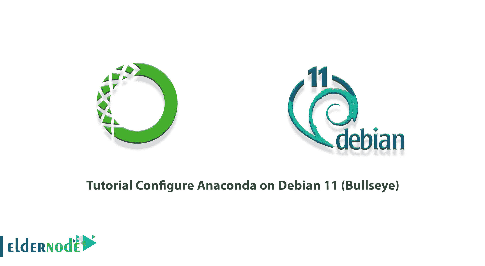
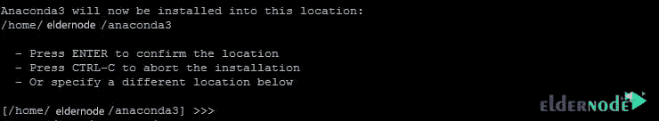

# 教程在 Debian 11 上配置 Anaconda(牛眼)- Eldernode 博客

> 原文：<https://blog.eldernode.com/configure-anaconda-on-debian-11/>



Anaconda 是 Python 和 R 编程语言的免费开源发行版，用于执行科学计算和处理大量数据。Anaconda 旨在使管理所使用的包变得容易。Anaconda 发行版目前有 1500 多万用户在使用，在大多数操作系统中包含大约 1500 个应用程序包。在本文中，我们将教你如何在 Debian 11(牛眼)上配置 Anaconda。如果你想买一个 [**Linux VPS**](https://eldernode.com/linux-vps/) 服务器，你可以在 [Eldernode](https://eldernode.com/) 看到可用的软件包。

## **如何在 Debian 11 上配置 Anaconda**

### **蟒蛇及其特征介绍**

如果在安装 Anaconda 之前已经在您的系统上安装了 Python，那么安装它将会创建一个单独的文件夹，它不会损害原始 Python，并且可以单独使用。

通过安装 Anaconda‌，您可以访问一个名为 conda 的软件包管理系统。这样做允许用户搜索、安装、运行和更新他们想要的包。这个系统最初是为 [Python](https://blog.eldernode.com/install-python-programming-debian-10/) 创建的，但是现在可以用于其他编程语言，比如 Java、Ruby、C 和 Fortran。

Conda 还有一个单独的环境叫做 Conda environment，实际上是一个包含不同 Conda 包的路径。当您想要为不同的应用程序使用不同版本的库时，使用单独的 Conda 环境会很方便。显然，如果不创建单独的环境，就不可能同时安装不同版本的库。在这种情况下，您可以创建一个单独的 Conda 环境，并安装所需库的所需版本。这样，该库的不同版本就不会互相干扰，可以单独使用。

在本文中关注我们，向您展示如何在 [Debian 11](https://blog.eldernode.com/initial-server-setup-on-debian-11/) (牛眼)上安装和配置 Anaconda。

## **如何在 Debian 11 上安装 Anaconda(牛眼)**

在这一节中，我们想教你如何一步一步地在 [Debian](https://blog.eldernode.com/tag/debian/) 11(牛眼)上安装 Anaconda。为此，只需遵循以下步骤。

第一步是使用以下命令存储库更新软件包:

```
sudo apt update && sudo apt install curl -y
```

然后，您必须使用以下命令转到 **/tmp** 目录:

```
cd /tmp
```

现在，您可以通过运行以下命令来下载 Anaconda 安装脚本:

```
curl --output anaconda.sh https://repo.anaconda.com/archive/Anaconda3-2021.05-Linux-x86_64.sh
```

要安装 Anaconda，您可以使用以下命令运行 Anaconda 安装程序脚本:

```
bash anaconda.sh
```

当您看到“请按 ENTER 键继续，您必须按“ **Enter** ”消息时。

在下一步中，您应该键入" **yes** 来接受 Anaconda 许可条款。

如下图所示，将显示三个选项。确认 Anaconda 安装指南的位置后，必须按**键进入**:



此时，您必须键入" **yes** 来初始化系统上的 Anaconda 安装程序。

通过正确执行以上所有步骤，您将看到 Anaconda 安装成功。

### **在 Debian 11 上配置 Anaconda**

在上一节中，您已经能够在 Debian 11 上安装 Anaconda。现在，您可以使用以下命令来激活 Anaconda 环境:

```
source ~/.bashrc
```

现在，您可以使用以下命令打开 Conda 列表以确认安装:

```
conda list
```

请注意，您也可以使用以下命令来更新 Anaconda:

```
conda update --all
```

这里，您可以使用下面的命令在 Debian 11 中创建新的环境:

```
conda create
```

例如，要用 Python 创建一个名为 **firstenvironment** 的新环境，您应该执行以下操作:

```
conda create -n firstenvironment
```

要在 Anaconda 中安装软件包，您必须使用以下命令:

```
conda install -n firstenvironment packag-name
```

您还可以运行以下命令在您的环境中安装 Python 和 NumPy:

```
conda install -n firstenvironment python numpy
```

要激活环境并开始使用它，请运行以下命令:

```
conda activate firstenvironment
```

## 结论

Conda 可以快速安装、执行和更新软件包及其依赖项。它还简单地在用户的本地计算机上创建、存储和切换环境。在本文中，我们试图教您如何在 Debian 11(牛眼)上安装和配置 Anaconda。