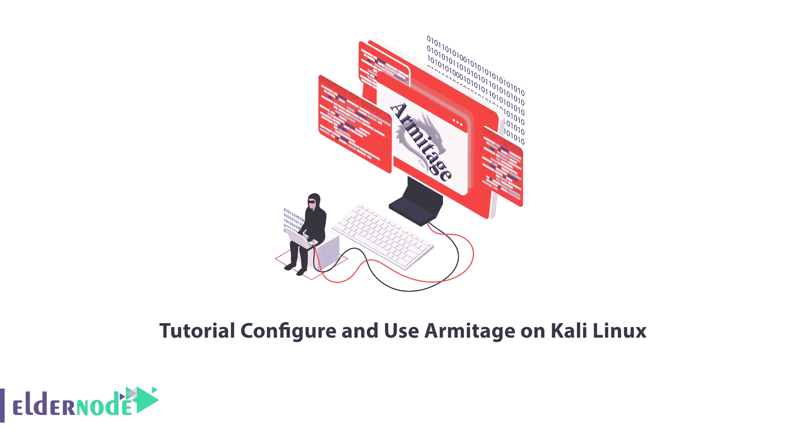
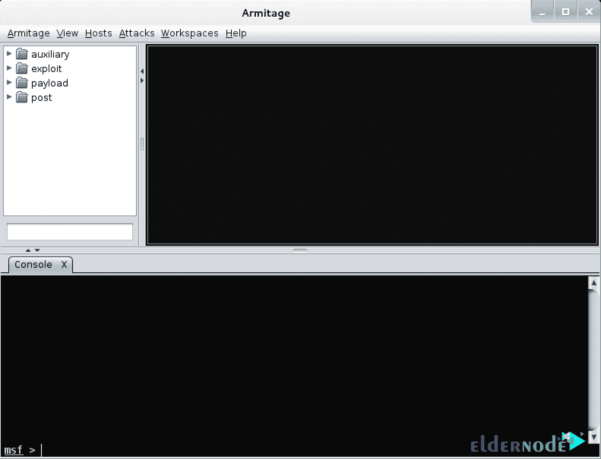

# 教程在 Kali Linux 上配置和使用 Armitage

> 原文：<https://blog.eldernode.com/configure-and-use-armitage-on-kali-linux/>



Armitage 是一个与 Metasploit 紧密合作的工具。Metasploit 是渗透测试人员工具带中最酷的工具之一，是一个完整的框架，具有许多模块化代码库，用于设计定制的有效负载和攻击。您可以使用它来扫描漏洞和利用弱点。本文将教你如何在 Kali Linux 上配置和使用 Armitage。如果你想购买 **[Linux VPS](https://eldernode.com/linux-vps/)** 服务器，你可以查看 [Eldernode](https://eldernode.com/) 网站上提供的软件包。

## **如何在 Kali Linux 上配置和使用 Armitage**

### **阿米蒂奇是什么？**

Armitage 是 Metasploit 项目的图形化网络攻击管理工具，也是构建在 Metasploit 框架之上的可脚本化的 red team 协作工具。该工具有助于可视化目标，自动推荐合适的利用方式，并向框架展示高级的利用后功能。它是一个渗透测试框架，允许您管理渗透测试过程，并以最好的方式进行。事实上，Armitage 集成了 Metasploit 渗透测试，并为渗透测试的不同阶段提供了不同的工具需求。阿米蒂奇的用法包括以下几项:

1-用于网络服务器和个人系统的渗透测试

2-发布了 2000 多个强大的漏洞

3-超过 500 个有效载荷

4-简单易用的图形

## **在 Kali Linux 上配置 Armitage**

在这一步，你将学习如何在 [Kali Linux](https://blog.eldernode.com/tag/kali-linux/) 上配置 Armitage。只需按照下面的步骤输入命令。

首先，**使用以下命令更新您的系统**包:

```
sudo apt update
```

现在您可以使用下面的命令安装 Armitage :

```
sudo apt install armitage
```

### **如何在 Kali Linux 上使用 Armitage**

首先，您应该使用下面的命令在 Kali Linux 中启动 Metasploit :

```
sudo service metasploit start
```

现在为了**打开 Armitage** ，运行下面的命令:

```
sudo armitage
```

然后你会看到下面的屏幕，显示 Armitage 正在你的 Kali Linux 上运行:



### **如何在 Kali Linux 上卸载 Armitage**

如果您想在 Kali Linux 上卸载 Armitage 包，运行下面的命令:

```
sudo apt-get remove armitage
```

您可以通过输入以下命令删除 Armitage 配置、数据及其所有依赖项:

```
sudo apt-get -y autoremove --purge armitage
```

## 常见问题解答

[sp _ easy agreement]

## 结论

Armitage 是一个带有 Metasploit 框架的可脚本化的 red team 协作工具，可以被所有团队使用。Armitage 是 Java GUI 技术的一个优秀例子。在本文中，我们教您如何在 Kali Linux 上配置和使用 Armitage。我希望这篇教程对你有用，并且你喜欢它。如果有什么问题，可以在评论里联系我们。