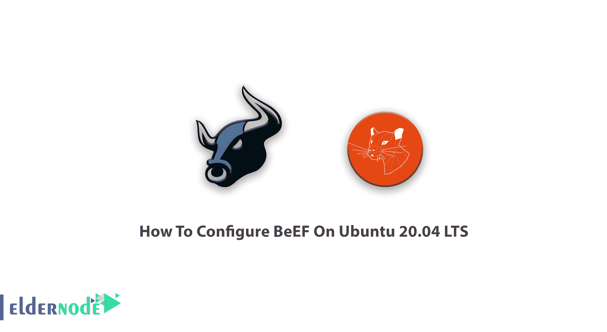
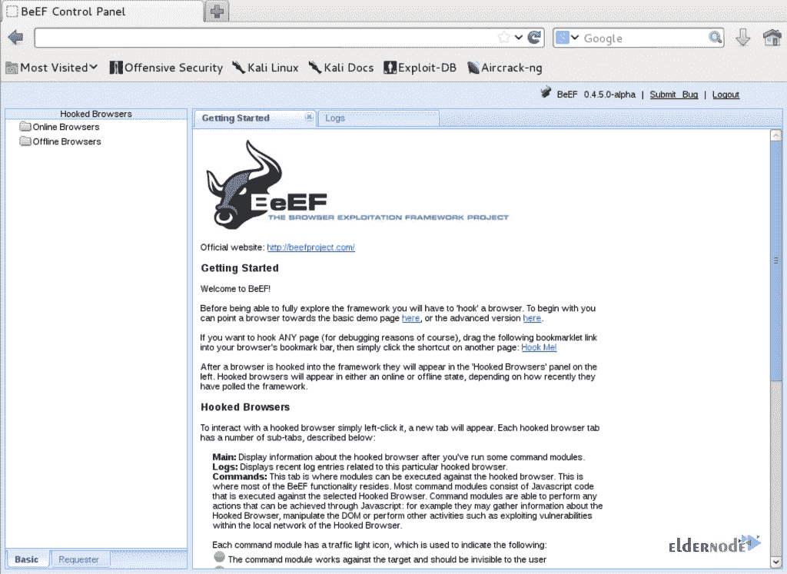

# 如何在 Ubuntu 20.04 LTS -埃尔德诺德博客上配置牛肉

> 原文：<https://blog.eldernode.com/configure-beef-on-ubuntu-20-04/>



了解如何在 Ubuntu 20.04 LTS 上安装**和** **配置 BeEF。BeEF，即 **B** 浏览器**E**x 开发 **F** 框架是一个强大的专注于网络浏览器的渗透测试工具。要使用该工具，请购买您自己的 [Linux VPS](https://eldernode.com/linux-vps/) ，并在 [Eldernode](https://eldernode.com/) 中使用比特币和即时设置来享受 VPS 托管。该实用程序的主要作用是允许专业渗透测试人员通过使用客户端攻击媒介来访问目标环境的实际安全状况。**

## 教程在 Ubuntu 20.04 LTS 上配置牛肉

加入这篇文章，看看牛肉的配置方式。可以自定义设置。

### 牛肉有哪些延伸和特点:

1.  Web 用户界面
2.  控制台用户界面
3.  Metasploit 集成
4.  XSSRays
5.  模块结构
6.  牛肉 JavaScript 对象
7.  支持 CSRF
8.  窃取会话信息

### 牛肉模块有哪些特点？

BeEF 程序将一个或多个 web 浏览器连接到该程序，以启动直接命令模块。每个浏览器可能在不同的安全平台上，每个上下文可能提供一组独特的攻击媒介。这个框架允许渗透测试人员选择特定的模块(实时)。以下是它的一些模块特性:

1.  1-进程间通信和利用
2.  2-历史收集和情报
3.  3-网络侦察
4.  4-主机信息收集
5.  5-浏览器插件检测
6.  6-坚持不懈
7.  7-利用

## 如何在 Ubuntu 20.04 上安装和配置 BeEF

由于 BeEF 是默认安装在 Kali 发行版中的，所以它有一些设置可以在没有任何情况下为您正常工作。Beef 程序可以在 Kali Linux 和 BackTrack 上默认使用。



但是，如果出于某种特殊原因，您想要更改 BeEF 配置设置，首先要更改 Web UI 的凭证。旧的默认凭据:

```
credentials:  username=beef  passwd=beef
```

如果您不更改**密码**，BeEF 会生成一个新的随机密码，您可以在启动框架时在终端中查看。

BeEF 位于 **/usr/share/beef-xss/** 目录中，它没有与 Metasploit 框架集成。看看下面几个整合牛肉的步骤。

**步骤 1** :为了能够阅读以下内容，您需要编辑位于**/usr/share/beef-XSS/config . YAML**的主配置文件

```
metasploit:   enable:true
```

**步骤 2** :接下来，您需要编辑 host、 **callback_host** 和 OS**‘custom’**、path 行，以包含您的 IP 地址和 Metasploit 框架的位置。另外，编辑位于**/usr/share/beef-XSS/extensions/metasploit/config . yml**的文件

**步骤 3** :最后是启动 **sfconsole** ，加载 **msgrpc** 模块

### 如何解决错误:用户名或密码无效

默认情况下，登录和密码是 beef/beef，但是一旦您遇到错误消息:无效的用户名或密码，这意味着凭据可能不起作用。所以，你可以编辑 **/opt/beef/config.yaml** 配置文件来修改密码。

### 如何更新牛肉

当您使用 Github 存储库中的 BeEF 时，您可以通过运行以下命令轻松地更新它:

```
cd beef
```

```
git pull
```

```
vim Gemfile
```

**结论**

在本文中，您了解了如何在 Ubuntu 20.04 LTS 上配置 BeEF。使用这个强大的工具来测试您的系统安全性和防止网络攻击。如果你有兴趣了解更多，请阅读我们关于如何在 Debian 10 上安装 Armitage 的文章。

In this article, you learned How To Configure BeEF On Ubuntu 20.04 LTS. Use this powerful tool to test your system security and prevent cyberattacks. In case you are interested to learn more, read our article on [How to install Armitage on Debian 10](https://blog.eldernode.com/install-armitage-on-debian-10/).