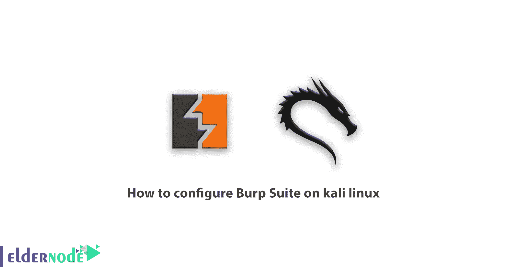
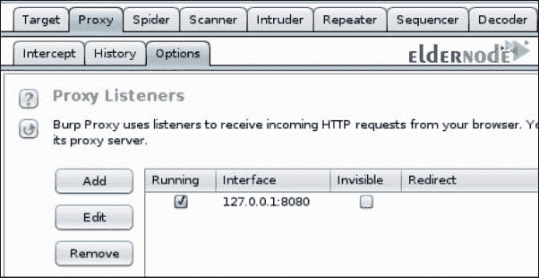
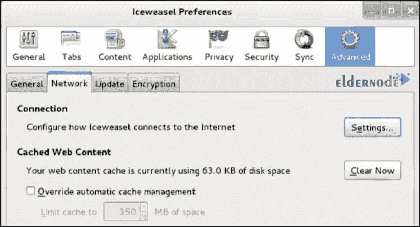
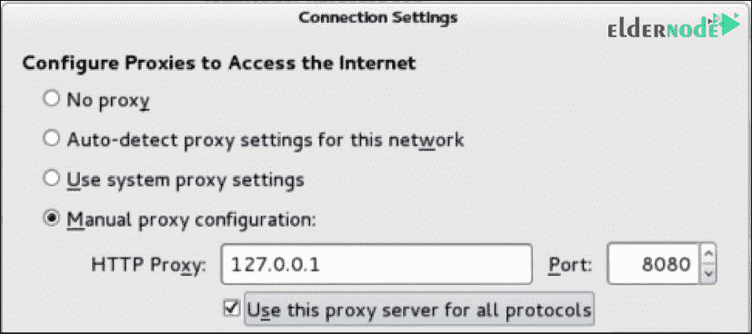
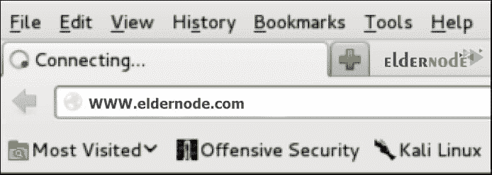

# 如何在 kali linux - Eldernode 博客上配置 Burp 套件

> 原文：<https://blog.eldernode.com/configure-burp-suite-on-kali-linux/>



一步步学习**如何在 kali linux** 上 **配置 Burp 套件。Burp suite 是一个用于检查 web 应用程序安全性的软件应用程序，它包括为您提供现代功能软件的工具。该软件由 Portswigger 公司提供，已经发布了两个版本，专业版和免费版。在本文中，我们将教你如何在 kali linux 上配置 Burp Suite。如果您需要购买 [Linux VPS](https://eldernode.com/linux-vps/) 服务器，可以访问 [Eldernode](https://eldernode.com/) 中提供的软件包。**

### 什么是打嗝套件？

Burp Suite 让用户完全控制，并允许他们结合不同的和先进的技术，以更快，更有效和更愉快的工作。这个软件非常简单，方便和可配置，并有许多强大的功能，以帮助那些测试软件。它的专业版包括多种工具和一个自动扫描仪。同时，免费版本是完整的，包括所有的基本工具。

## 教程在 kali linux 上配置 Burp 套件

在我们配置 Burp Suite 之前，我们将首先向您介绍该软件的选项卡，包括以下内容:

**–Target:**使用该工具，您可以收集 web 应用程序的所有资源进行识别。

**–Proxy:**使用此工具，可以分析和编辑所有 web 应用流量。

**–Spider:**这个工具可以让你按照一定的算法和模式浏览互联网。

**–Scanner:**web 应用下的全面安全扫描器，只有专业版才有。

**-入侵者:**有了这个工具，所有的 web 应用请求都是自动化的。通过多次重复一个请求(模糊化)，这实际上意味着向程序发送意外的请求，这个过程可以发现安全漏洞。

**–Repeater:**用于重新编辑和发送 web 请求的强大工具。

**–Sequencer:**用于检查令牌和 cookies 的工具。

**–解码器:**允许您加密或解密数据。

**–比较器:**此工具用于查找网页上的变化。

## 如何在 kali linux 上安装 Burp 套件

第一种方法是，您可以通过以下路径访问 Burp 套件:

应用> > Kali Linux > >十大安全工具> > burpsuite。

第二种方法是通过从 bash 终端进入 Java 解释器，您可以运行 Burp Suite:

```
[[email protected]](/cdn-cgi/l/email-protection):~# java -jar /usr/bin/burpsuite.jar
```

下载 Burp 套件后，确保代理监听器已启用。以下示例使用 TCP 8080 端口。



在本节中，您将看到所有代理侦听器的列表。您可以在没有代理侦听器的情况下添加它。要在 Kali Linux 上使用 IceWeasel web 浏览器，请配置监听器监听 127.0.0.1 上的专用端口。还要确保运行框处于活动状态。

现在，您需要更改浏览器配置，通过代理路由流量。为此，点击页面顶部的鼬球图标，打开 **IceWeasel** 。然后按照下面的路径打开下面的页面:

编辑>>首选项



在**首选项**菜单中，点击**高级**选项，然后选择**网络**选项卡。

然后，点击**设置**。这将带您进入连接设置配置页面:



将代理单选按钮更改为手动配置。在本例中，HTTP 代理地址设置为 127.0.0.1，端口值设置为 TCP 8080。通过 IceWeasel 浏览器搜索网站，确保配置正确。



您会注意到浏览器试图连接，但是浏览器中什么也没有提供，因为从浏览器发送的请求被代理拦截了。要使用浏览器，您可以将代理设置更改为使用系统代理设置选项，并且仅在使用 Burp 时使用手动代理设置。

介绍 Burp 套件插件

### **1-** [AdminPanelFinder 插件](https://github.com/moeinfatehi/Admin-Panel_Finder)

这个插件用于搜索网站的管理页面。使用这个插件，你可以很容易地在 burpsuite 中找到网站管理面板。在这个插件的特性中，你可以测试超过 1000 个页面和它的高速度。

**2-** [备份查找器插件](https://github.com/moeinfatehi/Backup-Finder)

这个插件用于搜索服务器内部的备份文件，在 burpsuite 中作为插件使用。它还能够读取目录并使用默认名称搜索备份。

**3-** [BurpelFish 翻译插件](https://github.com/portswigger/burpelfish)

这个插件非常好，非常有用，在测试渗透率的时候可以使用谷歌翻译外文文本。由于使用了谷歌服务，你可以翻译所有常见的语言。

**4-** [AES 黑仔插件](https://github.com/Ebryx/AES-Killer.git)

这个插件用于在流量通过网络时破解 AES 加密，对于测试加密数据的渗透非常有用。它还能够连接到代理并进行扫描。

**5-** [打嗝 WP 插件打嗝 WP](https://github.com/kacperszurek/burp_wp.git)

使用 burpsuite 搜索 [WordPress](https://blog.eldernode.com/tag/wordpress/) 插件，burp suite 能够搜索超过 35，000 个 WordPress 插件。

结论

## Burp 套件是黑客中非常流行的工具，用于测试网络入侵，尤其是 web 应用程序。默认情况下，这个工具在各种安全操作系统上可用，比如 Kali Linux。在本文中，我们试图在介绍了 Burp Suite 之后，教你如何在 kali linux 上配置 Burp Suite。

Burp Suite is a very popular tool among hackers that is used to test network intrusion, especially web applications. This tool is available by default on a variety of security operating systems such as Kali Linux. In this article, we tried to teach you How to configure Burp Suite on kali linux after introducing Burp Suite.