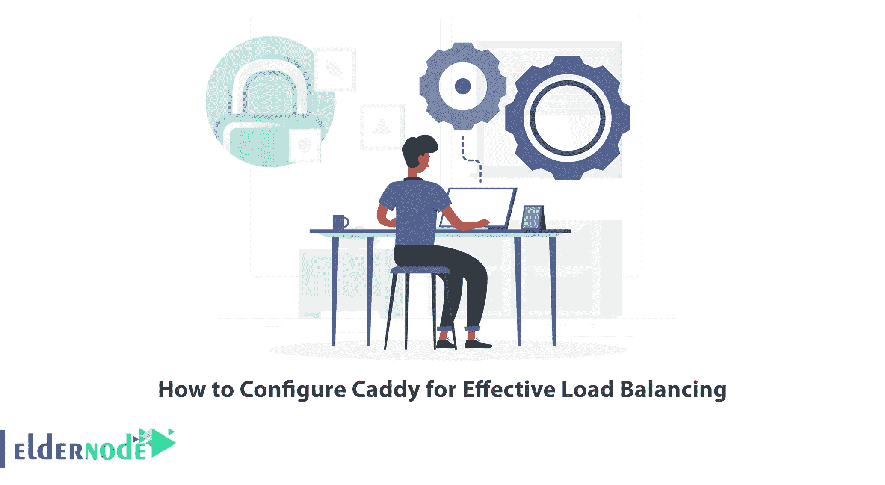
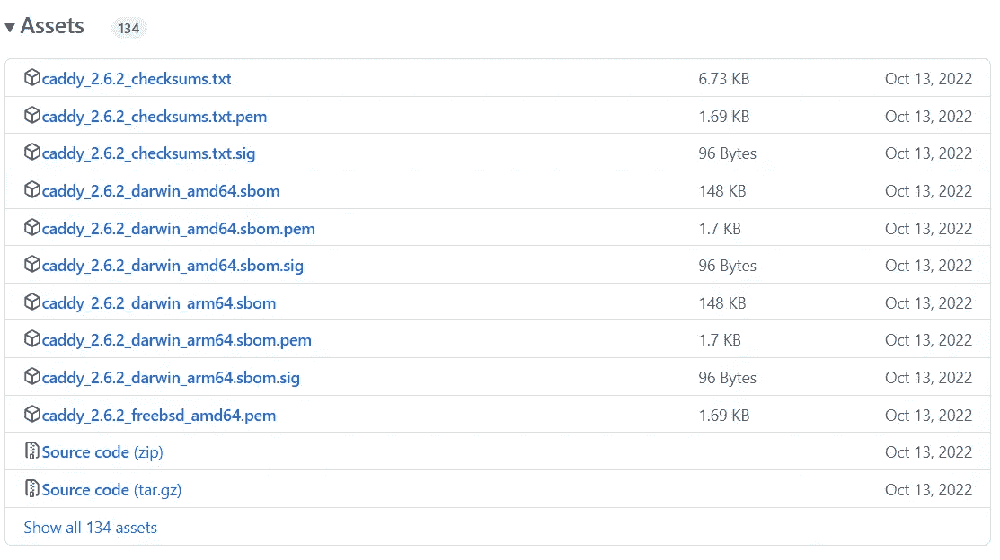

# 如何配置 Caddy 以实现有效的负载平衡

> 原文：<https://blog.eldernode.com/configure-caddy-for-effective-load-balancing/>



在某些情况下，您会遇到这样的情况:您必须在尽可能短的时间内建立并运行一个静态网站。Caddy 是一款注重简单性和安全性的现代 web 服务器，可以在整个过程中为您提供帮助。本文将教你如何配置 Caddy 来实现有效的负载平衡。我们提供经济实惠的 Linux VPS 服务器，这是想购买的人的最佳选择。

## **教程为负载均衡配置 Caddy**

### **球童介绍**

Caddy 是一个开源的、跨平台的、可扩展的 web 服务器，默认情况下自动使用 HTTPS。它是用 Go 编写的，没有依赖性，因此可以在容器中完美运行。该 web 服务器负责 TLS 证书更新、OCSP 装订、静态文件服务、反向代理、Kubernetes 入口等，并简化您的基础架构。它的模块化架构允许您使用一个可在任何平台上编译的静态二进制文件完成更多工作。

## **安装 Caddy 进行有效负载均衡**

首先，导航到[官方 GitHub 网站](https://github.com/caddyserver/caddy/releases)并下载 Caddy:



或者，您可以使用以下命令之一下载 Caddy:

```
curl -OL "https://github.com/caddyserver/caddy/releases/latest/download/Filename"
```

```
wget "https://github.com/caddyserver/caddy/releases/latest/download/Filename"
```

***注意:*** 为你的平台替换文件名而不是“文件名”。

您可以使用下面的命令在 Ubuntu、Debian 和 Raspbian 上安装 Caddy:

```
echo "deb [trusted=yes] https://apt.fury.io/caddy/ /" \
```

```
sudo tee -a /etc/apt/sources.list.d/caddy-fury.list
```

### **在 Docker Compose** 中配置 Caddy 负载平衡器

首先，您应该使用服务器容器，它将打印出当前容器的主机名以及请求细节。

Caddy 的死简单配置文件的设置如下:

```
:80 {        encode zstd gzip        reverse_proxy www01:8080 www02:8080 {            health_uri /          health_interval 5s          health_timeout 3s          health_status 200        }  }
```

这两个工作负载在端口 8080 上运行，Caddy 负载平衡器在端口 80 上向您的本地机器公开。现在将这些容器隔离在一个名为 instance 的网络中:

```
version: "3.9"  services:    caddy-lb:      networks:        - instance      image: caddy:2-alpine      volumes:        - ./caddy/data:/data        - ./caddy/config/Caddyfile:/etc/caddy/Caddyfile      depends_on:        - www01        - www02      ports:        - "80:80"    www01:      image: jmalloc/echo-server      hostname: www01      networks:        - instance      ports:        - "8080"    www02:      image: jmalloc/echo-server      hostname: www02      networks:        - instance      ports:        - "8080"    networks:    instance:
```

您可以运行该实例，如下所示:

```
docker-compose up --build --remove-orphans
```

现在，在您想要的浏览器中单击 localhost。

然后刷新几次。请求在上游目地之间切换，不同的容器为其服务。在此阶段，借助以下命令终止其中一个容器:

```
docker kill ID
```

***注意:*** 记得用浏览器中的一个 ID 替换 ID。

如果您再刷新几次，您将看到 Caddy 不再为来自该容器的流量提供服务。

就是这样！

## 结论

Caddy web server 负责 TLS 证书更新、OCSP 装订、静态文件服务、反向代理、Kubernetes 入口等，并简化您的基础架构。在本文中，我们向您介绍了如何配置 Caddy 来实现有效的负载平衡。我希望本教程对您有用，并帮助您配置 Caddy 以实现有效的负载平衡。如果你遇到任何问题或者有任何疑问，可以在评论区联系我们。