# 教程在 Ubuntu 20.04 上配置 Cinnamon 桌面- Eldernode 博客

> 原文：<https://blog.eldernode.com/configure-cinnamon-desktop-on-ubuntu/>

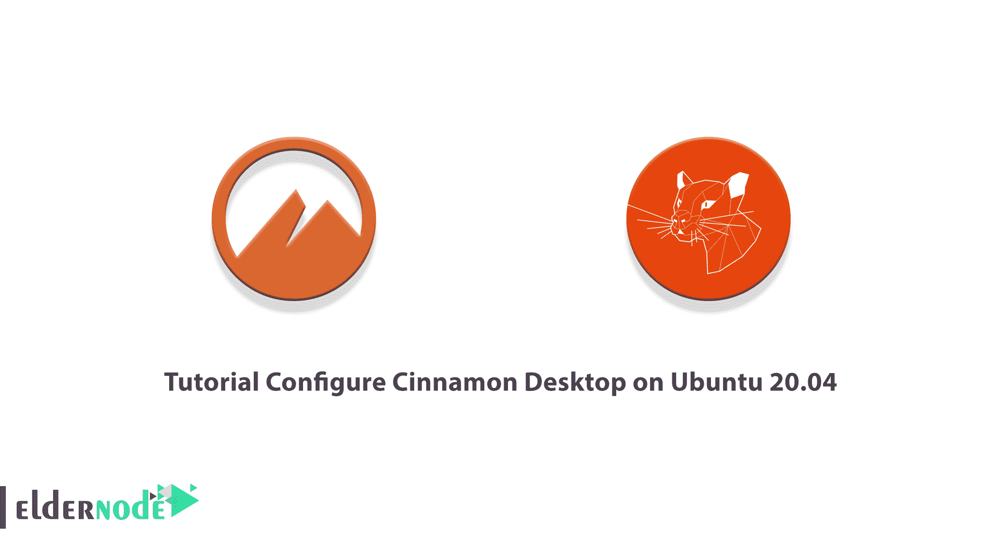

Cinnamon 桌面环境实际上是几个不同项目的集合，如 Cinnamon，GNOME 的一部分，Cinnamon 屏保项目，Cinnamon 桌面，Cinnamon 菜单，Cinnamon 设置，以及其他一些例子。在本文中，我们将一步一步地教你如何在 Ubuntu 20.04 上配置 Cinnamon Desktop。如果你想购买一台 [**Ubuntu VPS**](https://eldernode.com/ubuntu-vps/) 服务器，你可以访问 [Eldernode](https://eldernode.com/) 中提供的软件包。

## **如何在 Ubuntu 20.04 上安装配置 Cinnamon Desktop**

### **肉桂桌面简介**

Cinnamon 桌面环境实际上是 Gnome 项目的一部分，默认安装在 [Linux](https://blog.eldernode.com/tag/linux/) Mint 上。这种环境具有以下特点:

–MDM 显示管理器

–Nemo 文件管理器

-松饼橱窗经理

–Cinnamon 会议经理

–肉桂翻译

–蓝牙配置的蓝莓工具

在下图中，您可以看到 Cinnamon 桌面环境的主页:

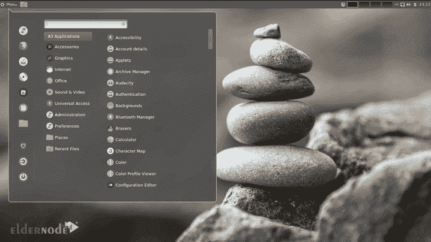

在本文的剩余部分，加入我们向您展示如何在 Ubuntu 20.04 上安装和配置 Cinnamon 桌面环境。

## **如何在 Ubuntu 20.04 上安装肉桂桌面|** **Ubuntu 21.04**

在这一节，我们将教你如何在 Ubuntu 20.04 上安装 Cinnamon 桌面环境。为此，只需按顺序执行以下步骤。

安装之前要知道的一件事是，用于 Ubuntu 20.04 的 Cinnamon 桌面环境包可以在操作系统库中获得。因此，您必须使用以下命令**更新**缓存，然后启动**安装**:

```
sudo apt update
```

```
sudo apt install cinnamon-desktop-environment
```

***注意:*** 根据您的互联网连接速度，您可能需要耐心等待，直到所有软件包安装完毕。

当被问到“**是否要继续？**”，你要输入“ **y** ，回车。

最后，在完成 Cinnamon Desktop 安装后，您必须运行以下命令来重新启动系统一次:

```
reboot
```

### **如何在 Ubuntu 20.04 上运行肉桂桌面**

在上一节成功安装 Cinnamon Desktop 后，我们现在要向您展示如何运行它。安装 Cinnamon Desktop(这是一个传统的 Linux 桌面环境)后，关闭命令终端并注销。

现在你必须点击如下所示的**用户名**，在输入密码之前，点击右下角的**齿轮**图标。

在出现的弹出窗口中，选择**肉桂**，然后输入您的密码。

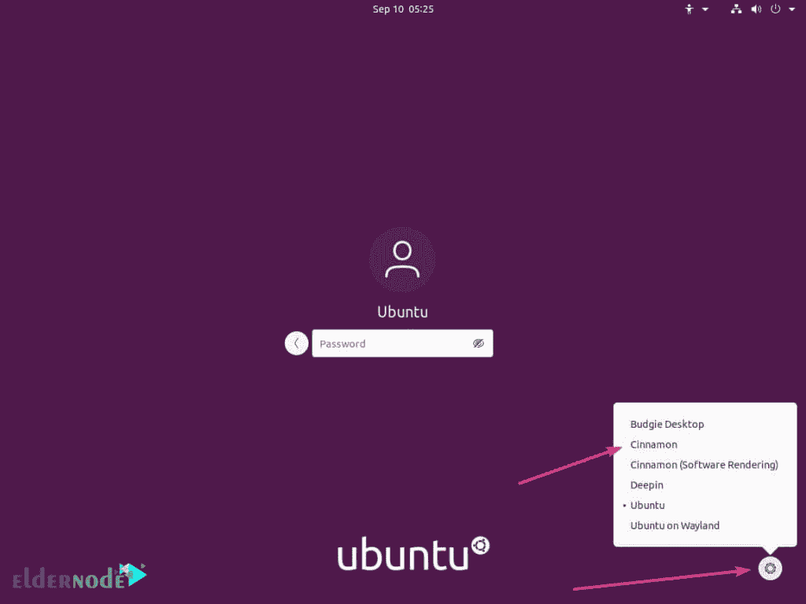

*

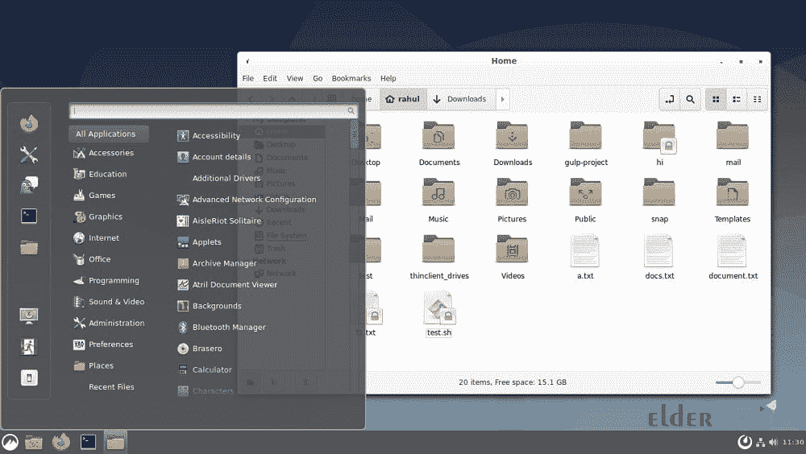

启动 Cinnamon 后，您可以使用以下命令来远程控制 Ubuntu 20.04 上的 Cinnamon 桌面:

```
sudo apt purge cinnamon-desktop-environment
```

### **在 Ubuntu 20.04 上配置肉桂桌面**

本节包括 Cinnamon Desktop 的设置和配置。

**1。效果**

将不同桌面元素的效果**打开**或**关闭**。您还可以通过更改效果的样式来更改窗口过渡。要改变效果的速度，可以通过**自定义**选项卡来实现。

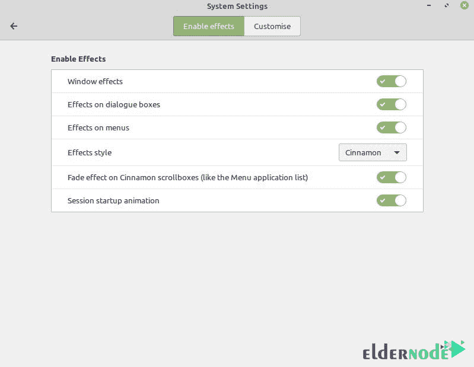

**2。字体选择**

您可以根据大小和类型区分整个系统中使用的字体，并很好地调整外观。

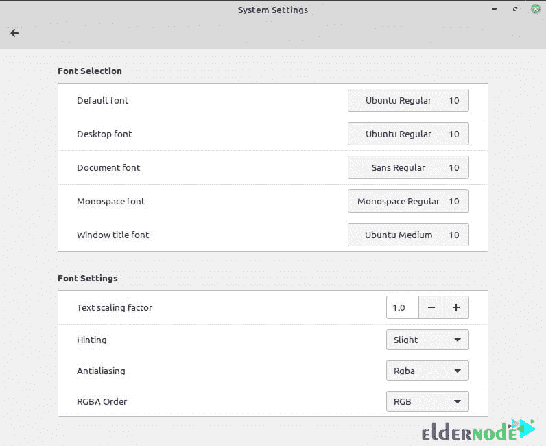

**3。主题和图标**

使用本节中的设置，您可以将屏幕主题更改为暗色或亮色，并更改窗口边距以适应您的更改。

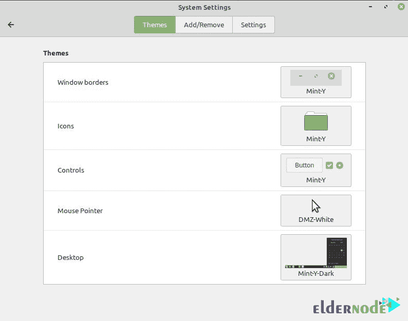

**4。肉桂苹果**

您可以在**管理**选项卡中添加或删除已安装的小程序:

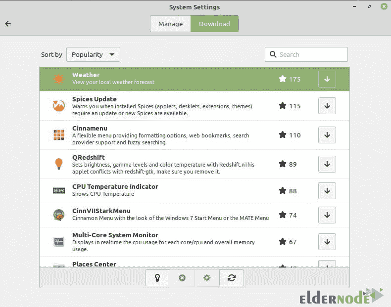

**5。肉桂桌**

像其他自定义选项一样，可以从“设置”菜单访问桌面。

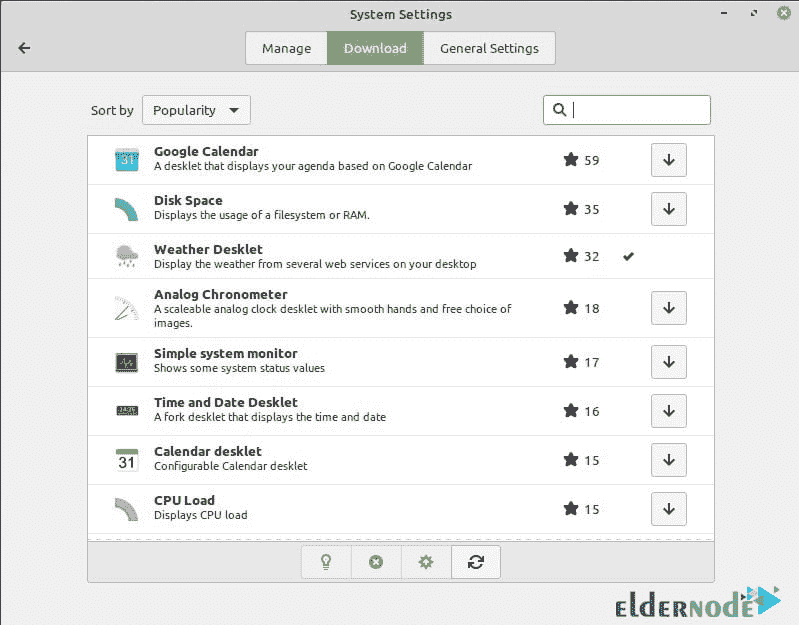

**6。桌面壁纸**

在桌面上点击右键，选择**改变桌面背景**。在打开的窗口中，现有后台系统的文件夹列在左侧，在游乐设备部分，有每个文件夹内图像的预览。

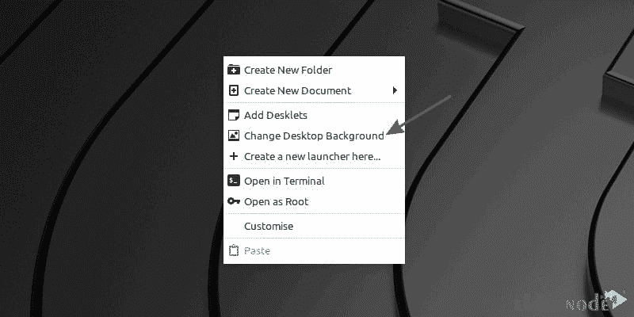

通过点击( **+** )移动文件夹来添加文件夹。在**设置**选项卡中，您还可以选择背景是静态还是幻灯片，以及背景在屏幕上的放置方式。

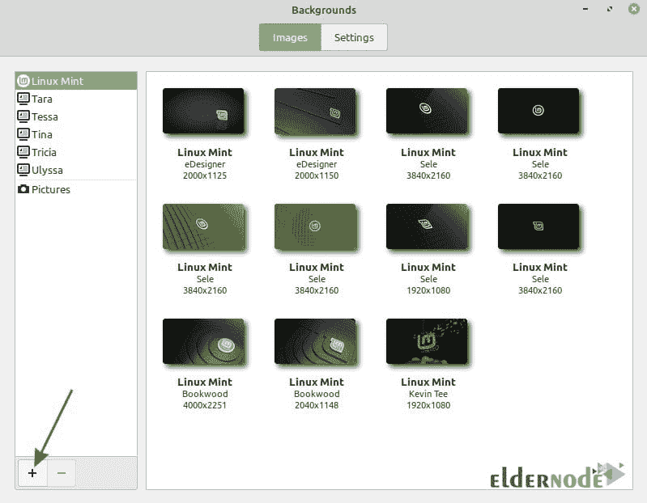

**7。定制桌面屏幕上的内容**

在桌面上点击右键，点击“**自定义**”。你会发现你可以找到更多的选择。

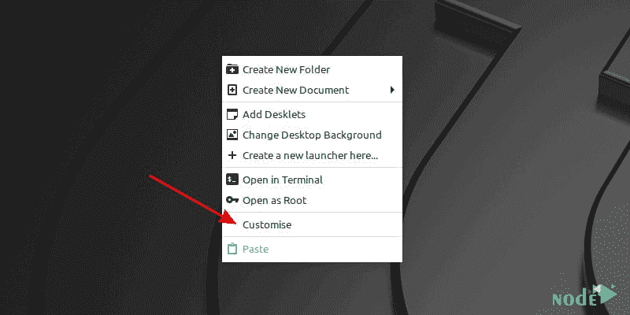

您可以调整图标的大小，将位置从垂直更改为水平，并更改它们在两个轴上的距离。如果你不喜欢你正在做的事情，点击**重置网格间距**回到默认状态。

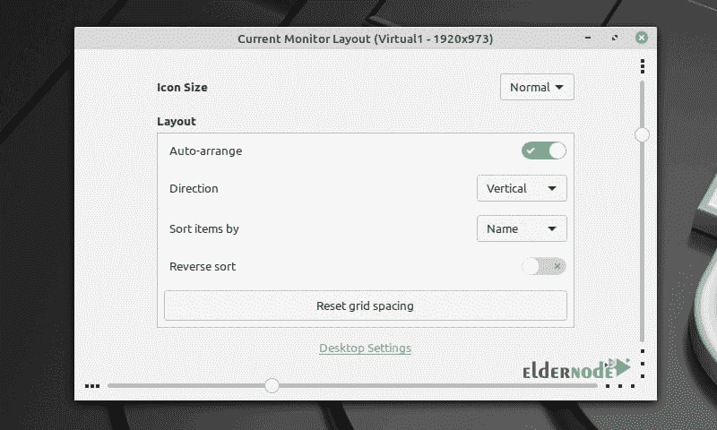

如果点击**桌面设置**，会显示更多选项。您可以禁用桌面上的图标，将它们放在主显示器或辅助显示器上，或者两者都放。

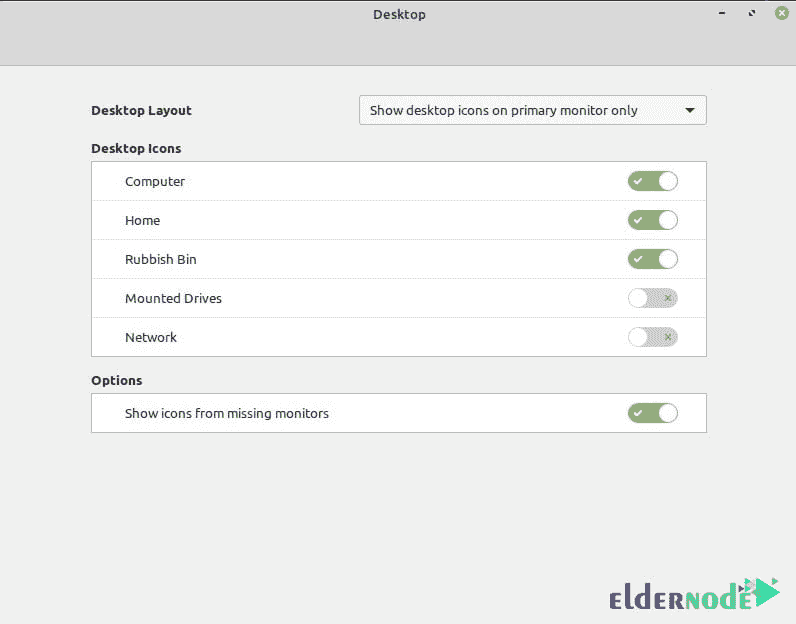

## 结论

Cinnamon 提供了传统的桌面体验，许多用户喜欢它的本来面目。Cinnamon 提供了几种定制桌面的方法。在这篇文章中，我们在介绍了 Cinnamon 之后，试图教你如何在 Ubuntu 20.04 上安装和运行 Cinnamon。我们还向您展示了如何配置 cinnamon。