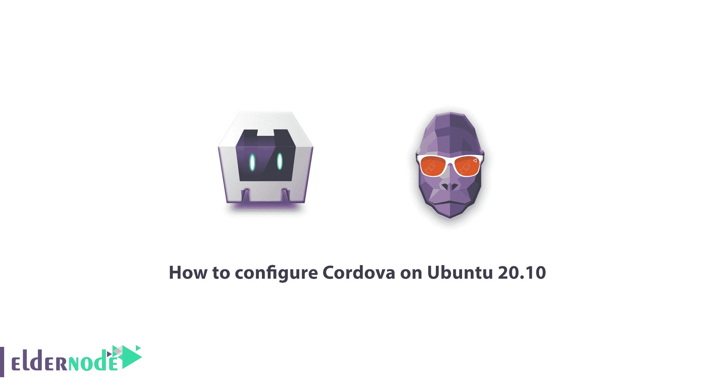

# 如何在 Ubuntu 20.10 - Eldernode 博客上配置 Cordova

> 原文：<https://blog.eldernode.com/configure-cordova-on-ubuntu-20-10/>



了解如何**在 Ubuntu 20.10** 上一步步配置 Cordova。Apache Cordova 是第一个使用 HTML、CSS 和 JavaScript 构建移动应用程序的开源平台。该平台包括一组预建的插件，以提供对相机、GPS、文件系统和设备的其他组件的访问。Cordova 可以被认为是一个应用程序容器，其 web 视图覆盖了设备的整个屏幕。2011 年，Adobe 收购了 Nitobi，并将其开源内核捐赠给了 Apache Software Foundation，将其命名为 Apache Cordova。

在本文中，我们将在完整介绍 Apache Cordova 之后，教你如何在 Ubuntu 20.10 上配置 Cordova。您还可以在 [Eldernode](https://eldernode.com/) 中看到可用的包，因为安装和配置 Cordova 需要购买 [Ubuntu VPS](https://eldernode.com/ubuntu-vps/) 服务器。

## 什么是阿帕奇科尔多瓦？

Apache Cordova 提供了一组 API，用于访问设备的本机功能，如摄像头、SIM 卡和联系人列表。Cordova 可以被认为是一个应用程序容器，其 web 视图覆盖了设备的整个屏幕。Cordova 使用这个 web 视图的方式与本地操作系统相同。

## 在 Ubuntu 20.10 上配置 Cordova

Apache Cordova 包括一组预构建的插件，允许访问摄像头、GPS、文件系统和其他本地系统组件。Cordova 可用于开发以下平台的应用程序:

**–**Ubuntu

**–**窗口

**–**安卓

**–**iOS

**–**火狐操作系统

**–**黑莓

**–**ti Zen

**–**网络操作系统

**–**Symbian

### 阿帕奇科尔多瓦有哪些功能？

Apache Cordova 的基本功能如下:

***1。科尔多瓦**的基本组件*

Cordova 提供多种基本组件，每种组件都是为满足移动应用的特定需求而设计的。这些组件为应用程序专注于实现自己的逻辑提供了基础。

***2。命令行连接***

这个工具负责为各种平台构建流程和安装插件。它还用于启动项目并使开发过程更容易。

***3。科尔多瓦插件***

本节提供了一个用于在 JavaScript 应用程序中实现本地移动功能的 API。这些插件在应用程序中提供对设备功能的访问，如照相机、电池、联系人等。

### 阿帕奇科尔多瓦的优势

使用 Apache Cordova 平台开发跨平台应用程序的优势如下:

**–**一个开源平台。

**–**简单易学，用于开发跨平台应用。

**–**提供了为不同平台构建应用程序的灵活性，无需学习新的编程语言。

**–**科尔多瓦的应用开发速度很快。因为这个平台将应用程序转移到其他支持的平台。

**–**在这个平台上搭建原型非常快。

**–**包括一组预建的插件，用于访问手机的摄像头、GPS 和文件系统。

有许多免费插件提供了几个库和框架。

### 阿帕奇科尔多瓦的缺点

尽管列出了 Apache Cordova 的优点，但该平台也有一些缺点，如下所示:

**–**不是大型应用的最佳选择。因为混合应用程序比原生应用程序慢。

**–**由于 Web 视图中的代码执行，应用程序性能降低。

**–**不适合游戏开发。因为它需要目前没有的高级插件。

## 教程在 Ubuntu 20.10 上安装 Cordova

认为一个人可以掌握 HTML、CSS 和 Js 的移动应用程序可能有些牵强。因为乍一看这些技能好像是设计网页用的。但真的不是！在 Apache Cordova 的帮助下，您将能够利用网页设计知识构建移动应用程序。在这一节，我们将教你如何在 Ubuntu 上安装和配置 Apache Cordova。

很高兴知道 Cordova 提供了一组用于创建、运行和生产移动软件的命令。这些命令在终端中使用，需要 [NodeJs](https://blog.eldernode.com/install-and-config-node-js-on-ubuntu-20-04/) 运行。所以你首先需要在你的系统上安装 [NodeJs](https://blog.eldernode.com/install-node-js-centos-8/) 。为此，请在终端中输入以下命令:

```
sudo apt-get update  sudo apt-get install nodejs
```

要确保 NodeJs 安装正确，请在终端中输入以下命令来查看 NodeJs 的安装版本:

```
nodejs -v
```

下一步是安装 NPM。NPM 代表节点包管理器。接下来，您将需要 npm 来安装 Cordova，甚至是您可能正在使用的插件。要安装 npm，只需在终端中输入以下命令:

```
sudo apt install npm
```

为了确保正确安装 npm，您还可以使用以下命令，该命令显示系统上安装的 npm 版本:

```
npm -v
```

要安装 Cordova，只需在终端中输入以下命令:

```
sudo npm install -g cordova
```

## 如何在 Ubuntu 20.10 上配置 Cordova

执行上述命令后，Cordova 就安装在您的系统上了。现在，您可以在以下命令的帮助下创建您的第一个程序:

```
cordova create MyApp
```

通过运行上面的命令，Cordova 创建了一个名为 **MyApp** 的文件夹，其中包含项目所需的文件。

**如果您转到 MyApp 文件夹，您将看到以下文件和文件夹:**

***1。**钩子文件夹:*用来定制 Cordova 命令。一些插件可能会在这个文件夹中放一个脚本，并向 Cordova 添加命令。

***2。平台文件夹:*** 你可以为浏览器、Android、iOS，甚至 Windows 创建自己的应用。每个平台的输出都位于该文件夹中的一个单独的文件夹中。

***3。插件文件夹:*** 你添加到项目中的插件都放在这个文件夹中。

***4。文件夹 www:**组成你的应用程序，用 HTML、CSS、JS 编写的网页。请注意，默认情况下，index.html 页面将是您的应用程序的第一页。*

***5。config.xml 和 package.json 文件:*** 这些是程序配置文件。您添加到项目中的任何插件或库都将在这些文件中列出。更准确地说，config.xml 是您的程序设置，包括程序起始页、权限和程序规范。npm 使用 package.json 来管理库。

要向应用程序添加平台，只需在项目的终端文件夹中输入以下命令:

```
cordova platform add browser
```

执行上述命令将在 platforms 文件夹中创建一个名为 browser 的文件夹，这将是您的浏览器版本的输出。和上面的命令一样，你也可以为 **Android** 和 **iOS** 定义输出:

```
cordova platform add android 
```

```
cordova platform add ios
```

请注意，您无法在 Windows 或 Linux 环境中获得 iOS 输出。对于这个平台，您必须在 Mac OS 上构建项目。

要运行您的程序，只需在终端中输入以下命令:

```
cordova run browser
```

要退出 Android 或 iOS 应用程序，如果您已经将它们的平台添加到项目中，您可以使用以下命令获得项目输出:

```
cordova build android
```

## 结论

Apache Cordova 是最早的混合应用程序开发框架之一。这个框架已经被用来开发这样的应用程序很多年了。随着其他框架的出现，该框架现在有些边缘化，但它仍然在跨平台编程领域占有一席之地。在这篇文章中，我们试图提供一个完整的描述 Cordova 及其优点和缺点。然后我们教你如何在 Ubuntu 20.10 上安装和配置 Cordova。