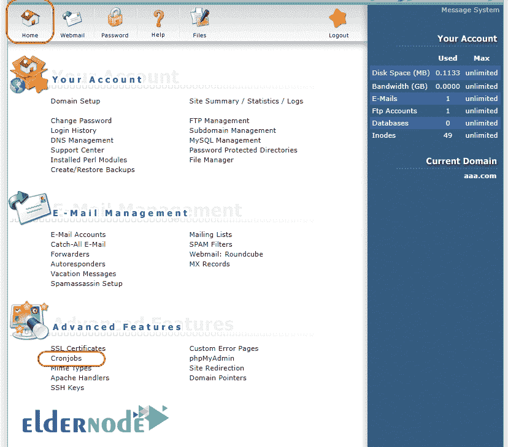

# 在 directadmin -教程 directadmin | Eldernode 中配置 cron 作业

> 原文：<https://blog.eldernode.com/configure-cron-job-in-the-directadmin/>

**在 directadmin 中配置 cron 作业，**

大多数系统使用 Cronjobs 来执行定期请求，如备份、系统设置和规范、持续更新和 MSs 更新。使用 SSH 命令在服务器级配置 Cronjobs 很容易，这使得图形化请求用户级控制面板变得更加容易。

在本教程中，我们将回顾在 admin 目录中设置和执行 Cron。

### **如何在 directadmin 中配置 cron 作业**

有几种方法可以正确执行 cron，如下所示。

登录 [directadmin](https://my.eldernode.com/cart.php?gid=4) 后，选择 Cronjobs 选项，如下图所示:

在“命令”部分的新页面上，您应该执行以下操作之一:

PHP-q/home/user/public _ html/cron . PHP

/usr/local/bin/PHP/home/domain . com/public _ html/cron jobs . PHP

/usr/bin/wget-O/dev/null http://domain.com/Folder/CronJobs.php

/usr/bin/wget-qo/dev/null http://domain.com/Folder/CronJobs.php

注意:
由于缺乏访问权限，一些 php 路径比/ usr / bin / wget 更好…

使用它运行没有 cron 问题。

在 command 部分添加适当的命令并输入所需的时间后，单击 Add 按钮。

同样，如果您没有大量可执行的亲信，您可以在电子邮件中，输入您的电子邮件以接收已执行请求的报告输出。

请注意，此部分有时会影响您的电子邮件数量和发送电子邮件的限制，并且是发送到您网站的电子邮件的优先选项。

在下面图片的底部是一个示例边界，定义为在每晚 11 点运行下图中的测试运行，如果需要，您可以进行测试。

如果您需要服务器，可以从以下链接订购:

[**购买 VPS 服务器**](https://eldernode.com/vps-server/)