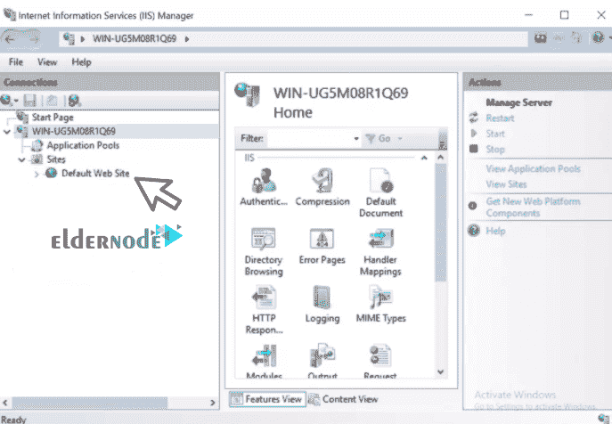
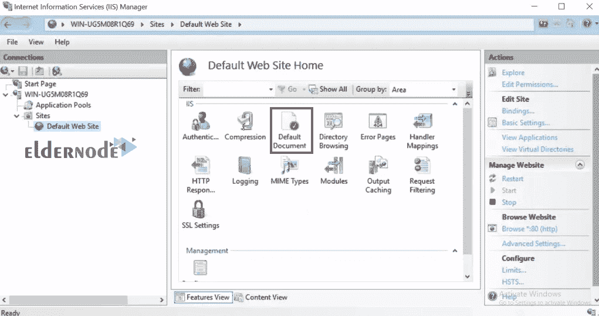

# 如何在 IIS Server 2019 - ElderNode 博客中配置默认站点

> 原文：<https://blog.eldernode.com/configure-default-site-in-iis-server/>

如何在 IIS Server 2019 中配置默认站点？在上一篇文章中，我们教过你[如何在 Windows Server 2019](https://eldernode.com/install-iis-web-server-on-windows-server/) 上安装 IIS Web Server。如你所知，通过安装 [IIS](https://eldernode.com/tag/iis/) ，默认创建一个名为默认网址的网站，可以用来测试 IIS 的**健康状况。**

该网站被配置为通过端口 80 响应来自 [HTTP 协议](https://en.wikipedia.org/wiki/Hypertext_Transfer_Protocol)的用户请求，端口 80 是分配给[网络服务器](https://eldernode.com/tag/web-server/)的所有不属于特定网站的 IP(全部未分配)。

我们将通过了解其文档根的位置以及如何在其中托管一个**简单网站**来使用**默认站点**。这样，你就可以上传你的文件并启动你的网站和配置。

*[**ElderNode VPS 托管套餐**](https://eldernode.com/vps-hosting/)*

### 1) 打开默认站点

要打开 IIS 管理器，执行以下操作:

**–**首先，按下窗口的键。

**–**然后搜索服务器管理器运行它。

**–**从**工具**菜单中，点击互联网信息服务(IIS)管理器。

一旦您的 IIS 管理器打开，**展开起始页下的**服务器名称，并进一步**展开** 站点文件夹以显示默认站点。

*****

**展开**服务器名。

下一步，**暴露**默认的站点。

******

### 2) 如何查看其档案

默认站点将其文件存储在**特定目录**中。

要显示这些信息，**右键点击**，选择管理网站，然后选择高级设置，如下图所示:

这将打开一个弹出窗口，显示所有的默认站点信息，如通常所知的文件或文档根、启用**的协议**，甚至是绑定。

如果您点击物理路径，在其最右侧会出现一个按钮，您可以在此选择一个不同的文档根目录。

### 3) 默认单据

IIS 管理器中的“默认文档功能帮助您指定当客户端没有从网络服务器请求特定文件时返回的默认文件。

**双击上面的**,查看显示的文件。它们是按优先顺序排列的。

*** * ***

在文件根目录中创建一个index.html文件，并检查它是否被加载。

打开您想要的**浏览器**并在那里登记。

*可以看到下载成功。*

**亦作，见:**

[1。 Windows Server 2019 安装配置教程](https://eldernode.com/windows-server-2019-install-and-config/)

[2。教程在 Windows Server 2019 中配置 NTP 服务器](https://eldernode.com/configure-ntp-server-in-windows-server/)

[3。教程在 Windows IIS Server 2019 上配置虚拟目录](https://eldernode.com/configure-virtual-directory-on-windows-server/)

[4。如何在 Windows Server 2019 上安装和配置 Hyper-V](https://eldernode.com/install-and-configure-hyper-v-on-windows/)

[5。如何在 Windows Server 2019 上安装 Active Directory](https://eldernode.com/install-active-directory-on-windows-server/)

[6。如何在 Windows 服务器上安装和配置 Windows 管理中心](https://eldernode.com/install-and-configure-windows-admin-center-on-windows-server/)

**尊敬的用户**，我们希望您能喜欢这个[教程](https://eldernode.com/category/tutorial/)，您可以在评论区提出关于本次培训的问题，或者解决[老年人节点培训](https://eldernode.com/blog/)领域的其他问题，请参考[提问页面](https://eldernode.com/ask)部分，并尽快提出您的问题。腾出时间给其他用户和专家来回答你的问题。

如何在 IIS Server 2019 中配置默认站点？

好运。