# 教程在 Windows Server 2016 上配置 DNS-elder node 博客

> 原文：<https://blog.eldernode.com/configure-dns-on-windows-server-2016/>

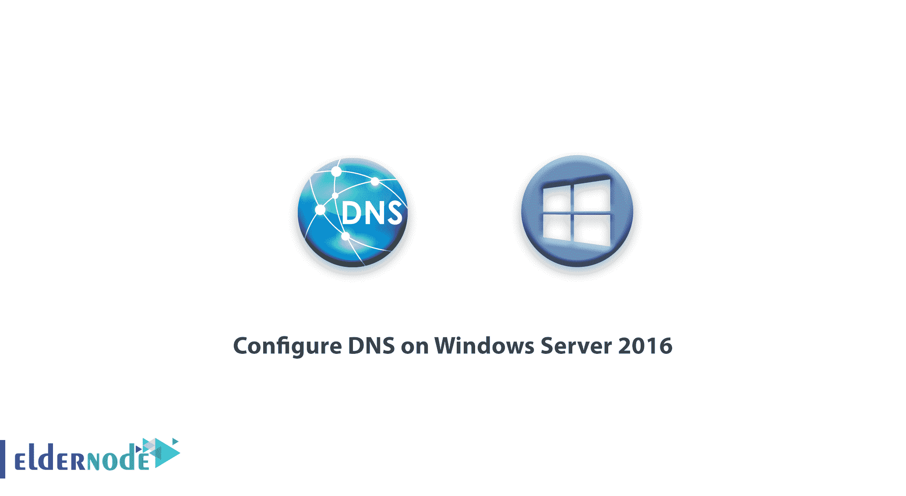

在本[教程](https://eldernode.com/category/tutorial/)中，我们要一步步学习如何在 [Windows Server](https://eldernode.com/tag/windows-vps/) 2016 上安装和配置 DNS。

注意:在虚拟服务器上安装 DNS 之前，您必须静态设置服务器的 IP 地址，否则您将在安装过程中遇到错误。

## 教程如何在 Windows Server 2016 上安装和配置 DNS

[DNS](https://en.wikipedia.org/wiki/Domain_Name_System) 代表域名系统，一般意义上负责将域名翻译成 IP 地址。
DNS 内有区域，当网络管理员安装和配置时，使它们使用它们的网络域名并使用它们。

### 在 Windows Server 2016 上安装 DNS

1-首先打开您的服务器管理器。

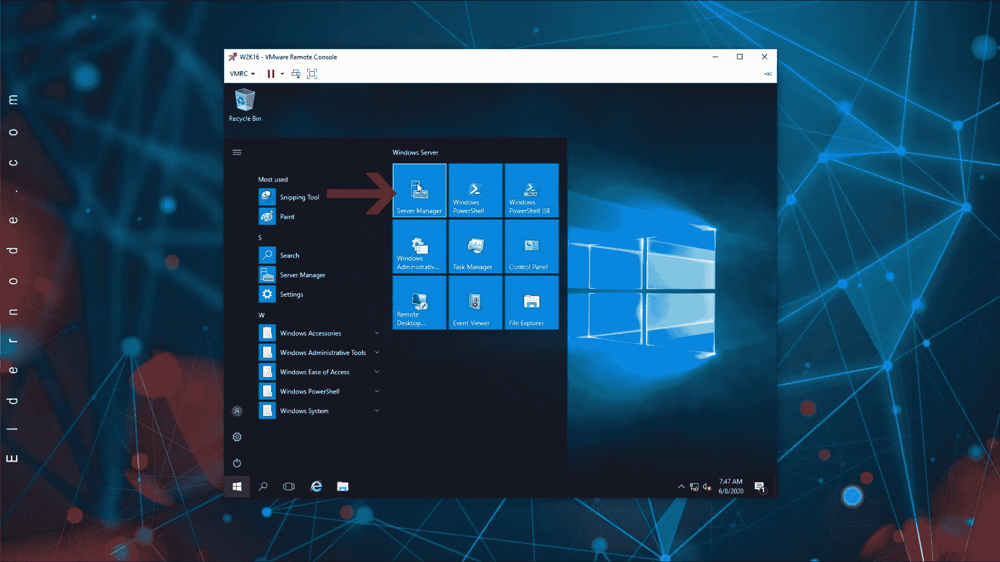

2.单击添加角色和功能以打开添加角色页面。

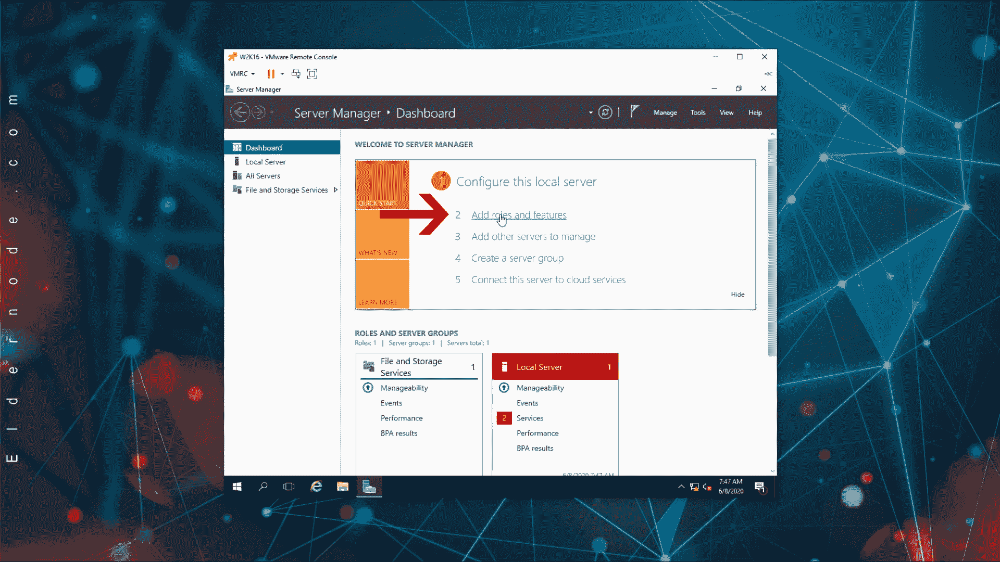

3.在打开的页面上，单击下一步。

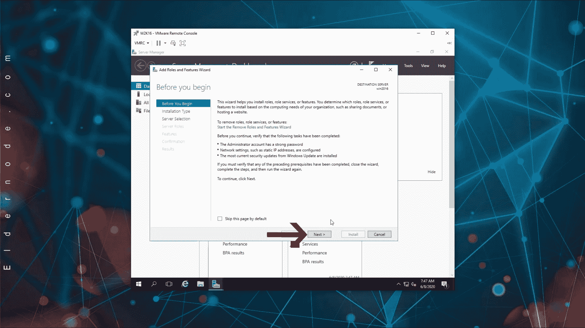

4.然后单击基于角色或基于功能的安装，并单击下一步。

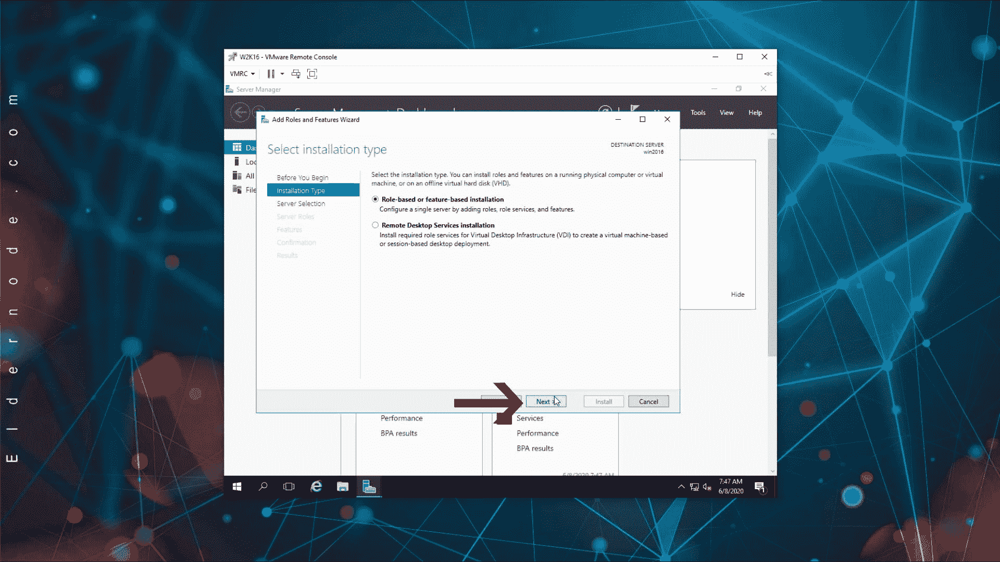

5-在此步骤中，选择从服务器池中选择一个服务器，并在下面的框中选择您的服务器的名称，最后单击下一步。

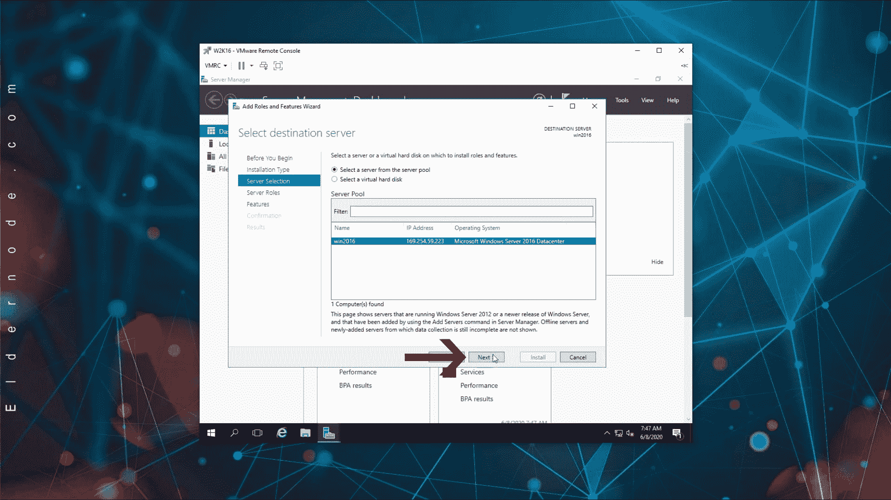

6-在本节中，找到短语 DNS 服务器并检查它。

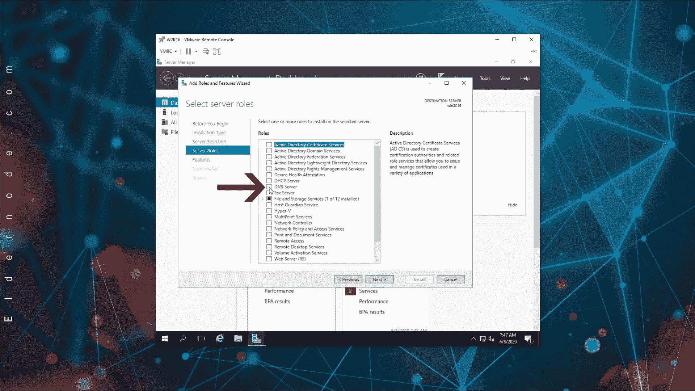

检查 DNS 服务器后，Windows 会给你一条消息，说明你需要安装一些必要的功能来控制 DNS，在这一部分点击添加功能，然后点击下一步。

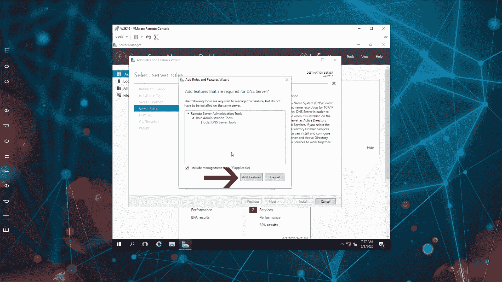

7-不加修改地传递功能和 DNS 服务器页面，并在最后单击安装。

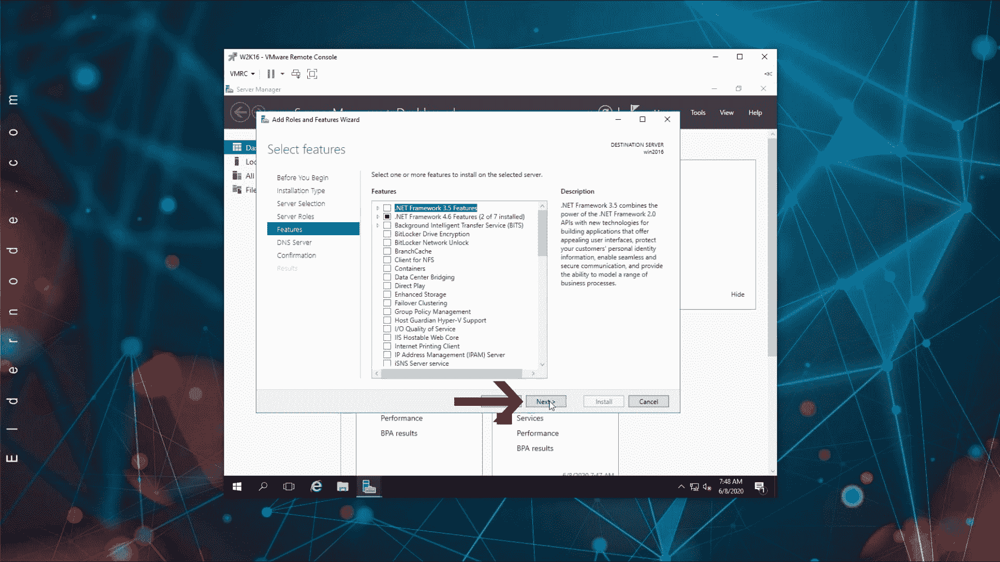

然后等待 DNS 服务器安装到您的服务器上。

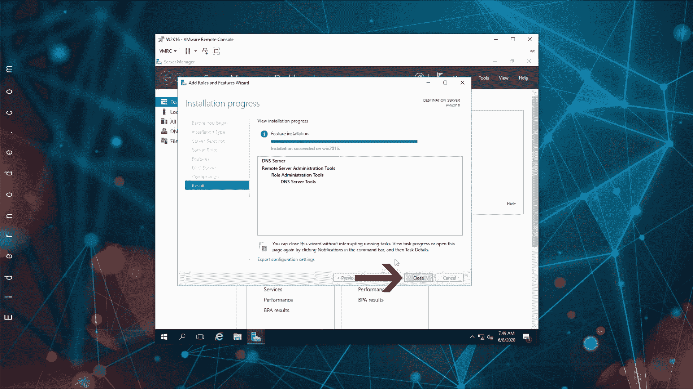

### 如何在 Windows Server 2016 中打开 DNS 管理控制台

在 [Windows VPS](https://eldernode.com/windows-vps/) 上安装了完整的 DNS 服务器 roll 之后，2016 服务器将解释如何以几种不同的方式打开 DNS 管理，或 DNS 管理控制台。

#### 1:从开始菜单打开 DNS 控制台

a)打开开始菜单，选择管理工具。

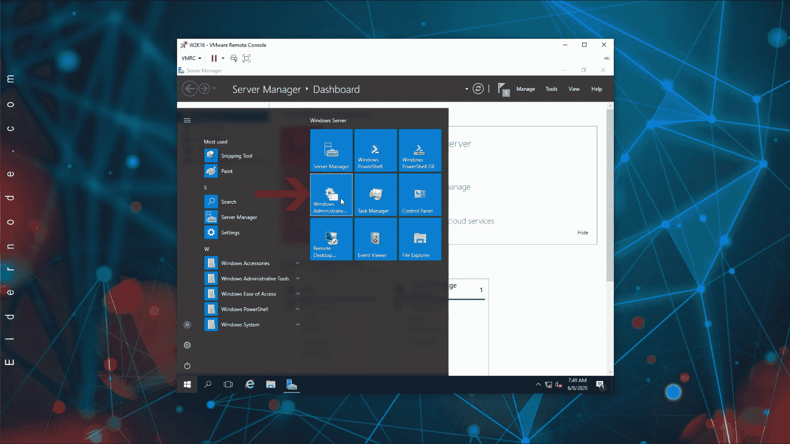

b)在打开的页面上，单击 DNS 打开 DNS 管理控制台。

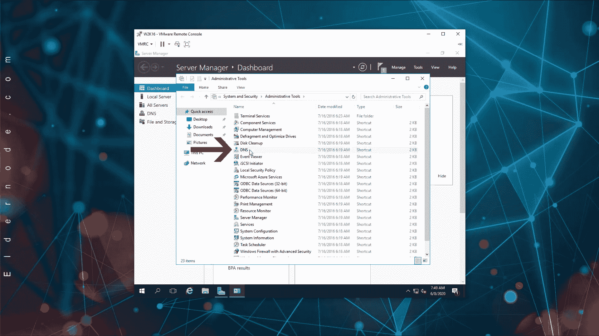

#### 2:从服务器管理器打开 DNS 管理控制台

a)打开服务器管理器控制台。

b)从“工具”菜单中，单击“DNS 管理”打开控制台。

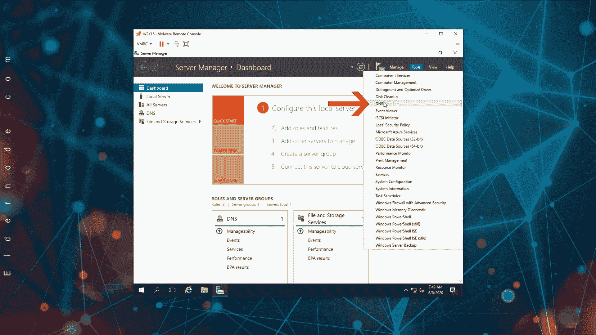

#### 3:从运行窗口打开 DNS 管理控制台

a)通过按键盘上的 Winkey + R 组合键打开运行窗口。

b)键入 dnsmgmt.msc，然后单击确定。

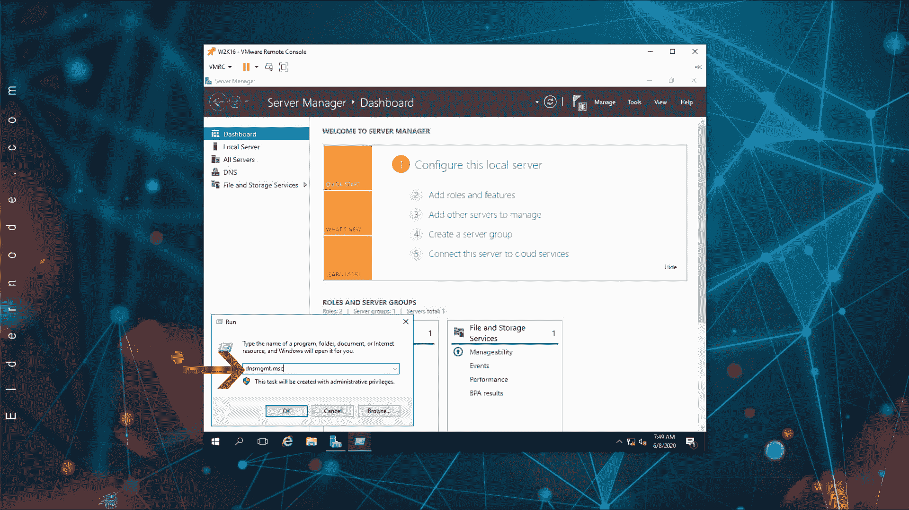

这将以多种方式打开 [DNS 管理控制台](https://eldernode.com/tag/dns-management-console/)。

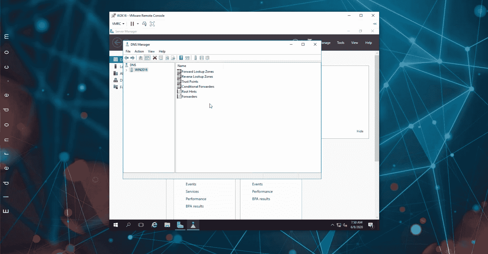