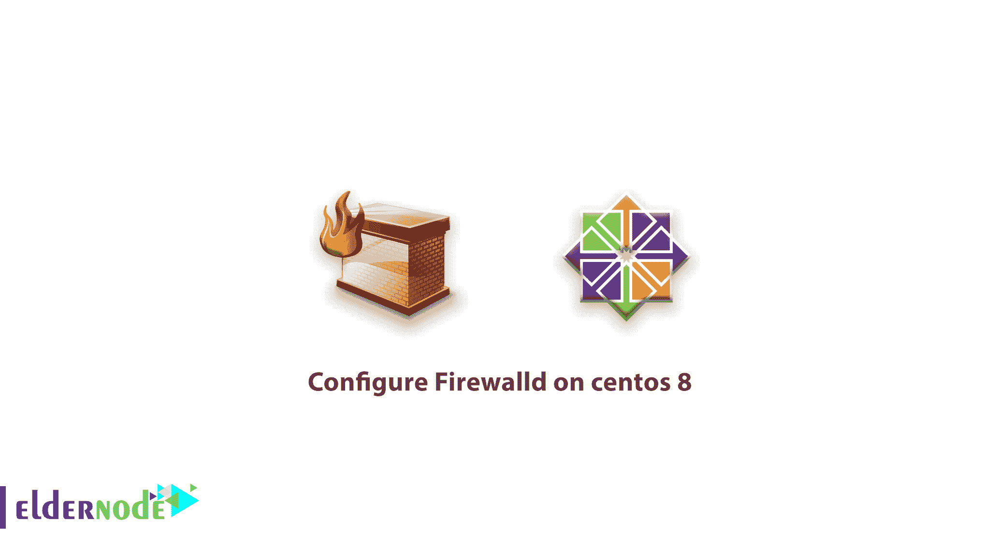

# 在 centos 8 - Eldernode 上配置防火墙

> 原文：<https://blog.eldernode.com/configure-firewalld-on-centos-8/>



在本[教程](https://eldernode.com/category/tutorial/ "tutorial")中，我们要向**解释什么是 Firewalld** 以及**如何在 centos 8** 等版本上配置 Firewalld。

我们将首先查看 Firewalld 以了解更多关于它的好处和特性，然后查看它的特性，最后设置 Firewalld 并对其进行配置。

### 什么是防火墙

据[参考网站](https://firewalld.org/)称，Firewalld 提供了一种动态管理的防火墙，支持定义网络连接或接口信任级别的网络/防火墙区域。它支持 IPv4、IPv6 防火墙设置、以太网网桥和 IP 集。运行时和永久配置选项是分开的。它还为服务或应用程序提供了直接添加防火墙规则的接口。

#### 防火墙的好处

可以在运行时环境中立即进行更改。不需要重新启动服务或守护进程。

借助 Firewalld D-Bus 接口，服务、应用程序以及用户可以轻松调整防火墙设置。该界面是完整的，用于防火墙配置工具 firewall-cmd、firewall-config 和 firewall-applet。

#### 更多 Firewalld 特性

*   完整的 D 总线 API
*   IPv4、IPv6、网桥和 ipset 支持
*   IPv4 和 IPv6 NAT 支持
*   防火墙区域
*   区域、服务和 ICMP 类型的预定义列表
*   简单服务、端口、协议、源端口、伪装、端口转发、ICMP 过滤器、丰富规则、区域中的接口和源地址处理
*   简单的服务定义，包括端口、协议、源端口、模块(Netfilter 助手)和目的地址处理
*   与木偶融合
*   用于在线和离线配置的命令行客户端
*   使用 gtk3 的图形配置工具
*   丰富的语言使区域中的规则更加灵活和复杂
*   区域中的定时防火墙规则
*   拒绝数据包的简单日志
*   直接接口
*   锁定:将可能修改防火墙的应用程序列入白名单
*   自动加载 [Linux](https://blog.eldernode.com/tag/linux/) 内核模块
*   等等…

太好了。现在你知道防火墙了。我们现在将在 centos 8 上设置并**配置 Firewalld。**

## 在 centos 8 上配置 Firewalld

### 在 centos 上设置防火墙

关于在 centos 上设置 Firewalld，您知道的第一点是，默认情况下，Firewalld 安装在 [centos 7](https://eldernode.com/tag/centos-7/ "centos 7") 和更高版本上，但是如果您想在其他 Linux 发行版上安装它，或者 Firewalld 没有预安装在您的 centos 服务器上。请按照这个命令安装它。

```
yum install Firewalld -y
```

*了解更多:* 如果你想在你的 [Ubuntu](https://eldernode.com/tag/ubuntu/ "Ubuntu") 或者 [Debian](https://eldernode.com/tag/debian/ "Debian") 发行版上安装 Firewalld，你必须使用 **APT** 命令而不是 **YUM** 。

#### 使用防火墙服务

要在 centos 上**启动**和**停止**防火墙服务，请遵循以下命令。

```
systemctl start Firewalld  systemctl stop Firewalld
```

为了**重启**防火墙服务，你可以使用这个命令。

```
systemctl restart Firewalld
```

在您了解了启动、停止和重启 Firewalld 服务之后，您必须知道如何在启动时启用和禁用 Firewalld 服务。

#### 启动时启用或禁用防火墙服务

要在 centos 上启用 Firewalld 服务，请执行以下命令。

```
systemctl enable Firewalld
```

或者如果您想在启动时禁用 Firewalld 服务，请执行以下命令。

```
systemctl disable Firewalld
```

#### 检查和验证服务

有时，您需要检查防火墙服务状态。要检查和验证防火墙，您可以使用以下命令。

```
firewall-cmd --state  systemctl status Firewalld
```

这两个命令都工作得很好，您可以了解并验证防火墙状态。

### 熟悉当前防火墙规则

好了，现在你知道了防火墙服务，在此之后的*在 centos 8 上配置防火墙文章*我们想告诉你一些在防火墙上管理和检查规则和情况的命令。

#### 探索默认区

```
firewall-cmd --get-default-zone
```

执行该命令后，您将看到如下输出

```
output  public  if you want to print all enable rule on your Firewalld service, use following command  firewall-cmd --list-all  after Enter the command, you will see output like this:  output  public (default, active)    target: default    icmp-block-inversion: no    interfaces: ens192    sources:    services: ssh dhcpv6-client    ports:    protocols:    masquerade: no    forward-ports:    source-ports:    icmp-blocks:    rich rules:
```

#### 改变界面的区域

例如，我们可以通过键入以下命令将我们的 ens192 接口转换到“私有”区域:

```
firewall-cmd --zone=private --change-interface=ens192
```

#### 调整默认区域

如果您的所有接口都可以由一个区域最好地处理，那么选择最佳默认区域并将其用于您的配置可能会更容易。

例如，在以下命令中，我们将公共区域设置为默认区域。

```
firewall-cmd --set-default-zone=public
```

### 为您的应用程序设置规则

#### 向区域添加服务

最简单的方法是将您需要的服务或端口添加到您正在使用的区域。

```
firewall-cmd --zone=public --add-service=http
```

在这个命令中，我们将 HTTP 服务添加到我们的区域以及现在可用的端口 80 和 433。

关于所有服务的更多信息，你可以在 Firewalld 上添加，使用下面的命令来显示所有可用的服务。

```
firewall-cmd --get-services
```

添加所需的服务后，您必须键入以下命令来重新加载 Firewalld

#### 在 centos 8 上重装防火墙

```
firewall-cmd --reload
```

#### 检查防火墙上的所有服务使能

现在，您可以使用以下命令检查 Firewalld 上所有可用的服务

```
firewall-cmd --zone=public --list-services
```

好的，现在在检查服务之后……确保你添加到防火墙的规则有效。您可以为每次使用添加永久规则。因为现在您的规则将在重启防火墙服务或重启 CentOS 后被删除。所以你必须使用**–永久**开关来改变永久规则。

```
firewall-cmd --zone=public --permanent --add-service=http
```

输入命令并重新加载防火墙后，该服务将永久添加到您的防火墙上。

#### 打开防火墙上的端口

在防火墙服务上打开你最喜欢的端口，你可以像服务一样，但有所不同。

例如，如果您想在防火墙上添加端口 **2245** ，您可以使用以下命令。

```
firewall-cmd --zone=public --add-port=2245/tcp
```

但是如果你想永久添加端口，你必须像这样使用**–永久**。

```
firewall-cmd --zone=public --permanent --add-port=2245/tcp
```

如果需要打开端口范围，可以使用这样的命令。

```
firewall-cmd --zone=public --permanent --add-port=4990-4999/udp
```

###### 结论

在这篇文章“**在 centos 8 上配置 Firewalld**”中，我们试图以一种简单的方式谈论 centos 上的 Firewalld，以及您必须知道的所有命令，但是 Firewalld 有许多命令和功能，您可以使用丰富的语言，创建自己的区域，创建您想要的服务和端口等等…

我们尝试在 Firewalld 上发布另一篇关于高级设置的文章，稍后再解释其他高级的东西。

感谢您的关注，您可以在下面评论，并提出您的问题或任何问题。还有，你可以在 Eldernode 上的 [**提问页面提出你所有关于**](https://eldernode.com/ask "Ask page on Eldernode") **[VPS](https://eldernode.com/vps/ "VPS") 和 [Linux](https://eldernode.com/linux-vps/ "Linux") 的问题。**