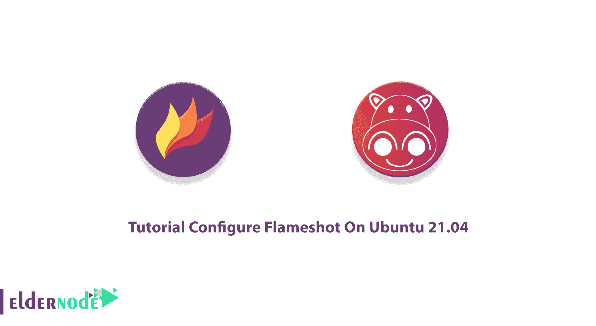
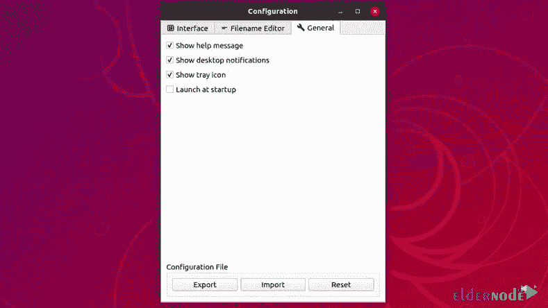
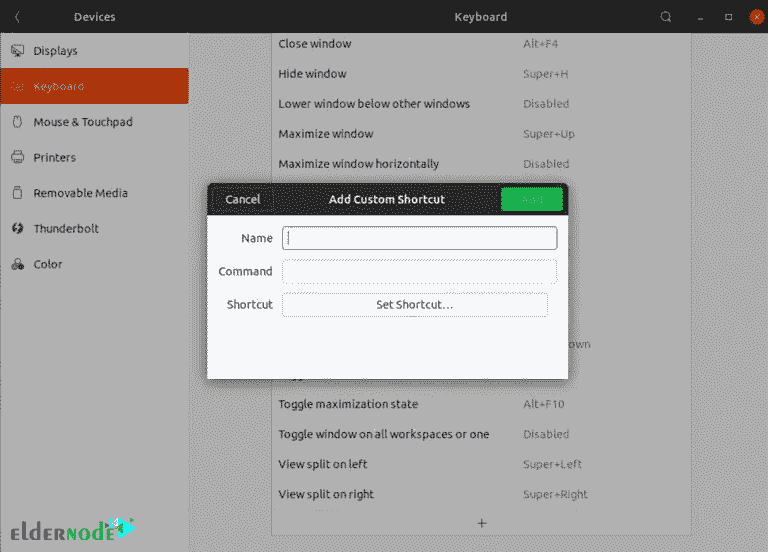
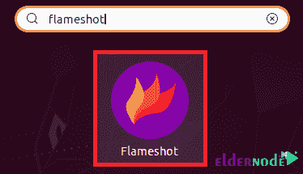
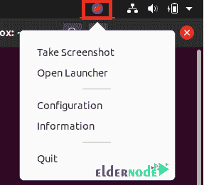

# 教程在 Ubuntu 21.04 - Eldernode 博客上配置 Flameshot

> 原文：<https://blog.eldernode.com/configure-flameshot-on-ubuntu/>



Flameshot 是一个开源的屏幕截图工具，既可以使用图形用户界面，也可以使用命令行界面。由于 Linux 发行版的截图工具并不完善，您可以使用 Flameshot 的功能。这个强大、简单、易用的截图软件可以即时编辑图像，并且可以定制。加入我们这篇文章来回顾一下**教程在 Ubuntu 21.04** 上配置 Flameshot。在 [Eldernode](https://eldernode.com/) 上选择你想要的包，购买自己的 **[Ubuntu VPS](https://eldernode.com/ubuntu-vps/)** 。

## **在 Ubuntu 21.04** 上配置 Flameshot

Flameshot 是用 C++用 Qt5 框架写的。它是为 Linux、macOS 和 T2 Windows 系统设计的注释灵活工具。在 Ubuntu 中按“打印屏幕”按钮就可以截图了。但是内置的截图功能并没有提供很多选项，但是 Flameshot 可以让你在截图上做更多的事情。接下来，你将学习如何在 [Ubuntu](https://blog.eldernode.com/tag/ubuntu/) 21.04 上安装和配置 Flameshot。

### **在 Ubuntu 21.04 上安装 Flameshot 的先决条件**

为了让本教程更好地工作，请考虑以下先决条件:

_ 拥有 Sudo 权限的非 root 用户。要进行设置，请遵循 Ubuntu 20.04 上的[初始服务器设置。](https://blog.eldernode.com/initial-server-setup-on-ubuntu-21-04/)

## **如何在 Ubuntu 21.04 上安装 Flameshot 工具**

Flameshot 不仅易于使用，而且它的安装过程也是最简单的。运行以下命令来更新您的系统，并在 Ubuntu 21.04 上安装 Flameshot 工具:

```
sudo apt update
```

```
sudo apt install flameshot
```

### **如何在 Ubuntu 21.04 上配置 Flameshot**

现在，您已经安装并启动了应用程序，您可以开始配置它了。要配置 Flameshot，您可以键入 **flameshot config** 或从托盘图标菜单中选择**配置**。

这样，您将能够在**启动**时显示要启动的托盘图标或火焰画面。然后，您还可以选择在 GUI 中显示什么按钮，以及您希望界面是什么颜色。



在撰写本文时，无法使用打印屏幕按钮来截图。但是将来可能会添加此功能。所以，自己覆盖打印屏幕快捷键。



要禁用快捷键，请遵循以下路径:

1-打开**系统设置**应用程序

2-选择**设备**，然后转到**键盘**。

3-向下滚动到**截图**。

4-选择“**保存截图到图片**

5-点击**删除**禁用快捷方式。

6-一直滚动到底部，点击**加**按钮。

最后，给它一个**名称，键入**你想要绑定到快捷键的 Flameshot 命令，并将快捷键设置为 Print Screen。

## **如何在 Ubuntu 21.04 上使用 Flameshot 工具**

有两种不同的方式来使用 Flameshot 应用程序。在这一节，你将学习他们两个选择你最喜欢的。

### **1-在 GUI 模式下使用 flame shot**

第一种方法，你可以通过应用菜单在 Ubuntu 21.04 中启动它。在活动搜索栏中搜索 Flameshot，如下图所示:



然后，点击搜索结果，查看 Ubuntu 21.04 系统任务栏上的 Flameshot 图标。点击此图标启动一个菜单，该菜单将为您提供使用此截图工具的各种选项。点击图标，选择**截图**即可开始。



你将不会被限制在一个镜头，选择屏幕的一部分进行截图。选择后，通过拖动不同的角来细化它。当你得到你的选择，你将能够用箭头注释截图，在上面画画，或者模糊部分。完成标记后保存您的屏幕截图。此外，您可以将它复制到剪贴板或直接在另一个应用程序中打开它。

### **2-从命令行使用 Flameshot**

如果你不想让应用程序一直在你的托盘中运行，使用这种方法。你也可以用 CLI 模式做你在 GUI 模式中学到的所有事情。要启动 flameshot，只需从终端运行“ **flameshot** ”。

要获取整个桌面的屏幕截图，请运行以下命令。它还会询问您将它保存在哪里:

```
flameshot full
```

要复制到剪贴板，请使用下面的命令:

```
flameshot full -c
```

此外，你可以有一些设置时间。以下命令将在 5 秒钟后截图:

```
flameshot full -c -d 5000
```

然后，您可以使用以下命令将其保存到您的桌面:

```
flameshot full -p ~/Desktop -d 5000
```

运行以下命令，启动该应用程序完整 GUI 版本使用的相同界面:

```
flameshot gui
```

这样 app 就不需要在托盘中运行了。

## 结论

在本文中，您了解了如何在 Ubuntu 21.04 上配置 Flameshot。安装屏幕截图工具不是必须的，但会提供详细的屏幕截图来报告错误或出现的问题。您可能更喜欢使用 Flameshot，而不是全屏截图并在 GIMP 中编辑结果图像。