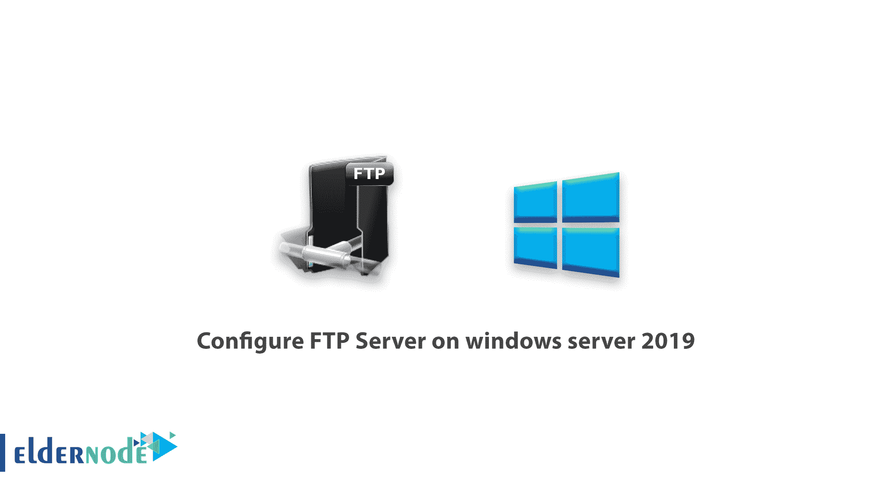
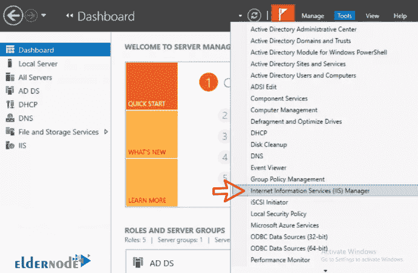
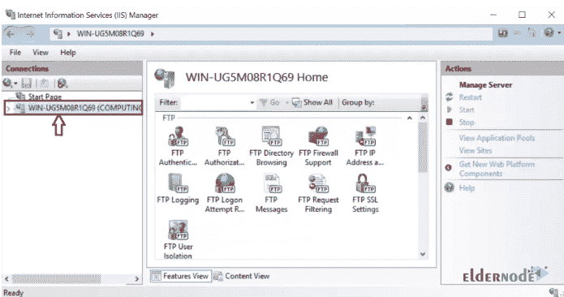
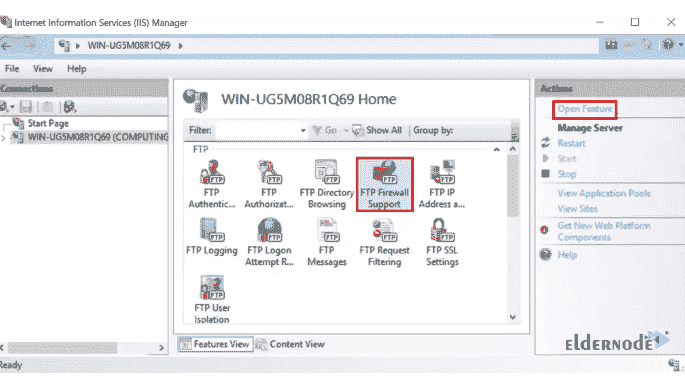
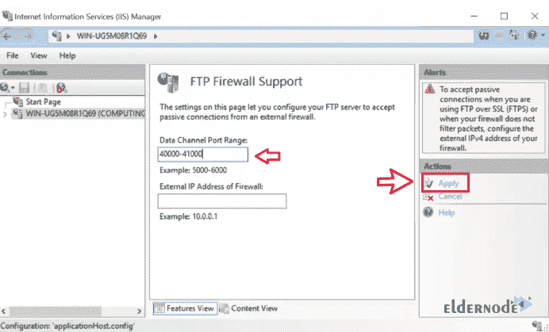
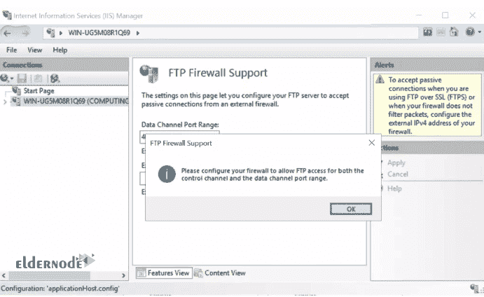
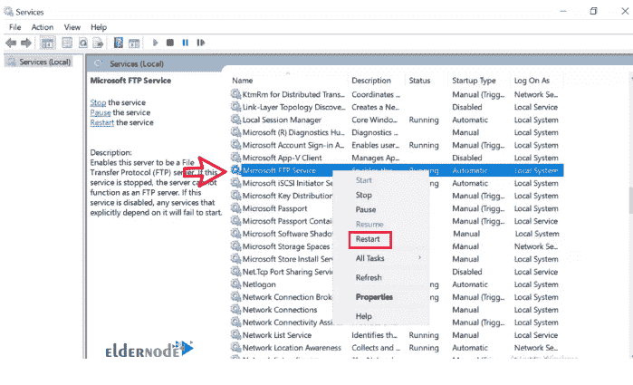
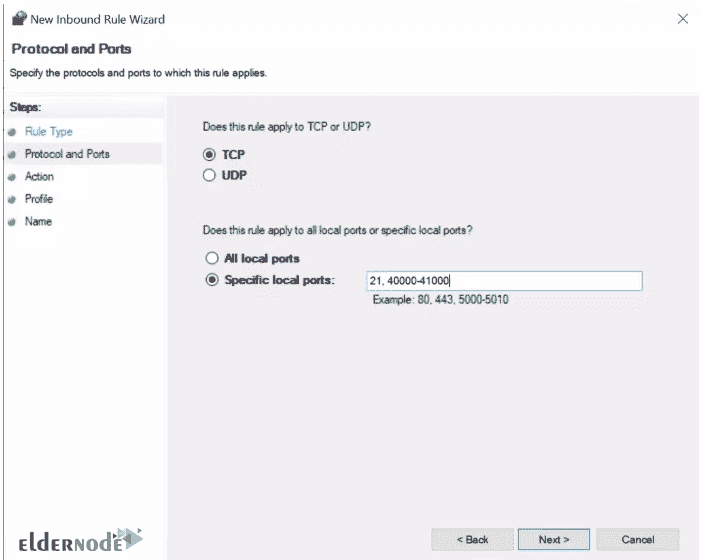

# 如何在 windows server 2019 - Eldernode 上配置 FTP 服务器

> 原文：<https://blog.eldernode.com/configure-ftp-server-on-windows-server/>

如何在 windows server 2019 上配置 FTP 服务器？在之前的文章中，我们教过你[如何在 Windows Server 2019](https://eldernode.com/install-ftp-server-on-windows-server/) 上安装 FTP 服务器。在本文中，我们将教你如何在 Windows Server 2019 上配置 FTP 服务器。

您可以从 eldernode 选择您最理想的 [Windows VPS Server](https://eldernode.com/windows-vps/) 软件包。

## 教程在 windows server 2019 上配置 FTP 服务器

在开始配置之前，需要在 Windows Server 2019 上安装 [FTP](https://www.microsoft.com/en-us/p/ftp-server/9wzdncrdn27z) 服务器。

我们将在被动模式下配置 FTP 服务器。按照以下步骤配置 FTP。

**1。T3 打开服务器管理器。**

**2。T3 从**工具**选项卡中选择互联网信息服务(IIS)管理器，如下图所示。**

**3。从左栏点击你的**服务器**。**

**4。** 点击 FTP 防火墙支持选项，点击右栏开放功能。

**5。在动作部分的右栏中T3，点击应用。**

**6。** 下面的小窗口会出现，提示您需要允许我们在防火墙中配置的端口范围。

点击确定。然后重启 FTP 服务器使更改生效。

**7。T3 在 Windows 搜索框中搜索服务。**

**打开服务应用后，右键点击微软 FTP 服务器上的**。选择重启。

**8。** 使用[如何在 Windows Server 防火墙上打开端口](https://eldernode.com/open-a-port-on-a-windows-firewall/)在您的防火墙上添加端口。另外，包括端口 21。

它应该如下图所示:

**尊敬的用户**，我们希望您能喜欢这个[教程](https://eldernode.com/category/tutorial/)，您可以在评论区提出关于本次培训的问题，或者解决[老年人节点培训](https://eldernode.com/blog/)领域的其他问题，请参考[提问页面](https://eldernode.com/ask)部分，并尽快提出您的问题。腾出时间给其他用户和专家来回答你的问题。

好运。

Goodluck.