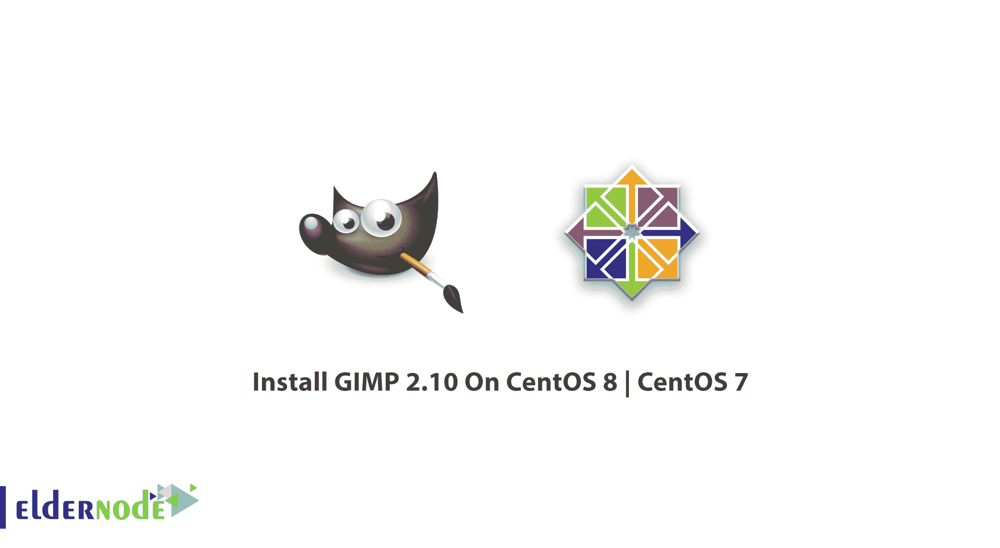
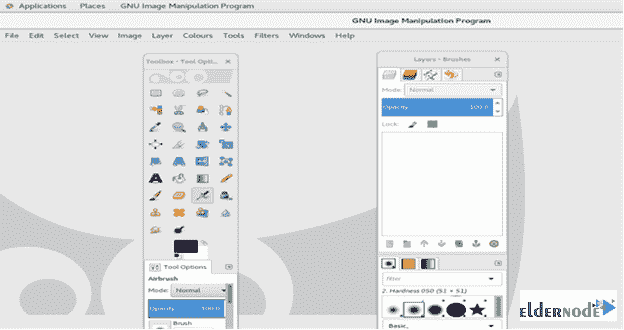

# 教程在 CentOS 8 | CentOS 7 - Eldernode 上配置 GIMP 2.10

> 原文：<https://blog.eldernode.com/configure-gimp-2-10-on-centos-8/>



教程**在 CentOS 8 和 CentOS 7** 上安装和配置 GIMP 2.10。GIMP(**G**NU**I**mage**M**animation**P**program)是一款免费开源的光栅图形编辑器。您可以使用它来操作、修饰和编辑图像，还可以自由绘制、在不同的图像文件格式之间进行代码转换，以及执行更专业的任务。在开始阅读本指南之前，请尝试在 [Eldernode](https://eldernode.com/) 中选择您的完美 [CentOS VPS](https://eldernode.com/centos-vps/) 套装，并购买您自己的套装。

## 教程在 CentOS 8 | CentOS 7 上安装 GIMP 2.10

### GIMP 特性

本教程收集时最新发布的 GIMP 版本是 [GIMP](https://www.gimp.org/) 2.10.22。以下是它的一些特点。

**1-** 支持多种文件格式

**2-** 硬件支持

**3-** 数码修图

**4-** 照片增强

**5-** 可定制界面

***有哪些发布亮点***

GIMP 2 . 10 . 22 是一个 bug 修复版本，它首次包含了核心代码的大部分维护变更。

强化了 **HEIC** 和新增加的 **AVIF** 支持

大量改进了对 **PSP** 文件格式的支持

改进的多层 **TIFF** 导出

更好地处理 Exif " **Orientation** "元数据

在 GEGL 操作工具中新增了**样本合并**选项

## 如何在 CentOS 8 上安装和配置 GIMP 2.10

为了让本教程更好地发挥作用，请考虑以下**先决条件**:

**1-** 拥有 sudo 权限的非 root 用户

**2-** 进行设置，遵循我们的[初始设置 centos 8](https://blog.eldernode.com/initial-set-up-centos-8/)

而 **Gimp** 包可在安装 CentOS/RHEL 8 时默认添加的 AppStream 存储库中获得。

```
sudo dnf provides gimp
```

然后，您可以通过运行以下命令在 CentOS 8 上安装 Gimp 2.x:

```
sudo dnf -y install gimp
```

接下来，从您的菜单或通过键入以下命令启动 Gimp 图形编辑器:

```
gimp
```

运行以下命令以确认安装并检查软件包详细信息:

```
dnf info gimp
```

一旦安装完成，你可以从网页界面或桌面应用程序启动程序，如 Gnome，KDE 等

## 如何在 CentOS 7 上安装 GIMP 2.10

你无法想象在 CentOS 7 上安装 GIMP 有多容易。但这是因为您只需要一个安装命令。因此，不要再等待，执行以下命令:

```
sudo yum install gimp 
```

当你看到下面的页面，这意味着一切正常。



## **结论**

在本文中，您了解了更多关于 GIMP 本身的知识，以及如何在 CentOS 的两个最新版本上安装它。现在，您已经准备好享受一个大的图像处理工具箱，使您能够执行通道操作和图层，效果，亚像素成像和抗锯齿，以及转换，所有这些都与多级撤消。另外，你可以阅读更多关于如何在 CentOS 7 Linux 上安装 VNC 的内容。