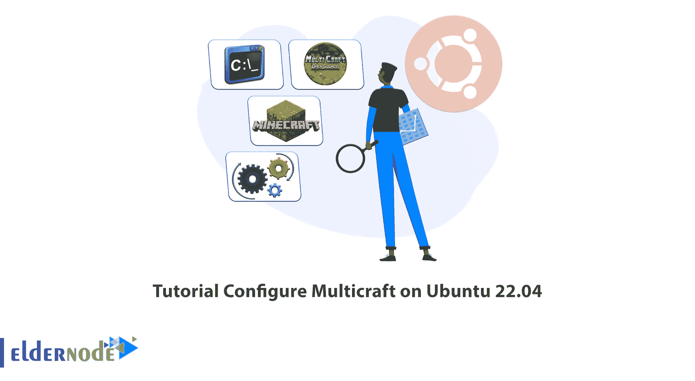

# 教程在 Ubuntu 22.04 上配置 Multicraft

> 原文：<https://blog.eldernode.com/configure-multicraft-on-ubuntu-22-04/>



主机和服务器中的控制面板便于管理和提高性能。他们的访问级别对每个用户来说可能是不同的，而那些在虚拟主机中使用的是基于网络的界面。在本文中，我们将教你**如何在 Ubuntu 22.04** 上配置 Multicraft。如果你想购买一台 [**Ubuntu VPS**](https://eldernode.com/ubuntu-vps/) 服务器，你可以查看 [Eldernode](https://eldernode.com/) 网站上提供的软件包。

### **什么是多筏？**

Multicraft 是一个强大的控制面板，可以在同一台机器上托管许多不同的《我的世界》服务器。它允许用户使用基于 web 的用户界面管理多台服务器。根据版本的不同，这些服务器可以位于多个物理机或虚拟机上。下载或使用该应用程序时没有年龄验证。您可以借助该面板免费版本的免费许可证来运行服务器。

### **多技能特点**

–从一个位置管理任意数量的服务器

–可配置为支持任何类型的服务器

–独立于《我的世界》更新

–计费集成的可用性

–适合大规模部署

–内置插件浏览器

–可用的 API

–带有实时日志/聊天/播放列表的 Ajax 界面

–对香草、布丁和龙头的官方支持

在这篇来自 Ubuntu 培训系列的文章中，我们打算教你如何在 Ubuntu 22.04 上安装 Multicraft。

## **在 Ubuntu 22.04 上安装 multi craft**

在这一节，我们将一步一步地解释如何在 Ubuntu 22.04 上安装 Multicraft。

首先，您应该使用以下命令**安装 Apache2** 和 **SQLite** :

```
apt-get install apache2 sqlite
```

接下来，运行以下命令**安装 PHP** 和**所需的 PHP 扩展**:

```
apt install lsb-release ca-certificates apt-transport-https software-properties-common -y
```

```
add-apt-repository ppa:ondrej/php
```

```
apt install php8.0
```

```
apt install php8.0-cli php8.0-common php8.0-imap php8.0-redis php8.0-xml php8.0-zip php8.0-mbstring
```

现在**用下面的命令安装 Java** :

```
apt-get install openjdk-8-jdk
```

在您喜欢的文本编辑器中打开 **Apache 配置文件**:

```
nano /etc/apache2/apache2.conf
```

然后找到 **<目录/var/www/ >** 并设置如下修改:

```
<Directory /var/www/>  Options Indexes FollowSymLinks  AllowOverride All  Require all granted  </Directory>
```

按 **Ctrl+X** 、 **Y** 和 **Enter** 保存并退出文件。

然后**用下面的命令重新加载 Apache 配置**:

```
service apache2 reload
```

现在是时候使用下面的命令**下载 Multicraft 安装程序**了:

```
wget -O multicraft.tar.gz http://www.multicraft.org/download/index?arch=linux64
```

运行以下命令**提取安装程序**:

```
tar -xzf multicraft.tar.gz
```

### **在 Ubuntu 22.04** 上配置 **组播**

您可以**导航提取的目录**,如下所示:

```
cd multicraft/
```

现在您应该**进入安装脚本**:

```
./setup.sh
```

如果安装脚本问你一个问题，按**回车**使用默认答案。

### **如何在 Ubuntu 22.04 上访问 multi craft**

首先，您应该打开 web 浏览器，使用以下命令找到服务器的 IP 地址:

```
http://IP-address/multicraft/install.php
```

现在点击**开始安装**和**继续。**

然后点击**继续**复制配置文件。

接下来，您应该点击**初始化数据库**来初始化数据库以供使用。然后再次点击**继续**。

点击**登录**，在登录表单中输入您的管理员名称和密码，然后再次点击**登录**。

最后，再次点击**初始化数据库**，然后按下**保存**按钮。

## 结论

借助 Multicraft 强大的控制面板，您可以在一台机器上托管多个《我的世界》服务器。在本文中，我们教你如何在 Ubuntu 22.04 上安装和配置 Multicraft。我希望这篇文章对你有用，你喜欢它。如有疑问，可在评论中联系我们。