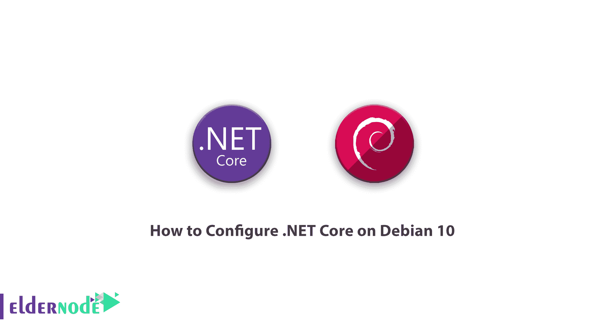

# 如何配置。Debian 10 - Eldernode 上的 NET Core

> 原文：<https://blog.eldernode.com/configure-net-core-on-debian-10/>



了解如何配置。Debian 10 上的 NET Core 循序渐进。。Net Core 是由微软和。在 [GitHub](https://github.com/) 上的网络社区。**。Net Core** 框架是完全跨平台的，可以在 Windows、Linux、Mac 上使用。它还用于各种设备、云空间和物联网相关的场景。在本文中，我们将介绍**。Net Core** 以及如何配置。Debian 10 上的 NET Core。如果需要购买 [Linux VPS](https://eldernode.com/linux-vps/) 服务器，可以在 [Eldernode](https://eldernode.com/) 中看到可用的包。

### 的主要特征是什么。网芯？

***1。使用灵活:*** 它可以在你想要的应用中作为扩展使用。或者完全独立地安装在您的服务中，用于不同的用途。

***2。跨平台能力:*** 能够在 [Windows](https://blog.eldernode.com/tag/windows/) 、Linux、macOS 上安装；能够移植到其他操作系统。据微软和其他相关公司、设计师和开发商称，对其他操作系统、CPU 和应用程序的支持将随着时间的推移而增长和改善。

***3。命令行工具:*** 所有源自不同场景的产品都可以作为命令行使用和编辑执行。

***4。**兼容性:*得益于标准的使用。Net 核心库，Net 兼容. Net 框架，。Xamarin 和 Mono。

***5。**开源:*了。Net Core 平台是完全开源的，使用 MIT 和 Apache 2 许可。

### 。Net 核心框架

**–**。Net 运行时，它提供了类型系统、程序集加载、垃圾收集器、本机互操作等一系列基本服务。

**–**一组框架库，包括基础数据类型、应用结构类型和基础应用工具。

**–**一组 SDK 工具和编译器，支持。Net Core SDk。

**–**dot net app 主机，用来运行。Net 核心应用程序。它的工作是选择运行时并托管它，提供程序集加载策略并运行应用程序。同样的“主机”也用于以类似的方式运行 SDK 工具。

### net core 支持哪些语言？

C#、F#和 VB 都可以用来为。网芯。因为编译器运行在。Net Core，它可以让你在任何地方进行设计和开发。网芯本身可以。这意味着您不会直接使用编译器，而是通过 SDK 工具间接使用它们。

因为 C#罗斯林编译器和。Net 核心工具能够集成各种文本编辑器和 ide，包括 Visual Studio、Visual Studio 代码、Sublime Text 和 Vim。Net Core 已经成为一个适合开发者的平台。在他们喜欢的环境和操作系统中执行他们想要的编码。

## 教程配置。Debian 10 上的 NET Core

**1。**使用 sudo 特权帐户登录您的 Debain 系统。然后，要更新 apt 缓存，请打开终端并安装以下软件包:

```
sudo apt update
```

```
sudo apt install apt-transport-https
```

***注意:*** 你需要在你的 Debian 上启用微软包库。微软提供 Debian 软件包在你的系统上创建一个 PPA 文件。

键入以下命令来配置 Microsoft PPA:

```
wget https://packages.microsoft.com/config/debian/10/packages-microsoft-prod.deb
```

```
sudo dpkg -i packages-microsoft-prod.deb 
```

## **如何安装。Debian 10 服务器上的 NET Core**

现在是时候安装了。Debian 上的 NET core。需要注意的是**。net 运行时**用于在。网芯。安装**。NET Core SDK** ，在终端输入以下命令:

```
sudo apt update    sudo apt install dotnet-sdk-3.1
```

您也可以输入以下命令来安装以前版本的。Net Core SDK 2.1:

```
sudo apt install dotnet-sdk-2.1
```

如果你想安装。NET Core 运行时，只需输入以下命令:

```
sudo apt update    sudo apt install dotnet-runtime-3.1
```

您也可以使用以下命令安装以前版本的。Net core 运行时 2.1:

```
sudo apt install dotnet-runtime-2.1
```

### 有什么区别。NET 框架和。网芯？

***App-型号:*** 。NET Core 并不支持。NET 框架。因为它们中的大多数都是用像 WPF(基于 DirectX)这样的 Windows 技术构建和开发的。应用程序控制台和 ASP。两种平台都支持. NET 模型。

***API:***。NET Core 包括许多由。NET Framework，但总的来说它们更少，并且在某些因素上也有所不同。剩下的情况现在需要一系列彻底的改变才能移植到。网芯。的。NET 核心 API 实现了。NET 标准库，并且已经成长和扩展到包括更多。基于 API 的库。

***子系统:*** 为了简化加载和执行过程以及方便编程模型，。NET Core 被设计成运行子系统的子集。

***平台:*** 。NET Framework 只支持 Windows 和 Windows Server，而。NET Core 也可以用在 macOS 和 Linux 上。

***开源:*** 。NET Core 是完全开源的，而。NET 框架子集是开源的。

**结论**

尤其是程序员最基本的问题之一。NET 程序员，是他们是否可以运行 Asp.Net 应用程序的基础。Windows 服务器上的. Net Core。这个问题的答案对于很多用户来说可能更容易讨论。事实是，并不是所有的托管公司都准备好了。网芯。鉴于这些计划的实施略有不同，更关心安全性的公司可能还不会冒险支持。网芯在最早的机会。流行的 Plesk 控制面板支持。Net Core 默认情况下，即使在新的 Onyx 版本，你可以很容易地安装。安装 [Plesk](https://blog.eldernode.com/tag/plesk/) 时没有任何知识的 Net Core。

最后，建议如果您是. Net 程序员，不要怀疑您应该迁移到。NET 核心并尽早开始学习它。在本文中，我们试图向您介绍。NET 核心，还教你如何配置。Debian 10 上的 NET Core。