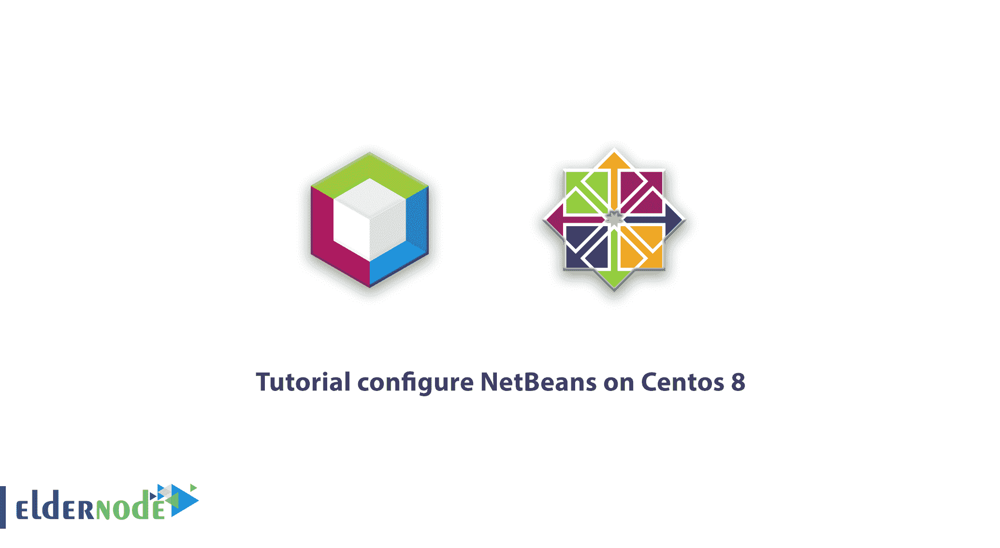
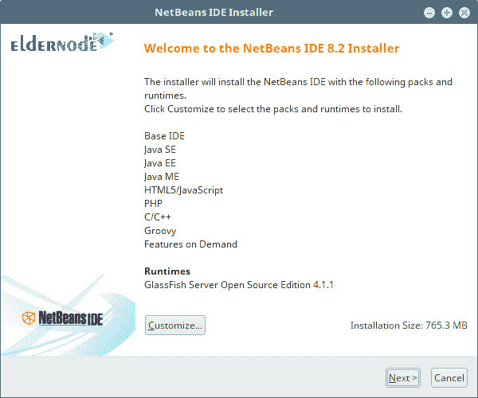
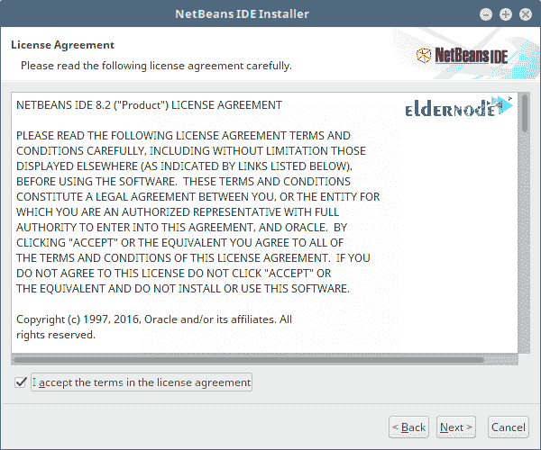
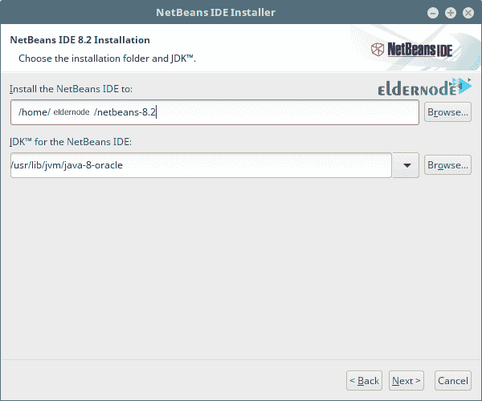
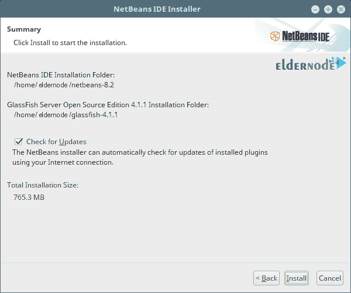

# 教程在 Centos 8 | Eldernode 上配置 NetBeans

> 原文：<https://blog.eldernode.com/configure-netbeans-on-centos-8/>



教程**如何在 Centos 8** 上配置 NetBeans。NetBeans 是一个 Java 软件开发平台，也是最受 T2 欢迎的 Linux 代码编辑器之一，可用于 Java、C、C++和 PHP 开发。该平台提供了许多预定义的模板和代码生成工具，以加快开发速度。NetBeans 是一个跨平台的软件，可以在 T4 的 Windows T5，OSX 的 Mac 和 Linux 上运行。在本教程中，我们将尝试让您熟悉如何在 Centos 8 上安装和配置 NetBeans。如果您需要购买 [CentOS VPS](https://eldernode.com/centos-vps/) 服务器，还可以访问 [Eldernode](https://eldernode.com/) 中提供的软件包。

### NetBeans 有什么特点？

[NetBeans](https://netbeans.org/) 被认为是一个模块化平台，用于开发 Java 桌面应用程序，由 Oracle 开发和发布。Java 语言也是由 Oracle 开发的，它也支持 NetBeans。以下是 NetBeans 的一些功能:

**–NetBeans for Linux**

对于开发者来说，NetBeans 是一个非常有用的 IDE，几乎适用于所有的操作系统，包括 Linux。所以如果你想加快你的编程速度，就用它吧。

**–适合初学者**

在 Linux 代码编辑器中，NetBeans 有一个很好的图形用户界面。如果您是 Java 编程新手，NetBeans 可以让您轻松创建项目、运行应用程序和搜索关键字。窗口和菜单很容易访问，全屏模式非常适合小屏幕，并且很容易导入其他 NetBeans 项目。

**–发现 Java 代码错误**

NetBeans 检测潜在的错误和编码问题。还支持查找代码中可能存在的错误。如果使用了关键字，NetBeans 会在编程过程中显示函数和模块。

**–NetBeans 可视库**

NetBeans 可视库包含一组可重用、预定义和可扩展的 Java 小部件。每个小部件都包含各种功能，包括动作、布局和边框。运行小部件时，您可以快速、轻松地向用户提供数据可视化。NetBeans 可视库与其他应用程序接口(API)相结合，允许您创建具有软件中常见功能的交互式用户界面。

**–插件管理**

有一个插件管理器来支持新的图形用户界面(GUI)特性和调试。这个插件管理器是一个添加新特性和 API 的好工具。

**–NetBeans 调试器**

NetBeans 调试器可以轻松处理多学科应用程序。您可以轻松地在线程之间切换。代码段计算器允许您定义在调试时格式化对象输出的方法。这样就可以用更易读的形式显示对象。

**–NetBeans 可视库**

如果您遇到问题，NetBeans 有一个很大的支持社区可供您使用。您的问题可以在[社区论坛](https://netbeans.org/community/)中提出。

## 了解如何在 Centos 8 上配置 NetBeans

第一步，您需要安装 netbeans 依赖项。NetBeans 需要 Java JDK 来运行。为此，请按照下列步骤操作:

```
sudo dnf install java-11-openjdk java-11-openjdk-devel
```

然后，您必须**接受**开始下一步的安装过程:

```
....  Last metadata expiration check: 1 day, 8:47:43 ago on Thu 02 Jul 2020 01:55:46 AM EAT.  Dependencies resolved.  =====================================================================================================================================================================================================   Package                                                  Architecture                           Version                                             Repository                                 Size  =====================================================================================================================================================================================================  Installing:   java-11-openjdk                                          x86_64                                 1:11.0.7.10-1.el8_1                                 AppStream                                 247 k   java-11-openjdk-devel                                    x86_64                                 1:11.0.7.10-1.el8_1                                 AppStream                                 3.3 M  Installing dependencies:   java-11-openjdk-headless                                 x86_64                                 1:11.0.7.10-1.el8_1                                 AppStream                                  40 M    Transaction Summary  =====================================================================================================================================================================================================  Install  3 Packages    Total download size: 43 M  Installed size: 187 M  Is this ok [y/N]: y
```

确认 Java 安装后，下一步是**下载** NetBeans，开始**安装**过程。使用以下命令安装 **wget** :

```
sudo dnf install -y wget
```

使用以下命令行在 CentOS 8 上下载 NetBeans。然后运行脚本:

```
wget https://downloads.apache.org/netbeans/netbeans/12.0/Apache-NetBeans-12.0-bin-linux-x64.sh
```

```
chmod +x Apache-NetBeans-12.0-bin-linux-x64.sh
```

运行以下命令在 Linux Mint 20 上安装 NetBeans:

```
sudo ./Apache-NetBeans-12.0-bin-linux-x64.sh
```

点击**下一个**开始安装:



点击**我接受条款** …然后点击**下一步**确认许可协议:



在下一步中，指定程序的安装路径后，点击**下一个**:



在下一步中，您可以通过选中选项来使**自动更新**选项。最后点击**安装**:



在最后一个窗口中，点击**完成**以成功完成安装过程。

Centos 8 上的 NetBeans 安装过程现已完成，您可以通过搜索来使用它。

## 结论

NetBeans 是开始 Java 编程的好方法，可以帮助初学者学习。NetBeans 比其他 ide 有优势，比如 Oracle 开发的那些，还有最新的特性。但是 NetBeans 不像 Eclipse 那样流畅，并且与其他 ide 相比需要大量内存。但是，在本文中，我们试图教您如何在 Centos 8 上安装和配置 NetBeans。